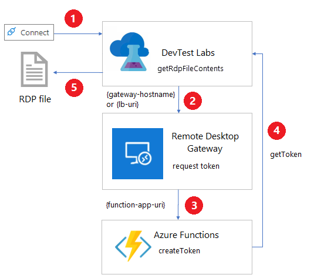

# Configure and use a remote desktop gateway in Azure DevTest Labs

This article describes how to set up and use a gateway for secure [remote desktop](/windows-server/remote/remote-desktop-services/Welcome-to-rds) access to lab virtual machines (VMs) in Azure DevTest Labs. Using a gateway improves security because you don't expose the VMs' remote desktop protocol (RDP) ports to the internet. This remote desktop gateway solution also supports token authentication.

DevTest Labs provides a central place for lab users to view and connect to their VMs. Selecting **Connect** > **RDP** on a lab VM's **Overview** page creates a machine-specific RDP file, and users can open the file to connect to the VM.

With a remote desktop gateway, lab users connect to their VMs through a gateway machine. Users authenticate directly to the gateway machine, and can use company-supplied credentials on domain-joined machines. Token authentication provides an extra layer of security.

Another way to securely access lab VMs without exposing ports or IP addresses is through a browser with Azure Bastion. For more information, see [Enable browser connection to DevTest Labs VMs with Azure Bastion](enable-browser-connection-lab-virtual-machines.md).

## Architecture

The following diagram shows how a remote desktop gateway applies token authentication and connects to DevTest Labs VMs.



1. Selecting **Connect** > **RDP** from a lab VM invokes the [getRdpFileContents](/rest/api/dtl/virtualmachines/getrdpfilecontents) REST command:

   ```http
   POST https://management.azure.com/subscriptions/{subscriptionId}/resourceGroups/{resourceGroupName}/providers/Microsoft.DevTestLab/labs/{labName}/virtualmachines/{name}/getRdpFileContents
   ```

1. When the lab has a gateway configured, the `getRdpFileContents` action invokes `https://{gateway-hostname}/api/host/{lab-machine-name}/port/{port-number}` to request an authentication token.
   - `{gateway-hostname}`, or `{lb-uri}` for a load balancer, is the gateway hostname specified on the **Lab settings** page for the lab.
   - `{lab-machine-name}` is the name of the VM to connect to.
   - `{port-number}` is the port to use for the connection. Usually this port is 3389, but if the lab VM uses a [shared IP](devtest-lab-shared-ip.md), the port number is different.

1. The remote desktop gateway uses `https://{function-app-uri}/api/host/{lab-machine-name}/port/{port-number}` to defer the call to an Azure Functions function app.

   > [!NOTE]
   > The request header automatically includes the function key, which it gets from the lab's key vault. The function key secret's name is the **Gateway token secret** on the lab's **Lab settings** page.

1. The Azure function generates and returns a token for certificate-based authentication on the gateway machine.

1. The `getRdpFileContents` action returns the complete RDP file, including the authentication token.

When an RDP connection program opens the RDP file, the remote desktop gateway authenticates the token, and the connection forwards to the lab VM.

> [!NOTE]
> Not all RDP connection programs support token authentication.

> [!IMPORTANT]
> The Azure function sets an expiration date for the authentication token. A user must connect to the VM before the token expires.

## Configuration requirements
 
There are some configuration requirements for gateway machines, Azure Functions, and networks to work with DevTest Labs RDP access and token authentication:

### Gateway machine requirements

The gateway machine must have the following configuration:

- A TLS/SSL certificate to handle HTTPS traffic. The certificate must match the fully qualified domain name (FQDN) of the gateway machine if there's only one machine, or the load balancer of a gateway farm. Wild-card TLS/SSL certificates don't work.

- A signing certificate. You can create a signing certificate by using the [Create-SigningCertificate.ps1](https://github.com/Azure/azure-devtestlab/blob/master/samples/DevTestLabs/GatewaySample/tools/Create-SigningCertificate.ps1) PowerShell script.

- A [pluggable authentication module](https://en.wikipedia.org/wiki/Pluggable_authentication_module) that supports token authentication. One example is *RDGatewayFedAuth.msi*, which comes with [System Center Virtual Machine Manager (VMM)](/system-center/vmm/install-console?view=sc-vmm-1807&preserve-view=true) images.

- The ability to handle requests to `https://{gateway-hostname}/api/host/{lab-machine-name}/port/{port-number}`.

You can use the [Application Routing Request module for Internet Information Server (IIS)](/iis/extensions/planning-for-arr/using-the-application-request-routing-module) to redirect `https://{gateway-hostname}/api/host/{lab-machine-name}/port/{port-number}` requests to the function app.

### Azure Functions requirements

An Azure Functions function app handles requests with the `https://{function-app-uri}/app/host/{lab-machine-name}/port/{port-number}` format, and creates and returns the authentication token based on the gateway machine's signing certificate. The `{function-app-uri}` is the URI used to access the function.

The request header must pass the function key, which it gets from the lab's key vault.

For a sample function, see [CreateToken.cs](https://github.com/Azure/azure-devtestlab/blob/master/samples/DevTestLabs/GatewaySample/src/RDGatewayAPI/Functions/CreateToken.cs).

### Network requirements

- The DNS for the FQDN associated with the gateway machine's TLS/SSL certificate must direct traffic to the gateway machine or to the load balancer of a gateway machine farm.

- If the lab VM uses a private IP address, there must be a network path from the gateway machine to the lab machine. The two machines must either share the same virtual network or use peered virtual networks.

## Create a remote desktop gateway

The [Azure DevTest Labs GitHub repository](https://github.com/Azure/azure-devtestlab) has Azure Resource Manager (ARM) templates that help set up DevTest Labs token authentication and remote desktop gateway resources. There are templates for gateway machine creation, lab settings, and a function app.

> [!NOTE] 
> By using the sample templates, you agree to the [Remote Desktop Gateway license terms](https://www.microsoft.com/licensing/product-licensing/products).

Follow these steps to set up a sample remote desktop gateway farm.

1. Create a signing certificate.

   Run [Create-SigningCertificate.ps1](https://github.com/Azure/azure-devtestlab/blob/master/samples/DevTestLabs/GatewaySample/tools/Create-SigningCertificate.ps1). Record the thumbprint, password, and Base64 encoding of the created certificate to use later.
   
1. Get a TLS/SSL certificate. The FQDN associated with the TLS/SSL certificate must be for a domain you control.

1. Record the password, thumbprint, and Base64 encoding for the TLS/SSL certificate to use later.

   - To get the thumbprint, use the following PowerShell commands:

     ```powershell
     $cer = New-Object System.Security.Cryptography.X509Certificates.X509Certificate;
     $cer.Import('path-to-certificate');
     $hash = $cer.GetCertHashString()
     ```

   - To get the Base64 encoding, use the following PowerShell command:

     ```powershell
     [System.Convert]::ToBase64String([System.IO.File]::ReadAllBytes('path-to-certificate'))
     ```

1. Download all the files from [https://github.com/Azure/azure-devtestlab/tree/master/samples/DevTestLabs/GatewaySample/arm/gateway](https://github.com/Azure/azure-devtestlab/tree/master/samples/DevTestLabs/GatewaySample/arm/gateway). Copy all the files and *RDGatewayFedAuth.msi* to a blob container in a storage account.

1. Open *azuredeploy.json* from [https://github.com/Azure/azure-devtestlab/tree/master/samples/DevTestLabs/GatewaySample/arm/gateway](https://github.com/Azure/azure-devtestlab/tree/master/samples/DevTestLabs/GatewaySample/arm/gateway), and fill out the following parameters:
 

   |Parameter  |Required  |Description  |
   |---------|---------|---------|
   |`adminUsername`             |**Required** |Administrator user name for the gateway machines. |
   |`adminPassword`             |**Required** |Password for the administrator account for the gateway machines. |
   |`instanceCount`             |             |Number of gateway machines to create. |
   |`alwaysOn`                  |             |Whether to keep the created Azure Functions app warmed (on) or not. Keeping the app on avoids delays when users first try to connect to their lab VMs, but has cost implications. |
   |`tokenLifetime`             |             |The length of time in HH:MM:SS format that the created token is valid. |
   |`sslCertificate`            |**Required** |The Base64 encoding of the TLS/SSL certificate for the gateway machine. |
   |`sslCertificatePassword`    |**Required** |The password of the TLS/SSL certificate for the gateway machine. |
   |`sslCertificateThumbprint`  |**Required** |The certificate thumbprint for identification in the local certificate store of the signing certificate. |
   |`signCertificate`           |**Required** |The Base64 encoding for the signing certificate for the gateway machine. |
   |`signCertificatePassword`   |**Required** |The password for the signing certificate for the gateway machine. |
   |`signCertificateThumbprint` |**Required** |The certificate thumbprint for identification in the local certificate store of the signing certificate. |
   |`_artifactsLocation`        |**Required** |The URI location to find artifacts this template requires. This value must be a fully qualified URI, not a relative path. The artifacts include other templates, PowerShell scripts, and the Remote Desktop Gateway Pluggable Authentication module, expected to be named *RDGatewayFedAuth.msi* that supports token authentication. |
   |`_artifactsLocationSasToken`|**Required** |The shared access signature (SAS) token to access artifacts, if the `_artifactsLocation` is an Azure storage account. |

1. Run the following Azure CLI command to deploy *azuredeploy.json*:

   ```azurecli
   az deployment group create --resource-group {resource-group} --template-file azuredeploy.json --parameters @azuredeploy.parameters.json -–parameters _artifactsLocation="{storage-account-endpoint}/{container-name}" -–parameters _artifactsLocationSasToken = "?{sas-token}"
    ```

   - Get the `{storage-account-endpoint}` by running
     `az storage account show --name {storage-account-name} --query primaryEndpoints.blob`.

   - Get the `{sas-token}` by running
     `az storage container generate-sas --name {container-name} --account-name {storage-account-name} --https-only –permissions drlw –expiry {utc-expiration-date}`.

     - `{storage-account-name}` is the name of the storage account that holds the files you uploaded.
     - `{container-name}` is the container in the `{storage-account-name}` that holds the files you uploaded.
     - `{utc-expiration-date}` is the date, in UTC, when the SAS token expires and can no longer be used to access the storage account.

1. Record the values for `gatewayFQDN` and `gatewayIP` from the template deployment output. Also save the value of the key for the newly created function, which you can find in the function app's [Application settings tab](../azure-functions/functions-how-to-use-azure-function-app-settings.md#settings).

1. Configure DNS so that the FQDN of the TLS/SSL certificate directs to the `gatewayIP` IP address.

After you create the remote desktop gateway farm and update DNS, configure Azure DevTest Labs to use the gateway.

## Configure the lab to use token authentication

Before you update lab settings, store the key for the authentication token function in the lab's key vault. You can get the function key value on the function's **Function Keys** page in Azure portal.  To find the ID of the lab's key vault, run the following Azure CLI command: 

```azurecli
az resource show --name {lab-name} --resource-type 'Microsoft.DevTestLab/labs' --resource-group {lab-resource-group-name} --query properties.vaultName
```

Learn how to save a secret in a key vault in the article, [Add a secret to Key Vault](../key-vault/secrets/quick-create-portal.md#add-a-secret-to-key-vault). Record the secret name to use later. This value isn't the function key itself, but the name of the key vault secret that holds the function key.

To configure a lab's **Gateway hostname** and **Gateway token secret** to use token authentication with the gateway machine(s), follow these steps:

1. On the lab's **Overview** page, select **Configuration and policies** from the left navigation.

1. On the **Configuration and policies** page, select **Lab settings** from the **Settings** section of the left navigation.

1. In the **Remote desktop** section:

   - For the **Gateway hostname** field, enter the FQDN or IP address of the remote desktop services gateway machine or farm. This value must match the FQDN of the TLS/SSL certificate used on gateway machines.

   - For **Gateway token**, enter the secret name you recorded earlier. This value isn't the function key itself, but the name of the key vault secret that holds the function key.

   

1. Select **Save**.

   > [!NOTE] 
   > By selecting **Save**, you agree to [Remote Desktop Gateway license terms](https://www.microsoft.com/licensing/product-licensing/products).

Once you configure both the gateway and the lab, the RDP connection file created when the lab user selects **Connect** includes the necessary information to connect to the gateway and use token authentication.

### Automate lab configuration

- PowerShell: [Set-DevTestLabGateway.ps1](https://github.com/Azure/azure-devtestlab/blob/master/samples/DevTestLabs/GatewaySample/tools/Set-DevTestLabGateway.ps1) is a sample PowerShell script to automatically set **Gateway hostname** and **Gateway token secret** settings.

- ARM: Use the [Gateway sample ARM templates](https://github.com/Azure/azure-devtestlab/tree/master/samples/DevTestLabs/GatewaySample/arm/lab) in the Azure DevTest Labs GitHub repository to create or update labs with **Gateway hostname** and **Gateway token secret** settings.

### Configure a network security group

To further secure the lab, add a network security group (NSG) to the virtual network the lab VMs use as described in [Create, change, or delete a network security group](../virtual-network/manage-network-security-group.md).   For example, an NSG could allow only traffic that first goes through the gateway to reach lab VMs. The rule source is the IP address of the gateway machine or load balancer for the gateway farm.


## Next steps

- [Deploy your remote desktop environment](/windows-server/remote/remote-desktop-services/rds-deploy-infrastructure)
