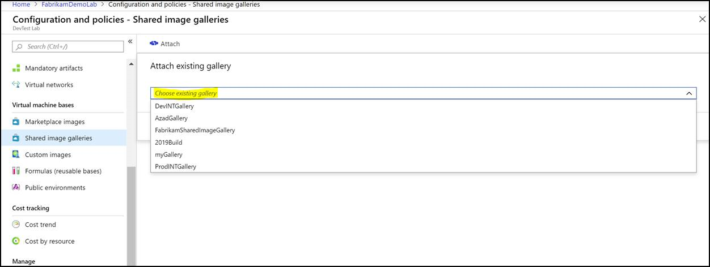
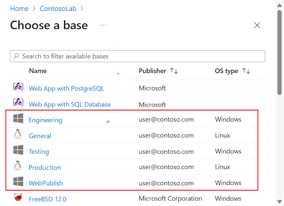

# Configure a shared image gallery in Azure DevTest Labs
DevTest Labs now supports the [Shared Image Gallery](../virtual-machines/shared-image-galleries.md) feature. It enables lab users to access images from a shared location while creating lab resources. It also helps you build structure and organization around your custom-managed VM images. The Shared Image Gallery feature supports:

- Managed global replication of images
- Versioning and grouping of images for easier management
- Make your images highly available with Zone Redundant Storage (ZRS) accounts in regions that support availability zones. ZRS offers better resilience against zonal failures.
- Sharing across subscriptions, and even between tenants, using Azure role-based access control (Azure RBAC).

For more information, see [Shared Image Gallery documentation](../virtual-machines/shared-image-galleries.md). 
 
If you have a large number of managed images that you need to maintain and would like to make them available throughout your company, you can use a shared image gallery as a repository that makes it easy to update and share your images. As a lab owner, you can attach an existing shared image gallery to your lab. Once this gallery is attached, lab users can create machines from these latest images. A key benefit of this feature is that DevTest Labs can now take the advantage of sharing images across labs, across subscriptions, and across regions. 

> [!NOTE]
> To learn about costs associated with the Shared Image Gallery service, see [Billing for Azure Compute Gallery](../virtual-machines/azure-compute-gallery.md#billing).

## Considerations
- You can only attach one shared image gallery to a lab at a time. If you would like to attach another gallery, you'll need to detach the existing one and attach another. 
- DevTest Labs currently doesn't support uploading images to the gallery through the lab. 
- When you create a virtual machine using a shared image gallery image, DevTest Labs always uses the latest published version of this image. However if an image has multiple versions, users can choose to create a machine from an earlier version by going to the Advanced settings tab during virtual machine creation.  
- Although DevTest Labs automatically makes a best attempt to ensure shared image gallery replicates images to the region in which the Lab exists, it’s not always possible. To avoid users having issues creating VMs from these images, ensure the images are already replicated to the lab’s region.”

## Use Azure portal
1. Sign in to the [Azure portal](https://portal.azure.com).
1. Select **All Services** on the left navigational menu.
1. Select **DevTest Labs** from the list.
1. From the list of labs, select your **lab**.
1. Select **Configuration and policies** in the **Settings** section on the left menu.
1. Select **Shared Image Galleries** under **Virtual machine bases** on the left menu.

    
1. Attach an existing shared image gallery to your lab by clicking on the **Attach** button and selecting your gallery in the dropdown.

    
1. After the image gallery is attached, select it to go to the attached gallery. Configure your gallery to **enable or disable** shared images for VM creation. Select an image gallery from the list to configure it. 

    By default, **Allow all images to be used as virtual machine bases** is set to **Yes**. It means that all images available in the attached shared image gallery will be available to a lab user when creating a new lab VM. If access to certain images needs to be restricted, change **Allow all images to be used as virtual machine bases** to **No**, and select the images that you want to allow when creating VMs, and then select the **Save** button.

    :::image type="content" source="./media/configure-shared-image-gallery/enable-disable.png" alt-text="Enable or disable images":::

    > [!NOTE]
    > Both generalized and specialized images in the shared image gallery are supported. 
1. Lab users can then create a virtual machine using the enabled images by clicking on **+Add** and finding the image in the **choose your base** page.

    
## Use Azure Resource Manager template

### Attach a shared image gallery to your lab
If you're using an Azure Resource Manager template to attach a shared image gallery to your lab, you need to add it under the resources section of your Resource Manager template, as shown in the following example:

```json
"resources": [
{
    "apiVersion": "2018-10-15-preview",
    "type": "Microsoft.DevTestLab/labs",
    "name": "mylab",
    "location": "eastus",
    "resources": [
    {
        "apiVersion":"2018-10-15-preview",
        "name":"myGallery",
        "type":"sharedGalleries",
        "properties": {
            "galleryId":"/subscriptions/11111111-1111-1111-1111-111111111111/resourceGroups/mySharedGalleryRg/providers/Microsoft.Compute/galleries/mySharedGallery",
            "allowAllImages": "Enabled"
        }
    }
    ]
}
```

For a complete Resource Manager template example, see these Resource Manager template samples in our public GitHub repository: [Configure a shared image gallery while creating a lab](https://github.com/Azure/azure-devtestlab/tree/master/samples/DevTestLabs/QuickStartTemplates/101-dtl-create-lab-shared-gallery-configured).

## Use REST API

### Get a list of labs 

```rest
GET  https://management.azure.com/subscriptions/{subscriptionId}/resourceGroups/{resourceGroupName}/providers/Microsoft.DevTestLab/labs?api-version= 2018-10-15-preview
```

### Get the list of shared image galleries associated with a lab

```rest
GET  https://management.azure.com/subscriptions/{subscriptionId}/resourceGroups/{resourceGroupName}/providers/Microsoft.DevTestLab/labs/{labName}/sharedgalleries?api-version= 2018-10-15-preview
   ```

### Create or update shared image gallery

```rest
PUT https://management.azure.com/subscriptions/{subscriptionId}/resourceGroups/{resourceGroupName}/providers/Microsoft.DevTestLab/labs/{labName}/sharedgalleries/{name}?api-version=2018-10-15-preview
Body: 
{
    "properties":{
        "galleryId": "[Shared Image Gallery resource Id]",
        "allowAllImages": "Enabled"
    }
}

```

### List images in a shared image gallery

```rest
GET  https://management.azure.com/subscriptions/{subscriptionId}/resourceGroups/{resourceGroupName}/providers/Microsoft.DevTestLab/labs/{labName}/sharedgalleries/{name}/sharedimages?api-version=2018-10-15-preview
```


## Next steps
See the following articles on creating a VM using an image from the attached shared image gallery: [Create a VM using a shared image from the gallery](add-vm-use-shared-image.md)
