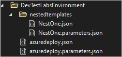

# Deploy DevTest Labs environments by using nested templates

A nested deployment runs secondary Azure Resource Manager (ARM) templates from within a main template. This article shows an example of nesting templates to deploy an Azure DevTest Labs environment. DevTest Labs environments contain multiple infrastructure-as-a-service (IaaS) virtual machines (VMs) with platform-as-a-service (PaaS) resources installed. You can provision the PaaS resources and VMs by using ARM templates.

Decomposing a deployment into a set of targeted, purpose-specific templates provides testing, reuse, and readability benefits. For general information about nested templates, including code samples, see [Using linked and nested templates when deploying Azure resources](../azure-resource-manager/templates/linked-templates.md).

## Deploy nested templates with Visual Studio

The Azure Resource Group project template in Visual Studio makes it easy to develop and debug ARM templates. When you add a nested template to the main *azuredeploy.json* template file, Visual Studio adds the following items to make the template more flexible:

- A subfolder with the secondary template and parameters files
- Variable names in the main template file
- Two key parameters, `_artifactsLocation` and `_artifactsLocationSasToken`

In DevTest Labs, you store ARM templates in a Git repository that you link to the lab. When you use one of the linked repository templates to create a new environment, the deployment copies the template files into an Azure Storage container in the lab. When you add a nested template resource to the repository and main template file, Visual Studio identifies the `_artifactsLocation` and `_artifactsLocationSasToken` values, copies the subfolders to the storage container, and inserts the location and Shared Access Signature (SaS) token into the parameters files.

## Nested template folder structure

In the following template example, the Git repository folder has a subfolder, *nestedtemplates*, with the nested template files *NestOne.json* and *NestOne.parameters.json*. The *azuredeploy.json* main template file builds the URI for the secondary templates by using the artifacts location, nested template folder, and nested template filename. The URI for the parameters file is the artifacts location, nested template folder, and nested template parameters file. You can add more nested template subfolders to the primary folder, but at only one level of nesting.

The following screenshot shows the project structure in Visual Studio: 



## Nested deployment example

The following example shows the main *azuredeploy.json* ARM template file for the nested deployment:

```json

"$schema": "https://schema.management.azure.com/schemas/2015-01-01/deploymentTemplate.json#",
"contentVersion": "1.0.0.0",
"parameters": {
    "_artifactsLocation": {
        "type": "string"
    },
    "_artifactsLocationSasToken": {
        "type": "securestring"
    }},
"variables": {
    "NestOneTemplateFolder": "nestedtemplates",
    "NestOneTemplateFileName": "NestOne.json",
    "NestOneTemplateParametersFileName": "NestOne.parameters.json"},
    "resources": [
    {
        "name": "NestOne",
        "type": "Microsoft.Resources/deployments",
        "apiVersion": "2016-09-01",
        "dependsOn": [ ],
        "properties": {
            "mode": "Incremental",
            "templateLink": {
                "uri": "[concat(parameters('_artifactsLocation'), '/', variables('NestOneTemplateFolder'), '/', variables('NestOneTemplateFileName'), parameters('_artifactsLocationSasToken'))]",
                "contentVersion": "1.0.0.0"
            },
            "parametersLink": {
                "uri": "[concat(parameters('_artifactsLocation'), '/', variables('NestOneTemplateFolder'), '/', variables('NestOneTemplateParametersFileName'), parameters('_artifactsLocationSasToken'))]",
                "contentVersion": "1.0.0.0"
            }
        }    
    }],
"outputs": {}
```

## Next steps

- For more information about DevTest Labs environments, see [Use ARM templates to create DevTest Labs environments](devtest-lab-create-environment-from-arm.md).
- For more information about using the Visual Studio Azure Resource Group project template, including code samples, see [Creating and deploying Azure resource groups through Visual Studio](../azure-resource-manager/templates/create-visual-studio-deployment-project.md).
