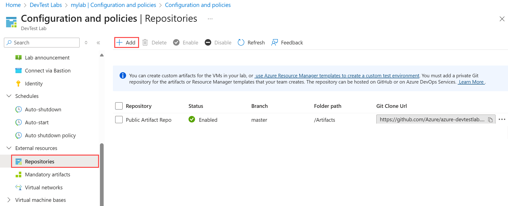
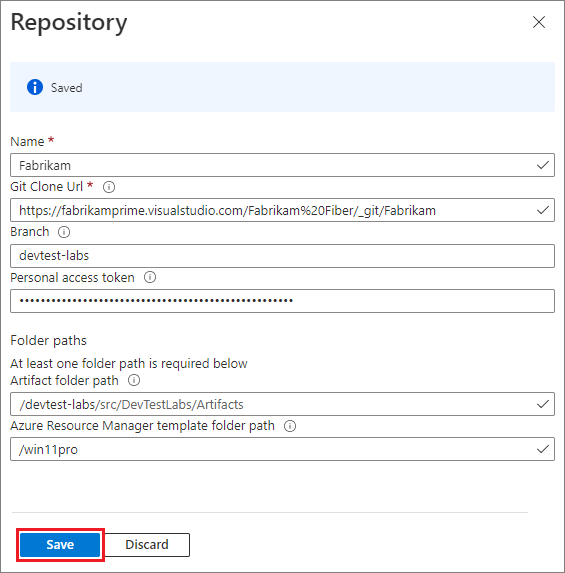

# Add a Git repository to store custom artifacts and Resource Manager templates

You can [create custom artifacts](devtest-lab-artifact-author.md) for the VMs in your lab, or [use Azure Resource Manager templates to create a custom test environment](devtest-lab-create-environment-from-arm.md). You must add a private Git repository for the artifacts or Resource Manager templates that your team creates. The repository can be hosted on [GitHub](https://github.com) or on [Azure DevOps Services](https://visualstudio.com).

We offer a [GitHub repository of artifacts](https://github.com/Azure/azure-devtestlab/tree/master/Artifacts) that you can deploy as-is, or you can customize them for your labs. When you customize or create an artifact, you can't store the artifact in the public repository. You must create your own private repo for custom artifacts and for artifacts that you create. 

When you create a VM, you can save the Resource Manager template, customize it if you want, and then use it later to create more VMs. You must create your own private repository to store your custom Resource Manager templates.  

* To learn how to create a GitHub repository, see [GitHub Bootcamp](https://help.github.com/categories/bootcamp/).
* To learn how to create an Azure DevOps Services project that has a Git repository, see [Connect to Azure DevOps Services](https://www.visualstudio.com/get-started/setup/connect-to-visual-studio-online).

The following figure is an example of how a repository that has artifacts might look in GitHub:  

## Get the repository information and credentials
To add a repository to your lab, first, get key information from your repository. The following sections describe how to get required information for repositories that are hosted on GitHub or Azure DevOps Services.

### Get the GitHub repository clone URL and personal access token

1. Go to the home page of the GitHub repository that contains the artifact or Resource Manager template definitions.
2. Select **Clone or download**.
3. To copy the URL to the clipboard, select the **HTTPS clone url** button. Save the URL for later use.
4. In the upper-right corner of GitHub, select the profile image, and then select **Settings**.
5. In the **Personal settings** menu on the left, select **Personal access tokens**.
6. Select **Generate new token**.
7. On the **New personal access token** page, under **Token description**, enter a description. Accept the default items under **Select scopes**, and then select **Generate Token**.
8. Save the generated token. You use the token later.
9. Close GitHub.   
10. Continue to the [Connect your lab to the repository](#connect-your-lab-to-the-repository) section.

### Get the Azure Repos clone URL and personal access token

1. Go to the home page of your team collection (for example, `https://contoso-web-team.visualstudio.com`), and then select your project.
2. On the project home page, select **Code**.
3. To view the clone URL, on the project **Code** page, select **Clone**.
4. Save the URL. You use the URL later.
5. To create a personal access token, in the user account drop-down menu, select **My profile**.
6. On the profile information page, select **Security**.
7. On the **Security** tab, select **Add**.
8. On the **Create a personal access token** page:
   1. Enter a **Description** for the token.
   2. In the **Expires In** list, select **180 days**.
   3. In the **Accounts** list, select **All accessible accounts**.
   4. Select the **Read Only** option.
   5. Select **Create Token**.
9. The new token appears in the **Personal Access Tokens** list. Select **Copy Token**, and then save the token value for later use.
10. Continue to the [Connect your lab to the repository](#connect-your-lab-to-the-repository) section.

## Connect your lab to the repository
1. Sign in to the [Azure portal](https://go.microsoft.com/fwlink/p/?LinkID=525040).
2. Select **More Services**, and then select **DevTest Labs** from the list of services.
3. From the list of labs, select your lab. 
4. Select **Configuration and policies** > **Repositories** > **+ Add**.

    
5. On the second **Repositories** page, specify the following information:
   1. **Name**. Enter a name for the repository.
   2. **Git Clone Url**. Enter the Git HTTPS clone URL that you copied earlier from either GitHub or Azure DevOps Services.
   3. **Branch**. To get your definitions, enter the branch.
   4. **Personal Access Token**. Enter the personal access token that you got earlier from either GitHub or Azure DevOps Services.
   5. **Folder Paths**. Enter at least one folder path relative to the clone URL that contains your artifact or Resource Manager template definitions. When you specify a subdirectory, make sure you include the forward slash in the folder path.

      
6. Select **Save**.

### Related blog posts
* [Troubleshoot failing artifacts in DevTest Labs](devtest-lab-troubleshoot-artifact-failure.md)
* [Join a VM to an existing Active Directory domain by using a Resource Manager template in DevTest Labs](https://www.visualstudiogeeks.com/blog/DevOps/Join-a-VM-to-existing-AD-domain-using-ARM-template-AzureDevTestLabs)

[!INCLUDE [devtest-lab-try-it-out](../../includes/devtest-lab-try-it-out.md)]

## Next steps
After you have created your private Git repository, you can do one or both of the following, depending on your needs:
* Store your [custom artifacts](devtest-lab-artifact-author.md). You can use them later to create new VMs.
* [Create multi-VM environments and PaaS resources by using Resource Manager templates](devtest-lab-create-environment-from-arm.md). Then, you can store the templates in your private repo.

When you create a VM, you can verify that the artifacts or templates are added to your Git repository. They are immediately available in the list of artifacts or templates. The name of your private repo is shown in the column that specifies the source. 
