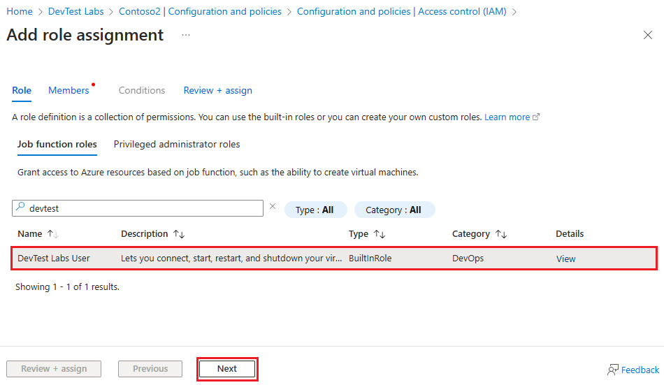

# Add lab owners, contributors, and users in Azure DevTest Labs 

Azure DevTest Labs uses Azure [role-based access control](../role-based-access-control/overview.md) (Azure RBAC) to define roles that have only the access necessary to do specific lab tasks. DevTest Labs has three built-in roles: *Owner*, *Contributor*, and *DevTest Labs User*. This article describes the tasks each role can do, and how to add members to lab roles by using the Azure portal or an Azure PowerShell script.

## Actions each role can take

Lab Owner, Contributor, and DevTest Labs User roles can take the following actions in DevTest Labs:

### Owner

The lab Owner role can take all of the following actions:

Lab tasks:
- Add users to the lab.
- Update cost settings.

Virtual machine (VM) base tasks:
- Add and remove custom images.
- Add, update, and delete formulas.
- Enable Marketplace images.

VM tasks:
- Create VMs.
- Start, stop, or delete VMs.
- Update VM policies.
- Add or remove VM data disks.

Artifact tasks:
- Add and remove artifact repositories.
- Apply artifacts to VMs.

### Contributor

The lab Contributor role can take all the same actions as lab Owner, except can't add users to labs.

### DevTest Labs User

The DevTest Labs User role can take the following actions in DevTest Labs:

- Add, update, and delete VM base formulas.
- Create VMs.
- Start, stop, or delete VMs the user creates.
- Add or remove data disks from VMs the user creates.
- Apply artifacts to VMs.

> [!NOTE]
> Lab users automatically have the **Owner** role on VMs they create.

## Add Owners, Contributors, or DevTest Labs Users

A lab owner can add members to lab roles by using the Azure portal or an Azure PowerShell script. The user to add can be an external user with a valid [Microsoft account (MSA)](/windows-server/identity/ad-ds/manage/understand-microsoft-accounts).

Azure permissions propagate from parent scope to child scope. Owners of an Azure subscription that contains labs are automatically owners of the subscription's DevTest Labs service, labs, and lab VMs and resources. Subscription owners can add Owners, Contributors, and DevTest Labs Users to labs in the subscription.

> [!NOTE]
> Added lab Owners' scope of administration is narrower than the subscription owner's scope. Added Owners don't have full access to some resources that the DevTest Labs service creates.

### Prerequisites

To add members to a lab, you must:

- Be an Owner of the lab, either directly or by inheritance as a subscription owner.
- Sign in to the [Azure portal](https://portal.azure.com) as an [Owner](../role-based-access-control/built-in-roles.md#owner) or [User Access Administrator](../role-based-access-control/built-in-roles.md#user-access-administrator).

### Add a lab member by using the Azure portal

To add a member:

- At the subscription level, open the subscription page.
- At the lab level, open the resource group that has the lab, and select the lab from the list of resources.

1. In the left navigation for the subscription or lab, select **Access control (IAM)**.

1. Select **Add** > **Add role assignment**.

   

1. On the **Add Role Assignment** page, select the **Owner**, **Contributor**, or **DevTest Labs User** role, and then select **Next**.

   

1. On the **Members** tab, select **Select members**.

1. On the **Select members** screen, select the member you want to add, and then select **Select**.

1. Select **Review + assign**, and after reviewing the details, select **Review + assign** again.

<a name="add-an-external-user-to-a-lab-using-powershell"></a>
### Add a DevTest Labs User to a lab by using Azure PowerShell

[!INCLUDE [updated-for-az](../../includes/updated-for-az.md)]

You can add a DevTest Labs User to a lab by using the following Azure PowerShell script. The script requires the user to be in the Azure Active Directory (Azure AD). For information about adding an external user to Azure AD as a guest, see [Add a new guest user](../active-directory/fundamentals/add-users-azure-active-directory.md#add-a-new-guest-user). If the user isn't in Azure AD, use the portal procedure instead.

In the following script, update the parameter values under the `# Values to change` comment. You can get the `subscriptionId`, `labResourceGroup`, and `labName` values from the lab's main page in the Azure portal.

```azurepowershell
# Add an external user to a lab user role in DevTest Labs.
# Make sure the guest user is added to Azure AD.

# Values to change
$subscriptionId = "<Azure subscription ID>"
$labResourceGroup = "<Lab's resource group name>"
$labName = "<Lab name>"
$userDisplayName = "<User's display name>"

# Log into your Azure account.
Connect-AzAccount

# Select the Azure subscription that contains the lab. This step is optional if you have only one subscription.
Select-AzSubscription -SubscriptionId $subscriptionId

# Get the user object.
$adObject = Get-AzADUser -SearchString $userDisplayName

# Create the role assignment. 
$labId = ('subscriptions/' + $subscriptionId + '/resourceGroups/' + $labResourceGroup + '/providers/Microsoft.DevTestLab/labs/' + $labName)
New-AzRoleAssignment -ObjectId $adObject.Id -RoleDefinitionName 'DevTest Labs User' -Scope $labId
```

## Next steps

- [Customize permissions with custom roles](devtest-lab-grant-user-permissions-to-specific-lab-policies.md)
- [Automate adding lab users](automate-add-lab-user.md)