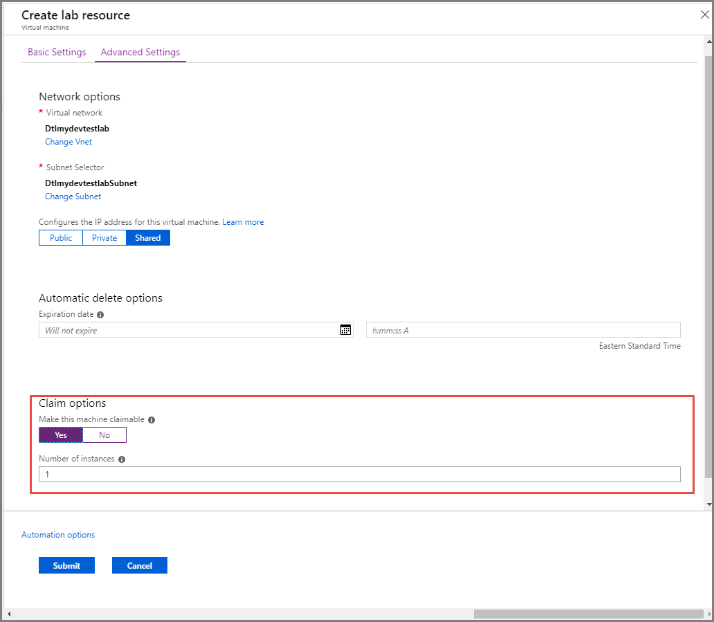

# Add a VM to a lab in Azure DevTest Labs
If you have already [created your first VM](tutorial-create-custom-lab.md#add-a-vm-to-the-lab), you likely did so from a pre-loaded [marketplace image](devtest-lab-configure-marketplace-images.md). Now, if you want to add subsequent VMs to your lab, you can also choose a *base* that is either a [custom image](devtest-lab-create-template.md) or a [formula](devtest-lab-manage-formulas.md). This tutorial walks you through using the Azure portal to add a VM to a lab in DevTest Labs.

This article also shows you how to manage the artifacts for a VM in your lab.

## Steps to add a VM to a lab in Azure DevTest Labs
1. Sign in to the [Azure portal](https://go.microsoft.com/fwlink/p/?LinkID=525040).
1. Select **All Services**, and then select **DevTest Labs** in the **DEVOPS** section. If you select * (star) next to **DevTest Labs** in the **DEVOPS** section. This action adds **DevTest Labs** to the left navigational menu so that you can access it easily the next time. Then, you can select **DevTest Labs** on the left navigational menu.

    
1. From the list of labs, select the lab in which you want to create the VM.
2. On the lab's **Overview** page, select **+ Add**.

    
1. On the **Choose a base** page, select a marketplace image for the VM.
1. On the **Basic Settings** tab of the **Virtual machine** page, do the following actions:
    1. Enter a name for the VM in the **Virtual machine name** text box. The text box is pre-filled for you with a unique auto-generated name. The name corresponds to the user name within your email address followed by a unique 3-digit number. This feature saves you the time to think of a machine name and type it every time you create a machine. You can override this auto-filled field with a name of your choice if you wish to. To override the auto-filled name for the VM, enter a name in the **Virtual machine name** text box.
    2. Enter a **User Name** that is granted administrator privileges on the virtual machine. The **user name** for the machine is pre-filled with a unique auto-generated name. The name corresponds to the user name within your email address. This feature saves you the time to decide on a username every time you create a new machine. Again, you can override this auto-filled field with a username of your choice if you wish to. To override the auto-filled value for user name, enter a value in the **User Name** text box. This user is granted **administrator** privileges on the virtual machine.
    3. If you are creating first VM in the lab, enter a **password** for the user. To save this password as a default password in the Azure key vault associated with the lab, select **Save as default password**. The default password is saved in the key vault with the name: **VmPassword**. When you try to create subsequent VMs in the lab, **VmPassword** is automatically selected for the **password**. To override the value, clear the **Use a saved secret** check box, and enter a password.

        

        You can also save secrets in the key vault first and then use it while creating a VM in the lab. For more information, see [Store secrets in a key vault](devtest-lab-store-secrets-in-key-vault.md). To use the password stored in the key vault, select **Use a saved secret**, and specify a key value that corresponds to your secret (password).
    4. In the **More options** section, select **Change size**. Select one of the predefined items that specify the processor cores, RAM size, and the hard drive size of the VM to create.
    5. Select **Add or Remove Artifacts**. Select and configure the artifacts that you want to add to the base image.
    **Note:** If you're new to DevTest Labs or configuring artifacts, refer to the [Add an existing artifact to a VM](./devtest-lab-add-vm.md#add-an-existing-artifact-to-a-vm) section, and then return here when finished.
2. Switch to the **Advanced Settings** tab at the top, and do the following actions:
    1. To change the virtual network that the VM is in, select **Change VNet**.
    2. To change the subnet, select **Change subnet**.
    3. Specify whether the IP address of the VM is **public, private, or shared**.
    4. To automatically delete the VM, specify the **expiration date and time**.
    5. To make the VM claimable by a lab user, select **Yes** for **Make this machine claimable** option.
    6. Specify the number of the **instances of VM** that you want to make it available to your lab users.

        
1. Select **Create** to add the specified VM to the lab.

   The lab page displays the status of the VM's creation - first as **Creating**, then as **Running** after the VM has been started.

    

## Add an existing artifact to a VM
While creating a VM, you can add existing artifacts. Each lab includes artifacts from the Public DevTest Labs Artifact Repository as
well as artifacts that you've created and added to your own Artifact Repository.

* Azure DevTest Labs *artifacts* let you specify *actions* that are performed when the VM is provisioned, such as running Windows PowerShell scripts, running Bash commands, and installing software.
* Artifact *parameters* let you customize the artifact for your particular scenario

To discover how to create artifacts, see the article, [Learn how to author your own artifacts for use with DevTest Labs](devtest-lab-artifact-author.md).

1. Sign in to the [Azure portal](https://go.microsoft.com/fwlink/p/?LinkID=525040).
1. Select **All Services**, and then select **DevTest Labs** from the list.
1. From the list of labs, select the lab containing the VM with which you want to work.
1. Select **My virtual machines**.
1. Select the desired VM.
1. Select **Manage artifacts**.
1. Select **Apply artifacts**.
1. On the **Apply artifacts** pane, select the artifact you wish to add to the VM.
1. On the **Add artifact** pane, enter the required parameter values and any optional parameters that you need.
1. Select **Add** to add the artifact and return to the **Apply artifacts** pane.
1. Continue adding artifacts as needed for your VM.
1. Once you've added your artifacts, you can [change the order in which the artifacts are run](#change-the-order-in-which-artifacts-are-run). You can also go back to [view or modify an artifact](#view-or-modify-an-artifact).
1. When you're done adding artifacts, select **Apply**

## Change the order in which artifacts are run
By default, the actions of the artifacts are executed in the order in which they are added to the VM.
The following steps illustrate how to change the order in which the artifacts are run.

1. At the top of the **Apply artifacts** pane, select the link indicating the number of artifacts that have been added to the VM.

    
1. On the **Selected artifacts** pane, drag and drop the artifacts into the desired order. **Note:** If you have trouble dragging the artifact, make sure that you are dragging from the left side of the artifact.
1. Select **OK** when done.

## View or modify an artifact
The following steps illustrate how to view or modify the parameters of an artifact:

1. At the top of the **Apply artifacts** pane, select the link indicating the number of artifacts that have been added to the VM.

    
1. On the **Selected artifacts** pane, select the artifact that you want to view or edit.
1. On the **Add artifact** pane, make any needed changes, and select **OK** to close the **Add artifact** pane.
1. Select **OK** to close the **Selected artifacts** pane.

## Save Azure Resource Manager template
An Azure Resource Manager template provides a declarative way to define a repeatable deployment.
The following steps explain how to save the Azure Resource Manager template for the VM being created.
Once saved, you can use the Azure Resource Manager template to [deploy new VMs with Azure PowerShell](../azure-resource-manager/templates/overview.md).

1. On the **Virtual machine** pane, select **View Azure Resource Manager Template**.
2. On the **View Azure Resource Manager template** pane, select the template text.
3. Copy the selected text to the clipboard.
4. Select **OK** to close the **View Azure Resource Manager Template pane**.
5. Open a text editor.
6. Paste in the template text from the clipboard.
7. Save the file for later use.

[!INCLUDE [devtest-lab-try-it-out](../../includes/devtest-lab-try-it-out.md)]

## Next steps
* Once the VM has been created, you can connect to the VM by selecting **Connect** on the VM's pane.
* Learn how to [create custom artifacts for your DevTest Labs VM](devtest-lab-artifact-author.md).
* Explore the [DevTest Labs Azure Resource Manager QuickStart template gallery](https://github.com/Azure/azure-devtestlab/tree/master/samples/DevTestLabs/QuickStartTemplates).
