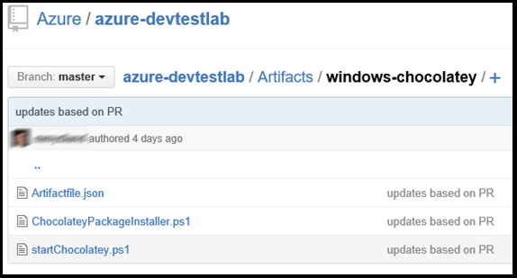

# Create custom artifacts for your DevTest Labs virtual machine

Watch the following video for an overview of the steps described in this article:

> [!VIDEO https://channel9.msdn.com/Blogs/Azure/how-to-author-custom-artifacts/player]
>
>

## Overview
You can use *artifacts* to deploy and set up your application after you provision a VM. An artifact consists of an artifact definition file and other script files that are stored in a folder in a Git repository. Artifact definition files consist of JSON and expressions that you can use to specify what you want to install on a VM. For example, you can define the name of an artifact, a command to run, and parameters that are available when the command is run. You can refer to other script files within the artifact definition file by name.

## Artifact definition file format
The following example shows the sections that make up the basic structure of a definition file:

    {
      "$schema": "https://raw.githubusercontent.com/Azure/azure-devtestlab/master/schemas/2016-11-28/dtlArtifacts.json",
      "title": "",
      "description": "",
      "iconUri": "",
      "targetOsType": "",
      "parameters": {
        "<parameterName>": {
          "type": "",
          "displayName": "",
          "description": ""
        }
      },
      "runCommand": {
        "commandToExecute": ""
      }
    }

| Element name | Required? | Description |
| --- | --- | --- |
| $schema |No |Location of the JSON schema file. The JSON schema file can help you test the validity of the definition file. |
| title |Yes |Name of the artifact displayed in the lab. |
| description |Yes |Description of the artifact displayed in the lab. |
| iconUri |No |URI of the icon displayed in the lab. |
| targetOsType |Yes |Operating system of the VM where the artifact is installed. Supported options are Windows and Linux. |
| parameters |No |Values that are provided when the artifact install command is run on a machine. This helps you customize your artifact. |
| runCommand |Yes |Artifact install command that is executed on a VM. |

### Artifact parameters
In the parameters section of the definition file, specify which values a user can input when they install an artifact. You can refer to these values in the artifact install command.

To define parameters, use the following structure:

    "parameters": {
      "<parameterName>": {
        "type": "<type-of-parameter-value>",
        "displayName": "<display-name-of-parameter>",
        "description": "<description-of-parameter>"
      }
    }

| Element name | Required? | Description |
| --- | --- | --- |
| type |Yes |Type of parameter value. See the following list for the allowed types. |
| displayName |Yes |Name of the parameter that is displayed to a user in the lab. |
| description |Yes |Description of the parameter that is displayed in the lab. |

Allowed types are:

* string (any valid JSON string)
* int (any valid JSON integer)
* bool (any valid JSON Boolean)
* array (any valid JSON array)

## Secrets as secure strings
Declare secrets as secure strings. Here is the syntax for declaring a secure string parameter within the `parameters` section of the **artifactfile.json** file:

```json

    "securestringParam": {
      "type": "securestring",
      "displayName": "Secure String Parameter",
      "description": "Any text string is allowed, including spaces, and will be presented in UI as masked characters.",
      "allowEmpty": false
    },
```

For the artifact install command, run the PowerShell script that takes the secure string created by using the ConvertTo-SecureString command. 

```json
  "runCommand": {
    "commandToExecute": "[concat('powershell.exe -ExecutionPolicy bypass \"& ./artifact.ps1 -StringParam ''', parameters('stringParam'), ''' -SecureStringParam (ConvertTo-SecureString ''', parameters('securestringParam'), ''' -AsPlainText -Force) -IntParam ', parameters('intParam'), ' -BoolParam:$', parameters('boolParam'), ' -FileContentsParam ''', parameters('fileContentsParam'), ''' -ExtraLogLines ', parameters('extraLogLines'), ' -ForceFail:$', parameters('forceFail'), '\"')]"
  }
```

For the complete example artifactfile.json and the artifact.ps1 (PowerShell script), see [this sample on GitHub](https://github.com/Azure/azure-devtestlab/tree/master/Artifacts/windows-test-paramtypes).

Another important point to note is not to log secrets to the console as output is captured for user debugging. 

## Artifact expressions and functions
You can use expressions and functions to construct the artifact install command.
Expressions are enclosed with brackets ([ and ]), and are evaluated when the artifact is installed. Expressions can appear anywhere in a JSON string value. Expressions always return another JSON value. If you need to use a literal string that starts with a bracket ([), you must use two brackets ([[).
Typically, you use expressions with functions to construct a value. Just like in JavaScript, function calls are formatted as **functionName(arg1, arg2, arg3)**.

The following list shows common functions:

* **parameters(parameterName)**: Returns a parameter value that is provided when the artifact command is run.
* **concat(arg1, arg2, arg3,….. )**: Combines multiple string values. This function can take a variety of arguments.

The following example shows how to use expressions and functions to construct a value:

    runCommand": {
        "commandToExecute": "[concat('powershell.exe -ExecutionPolicy bypass \"& ./startChocolatey.ps1'
    , ' -RawPackagesList ', parameters('packages')
    , ' -Username ', parameters('installUsername')
    , ' -Password ', parameters('installPassword'))]"
    }

## Create a custom artifact

1. Install a JSON editor. You need a JSON editor to work with artifact definition files. We recommend using [Visual Studio Code](https://code.visualstudio.com/), which is available for Windows, Linux, and OS X.
2. Get a sample artifactfile.json definition file. Check out the artifacts created by the DevTest Labs team in our [GitHub repository](https://github.com/Azure/azure-devtestlab). We have created a rich library of artifacts that can help you create your own artifacts. Download an artifact definition file and make changes to it to create your own artifacts.
3. Make use of IntelliSense. Use IntelliSense to see valid elements that you can use to construct an artifact definition file. You also can see the different options for values of an element. For example, when you edit the **targetOsType** element, IntelliSense shows you two choices, for Windows or Linux.
4. Store the artifact in the [public Git repository for DevTest Labs](https://github.com/Azure/azure-devtestlab/tree/master/Artifacts) or [your own Git repository](devtest-lab-add-artifact-repo.md). In the public repository, you can view artifacts shared by others that you can use directly or customize them to suit your needs.
   
   1. Create a separate directory for each artifact. The directory name should be the same as the artifact name.
   2. Store the artifact definition file (artifactfile.json) in the directory that you created.
   3. Store the scripts that are referenced from the artifact install command.
      
      Here is an example of how an artifact folder might look:
      
      
5. If you are using your own repository to store artifacts, add the repository to the lab by following instructions in the article: [Add a Git repository for artifacts and templates](devtest-lab-add-artifact-repo.md).

## Related articles
* [How to diagnose artifact failures in DevTest Labs](devtest-lab-troubleshoot-artifact-failure.md)
* [Join a VM to an existing Active Directory domain by using a Resource Manager template in DevTest Labs](https://www.visualstudiogeeks.com/blog/DevOps/Join-a-VM-to-existing-AD-domain-using-ARM-template-AzureDevTestLabs)

## Next steps
* Learn how to [add a Git artifact repository to a lab](devtest-lab-add-artifact-repo.md).
