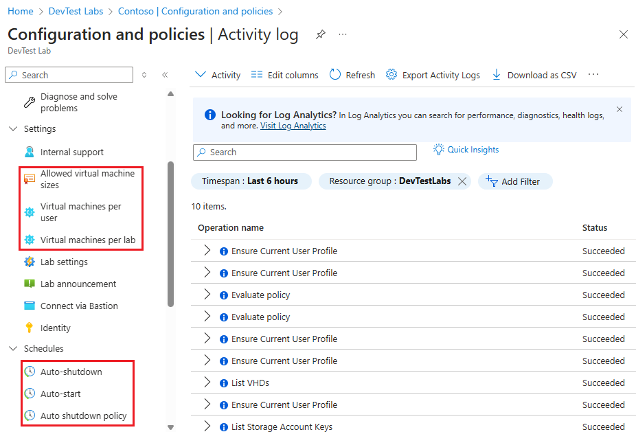
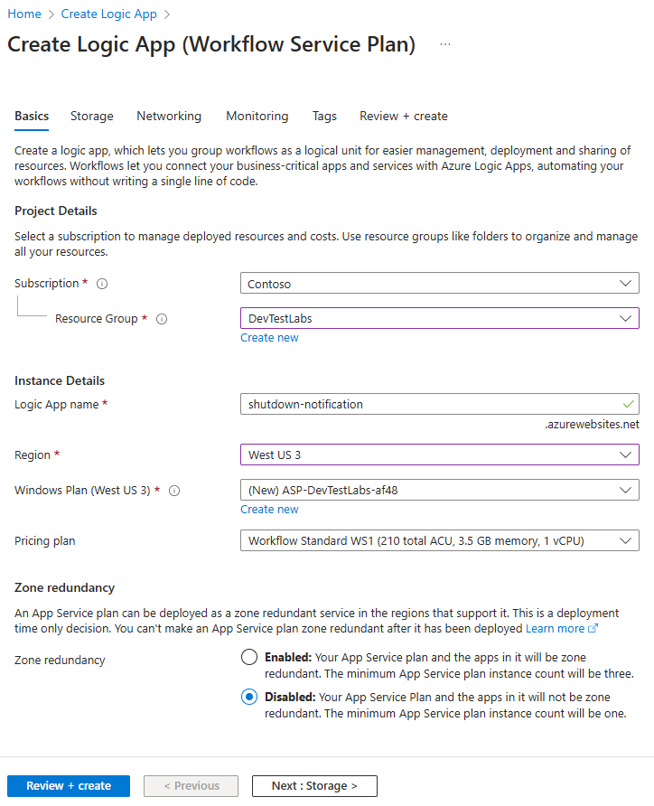
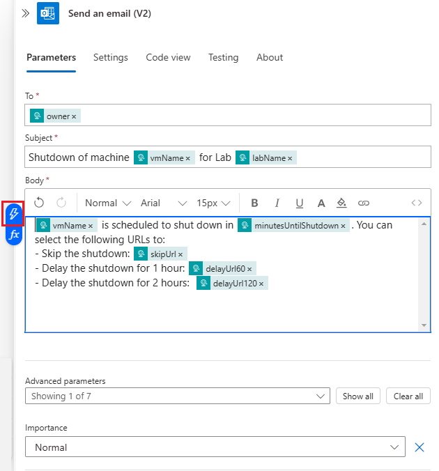

# Configure autoshutdown for lab and compute virtual machines in Azure DevTest Labs

This article explains how to configure autoshutdown settings for lab VMs in DevTest Labs and compute VMs. 

## Configure autoshutdown for lab VMs (DevTest Labs)
Azure DevTest Labs enables you to control cost and minimize waste in your labs by managing policies (settings) for each lab. This article shows you how to configure autoshutdown policy for a lab account and configure autoshutdown settings for a lab in the lab account. To view how to set every lab policy, see [Define lab policies in Azure DevTest Labs](devtest-lab-set-lab-policy.md).  

### Set auto shutdown policy for a lab
As a lab owner, you can configure a shutdown schedule for all the VMs in your lab. By doing so, you can save costs from running machines that aren't being used (idle). You can enforce a shutdown policy on all your lab VMs centrally but also save your lab users the effort from setting up a schedule for their individual machines. This feature enables you to set the policy on your lab schedule starting from offering no control to full control, to your lab users. As a lab owner, you can configure this policy by taking the following steps:

1. On the home page for your lab, select **Configuration and policies**.
2. Select **Auto shutdown policy** in the **Schedules** section of the left menu.
3. Select one of the options. The following sections give you more details about these options: The set policy applies only to new VMs created in the lab and not to the already existing VMs. 

    

### Configure auto shutdown settings
The autoshutdown policy helps to minimize lab waste by allowing you to specify the time that this lab's VMs shut down.

To view (and change) the policies for a lab, follow these steps:

1. Sign in to the [Azure portal](https://portal.azure.com).
2. Select **All services**, and then select **DevTest Labs** from the list.
3. From the list of labs, select the desired lab.   
4. Select **Configuration and policies**.

    
5. On the lab's **Configuration and policies** pane, select **Auto-shutdown** under **Schedules**.
   
    
6. Select **On** to enable this policy, and **Off** to disable it.
7. If you enable this policy, specify the time (and time zone) to shut down all VMs in the current lab.
8. Specify **Yes** or **No** for the option to send a notification 30 minutes prior to the specified autoshutdown time. If you choose **Yes**, enter a webhook URL endpoint or email address specifying where you want the notification to be posted or sent. The user receives notification and is given the option to delay the shutdown. For more information, see the [Notifications](#notifications) section. 
9. Select **Save**.

    By default, once enabled, this policy applies to all VMs in the current lab. To remove this setting from a specific VM, open the VM's management pane and change its **Autoshutdown** setting.
    
> [!NOTE]
> If you update the autoshutdown schedule for your lab or a specific lab virtual machine within 30 mins of the current scheduled time, the updated shutdown time will apply towards the next day's schedule. 

### User sets a schedule and can opt out
If you set your lab to this policy, the lab users can override or opt out of the lab schedule. This option grants lab users full control over auto shutdown schedule of their VMs. Lab users see no change in their VM auto shutdown schedule page.


### User sets a schedule and cannot opt out
If you set your lab to this policy, lab users can override the lab schedule. However, they can't opt out of auto shutdown policy. This option makes sure that every machine in your lab is under an auto shutdown schedule. Lab users can update auto shutdown schedule of their VMs, and set up shut down notifications.


### User has no control over the schedule set by lab admin
If you set your lab to this policy, lab users can't override or opt out of the lab schedule. This option offers lab admin the complete control on the schedule for every machine in the lab. Lab users can only set up auto shutdown notifications for their VMs.


### Notifications
Once autoshutdown set up by the lab owner, notifications will be sent to the lab users 30 minutes before the autoshutdown triggered if any of their VMs will be affected. This option gives lab users a chance to save their work before the shutdown. The notification also provides links for each VM for the following actions:

- Skip the autoshutdown for this time
- Snooze the autoshutdown for an hour or 2 hours, so that they can keep working on the VM.

Notification is sent through the configured web hook endpoint or an email address specified by lab owners in the autoshutdown settings. Webhooks allow you to build or set up integrations that subscribe to certain events. When one of those events is triggered, DevTest Labs will send an HTTP POST payload to the webhook's configured URL. For more information about webhooks, see [Create a webhook or API Azure Function](../azure-functions/functions-create-a-web-hook-or-api-function.md). 

We recommend you to use web hooks because they're extensively supported by various apps (for example, Slack, Azure Logic Apps, and so on.) and allows you to implement your own way for sending notifications. As an example, this article walks you through how to get autoshutdown notification from emails by using Azure Logic Apps. First, let's quickly go through the basic steps to enable autoshutdown notification in your lab.   

### Create a logic app that receives email notifications
[Azure Logic Apps](../logic-apps/logic-apps-overview.md) provides many out-of-the-box connectors that makes it easy to integrate a service with other clients, like Office 365 and twitter. At the high level, the steps to set up a Logic App for email notification can be divided into four phases: 

- Create a logic app. 
- Configure the built-in template.
- Integrate with your email client
- Get the Webhook URL.

### Create a logic app
To get started, create a logic app in your Azure subscription by using the following steps:

1. Select **+ Create a resource** on the left menu, select **Integration**, and select **Logic App**. 

    
2. On the **Logic App - Create** page, follow these steps: 
    1. Enter a **name** for the logic app.
    2. Select your Azure **subscription**.
    3. Create a new **resource group** or select an existing resource group. 
    4. Select a **location** for the logic app. 

        
3. In the **Notifications**, select **Go to resource** on the notification. 

    
4. Select **Logic app designer** under **Deployment Tools** category.

    
5. On the **HTTP Request-Response** page, select **Use this template**. 

    
6. Copy the following JSON into the **Request Body JSON Schema** section: 

    ```json
    {
    	"$schema": "http://json-schema.org/draft-04/schema#",
    	"properties": {
    		"delayUrl120": {
    			"type": "string"
    		},
    		"delayUrl60": {
    			"type": "string"
    		},
    		"eventType": {
    			"type": "string"
    		},
    		"guid": {
    			"type": "string"
    		},
    		"labName": {
    			"type": "string"
    		},
    		"owner": {
    			"type": "string"
    		},
    		"resourceGroupName": {
    			"type": "string"
    		},
    		"skipUrl": {
    			"type": "string"
    		},
    		"subscriptionId": {
    			"type": "string"
    		},
    		"text": {
    			"type": "string"
    		},
    		"vmName": {
    			"type": "string"
    		}
    	},
    	"required": [
    		"skipUrl",
    		"delayUrl60",
    		"delayUrl120",
    		"vmName",
    		"guid",
    		"owner",
    		"eventType",
    		"text",
    		"subscriptionId",
    		"resourceGroupName",
    		"labName"
    	],
    	"type": "object"
    }
    ```
    
    
7. Select **+ New step** in the designer, and follow these steps:
    1. Search for **Office 365 Outlook - Send an email**. 
    2. Select **Send an email** from **Actions**. 
    
        
    3. Select **Sign in** to sign into your email account. 
    4. Select **TO** field, and choose owner.
    5. Select **SUBJECT**, and input a subject of the email notification. For example: "Shutdown of machine vmName for Lab: labName."
    6. Select **BODY**, and define the body content for email notification. For example: "vmName is scheduled to shut down in 15 minutes. Skip this shutdown by clicking: URL. Delay shutdown for an hour: delayUrl60. Delay shutdown for 2 hours: delayUrl120."

        
1. Select **Save** on the toolbar. Now, you can copy the **HTTP POST URL**. Select the copy button to copy the URL to the clipboard. 

    

## Configure autoshutdown for compute VMs

1. On the **Virtual machine** page, select **Auto-shutdown** on the left menu in the **Operations** section. 
2. On the **Auto-shutdown** page, select **On** to enable this policy, and **Off** to disable it.
3. If you enable this policy, specify the **time** (and **time zone**) at which the VM should be shut down.
4. Specify **Yes** or **No** for the option to send a notification 30 minutes prior to the specified autoshutdown time. If you choose **Yes**, enter a webhook URL endpoint or email address specifying where you want the notification to be posted or sent. The user receives notification and is given the option to delay the shutdown. For more information, see the [Notifications](#notifications) section. 
9. Select **Save**.

    

### View activity logs for auto shutdown updates
When you update the autoshutdown setting, you will see the activity logged in the activity log for the VM. 

1. In the [Azure portal](https://portal.azure.com), navigate to the home page for your VM.
2. Select **Activity log** from the left menu. 
3. Remove **Resource: mycomputevm** from filters.
3. Confirm that you see the **Add or modify schedules** operation in the activity log. If you don't see it, wait for sometime and refresh the activity log.

    
4. Select the **Add or modify schedules** operation to see the following information on the **Summary** page:

    - Operation name (Add or modify schedules)
    - The date and time at which the autoshutdown setting was updated.
    - The email address of the user who updated the setting. 

        
5. Switch to the **Change history** tab in the **Add or modify schedules** page, you see the change history for the setting. In the following example, the shutdown time was changed from 7 PM to 6 PM on April 10, 2020 at 15:18:47 EST. And, the setting was disabled at 15:25:09 EST. 

    
6. To see more details about the operation, switch to the **JSON** tab in the **Add or modify schedules** page.

## Next steps
To learn how to set all policies, see [Define lab policies in Azure DevTest Labs](devtest-lab-set-lab-policy.md).

