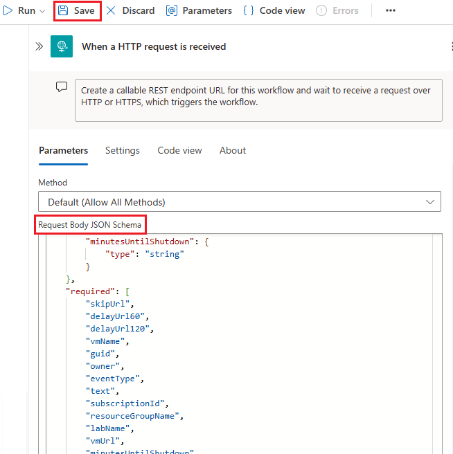
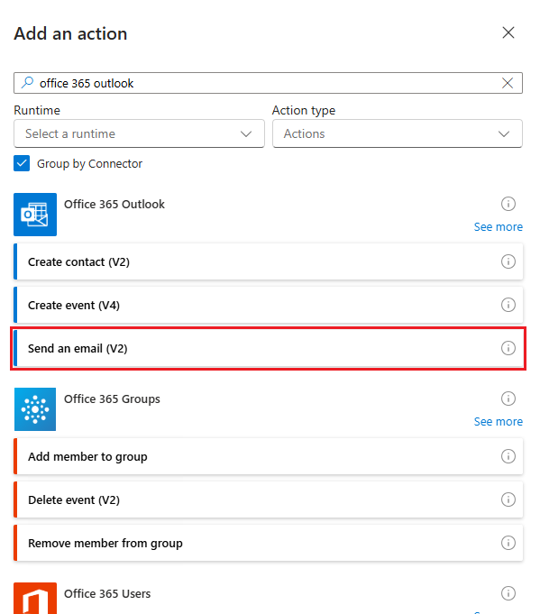
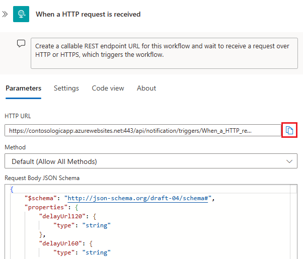

# Configure auto shutdown schedule and policy for Azure virtual machines in DevTest Labs

Azure DevTest Labs enables you to control cost in your labs by managing policies for each lab. This article shows you how to configure an auto shutdown policy for Azure virtual machines (VMs) at the lab level. It also shows how to configure auto shutdown settings for VMs at the individual level within the defined policy. To view how to set every lab policy, see [Define lab policies in Azure DevTest Labs](devtest-lab-set-lab-policy.md).

## Configure auto-shutdown schedule

As a lab owner, you can configure a shutdown schedule for the VMs in your lab. The auto-shutdown schedule minimizes lab waste by allowing you to specify the time that the lab's VMs are shut down. Auto-shutdown schedule updates within 30 minutes of the current schedule will apply towards the next day's schedule.

To view or change the lab schedule:

1. Sign in to the [Azure portal](https://portal.azure.com/).

1. Navigate to your lab in **DevTest Labs**.

1. Under **Settings**, select **Configuration and policies**.

   :::image type="content" source="./media/devtest-lab-auto-shutdown/portal-lab-configuration-policies.png" alt-text="Screenshot of the DevTest Labs home page.":::

1. On the **Configuration and policies** page, under **Schedules**, select **Auto-shutdown**.

1. Configure the following properties:

    |Property | Description |
    |---|---|
    |Enabled| Select **On** to enable this policy, or **Off** to disable it.|
    |Scheduled shutdown| Enter a time to shut down all VMs in the current lab.|
    |Time zone| Select a time zone from the drop-down list.|
    |Send notification before auto-shutdown? | Select **Yes** or **No** to send a notification 30 minutes before the specified auto-shutdown time. If you choose **Yes**, enter a webhook URL endpoint or email address specifying where you want the notification to be posted or sent. The user receives notification and is given the option to delay the shutdown. For more information, see [Notifications](#notifications), below.|
    |Webhook URL| A notification will be posted to the specified webhook endpoint when the auto-shutdown is about to happen.|
    |Email address| Enter a set of semicolon-delimited email addresses to receive alert notification emails.|

   :::image type="content" source="./media/devtest-lab-auto-shutdown/auto-shutdown.png" alt-text="Screenshot of auto-shutdown schedule details.":::
 
1. Select **Save**.  By default, the enabled policy applies to all VMs in the current lab. To modify the schedule for an individual VM, see [Configure auto shutdown for individual VMs](#configure-auto-shutdown-for-individual-vms), below.

## Configure auto shutdown policy

You can enforce a shutdown policy on all your lab VMs centrally and also save your lab users the effort from setting up a schedule for their individual machines. Configure this policy by taking the following steps:

1. Sign in to the [Azure portal](https://portal.azure.com/).

1. Navigate to your lab in **DevTest Labs**.

1. Under **Settings**, select **Configuration and policies**.

1. On the **Configuration and policies** page, under **Schedules**, select **Auto shutdown policy**.

1. Select the level of control lab users will have over their individual VM's shutdown schedule. 

    | Level of control | Description |
    |----|----|
    |User sets a schedule and can opt out| Lab users can override or opt out of the lab schedule. This option grants lab users full control over the auto shutdown schedule of their VMs.|
    |User sets a schedule and cannot opt out| Lab users can override the lab schedule. However, they can't opt out of the auto shutdown policy. This option ensures that every machine in your lab is under an auto shutdown schedule. Lab users can also modify shutdown notifications.|
    |User has no control over the schedule set by lab administrator| Lab users can't override or opt out of the lab schedule. This option offers the lab admin the complete control on the schedule for every machine in the lab.|

   :::image type="content" source="./media/devtest-lab-auto-shutdown/auto-shutdown-policy-options.png" alt-text="Screenshot of auto shutdown policy options.":::

1. Select **Save**. Changes to the shutdown policy only apply to new VMs created in the lab and not to existing VMs.

## Configure auto shutdown for individual VMs

1. Navigate to your lab in **DevTest Labs**.

1. Under **My Lab**, select **My Virtual machines**. Then select a virtual machine.

   :::image type="content" source="./media/devtest-lab-auto-shutdown/portal-lab-virtual-machines.png" alt-text="Screenshot of list of virtual machines.":::

1. On the **virtual machine** page, under **Operations**, select **Auto-shutdown**.

   :::image type="content" source="./media/devtest-lab-auto-shutdown/virtual-machines-autho-shutdown.png" alt-text="Screenshot of virtual machines home page.":::

1. The configurations are the same as described in [Configure auto-shutdown schedule](#configure-auto-shutdown-schedule), above. The auto shutdown policy determines the lab user's ability to modify the configurations as described in [Configure auto shutdown policy](#configure-auto-shutdown-policy), above. 

## View activity logs for auto shutdown updates

When you update the auto shutdown schedule or policy, you'll see the history in the VM's [Activity log](../azure-monitor/essentials/activity-log.md). When searching, remove the lab's resource group and add [Filter](../azure-monitor/essentials/activity-log.md#view-the-activity-log) **Operation**: for `Add or modify policies` and `Add or modify schedules`.

## Notifications

Once auto shutdown is configured, notifications will be sent to the lab users 30 minutes before their VMs will be affected. This option gives lab users a chance to save their work before the shutdown. The notification also provides links for each VM in case someone needs to keep working on their VM. The user will have the following choices:

- Skip the auto shutdown for this time
- Snooze the auto shutdown for an hour
- Snooze the auto shutdown for two hours

The Notification is sent to the webhook url if a webhook was specified.  If an email address was specified, an email will be sent to that email address. Webhooks allow you to build or set up integrations that subscribe to certain events. When one of those events is triggered, DevTest Labs will send an HTTP POST payload to the webhook's configured URL. For more information about responding to webhooks, see [Azure Functions HTTP triggers and bindings overview](../azure-functions/functions-bindings-http-webhook.md) or [adding an HTTP trigger for Azure Logic Apps](../connectors/connectors-native-http.md#add-an-http-trigger).

We recommend you to use webhooks because they're extensively supported by various apps like Azure Logic Apps and Slack.  Webhooks allow you to implement your own way for sending notifications. As an example, this article walks you through how to configure an auto shutdown email notification to the VM owner by using Azure Logic Apps. First, let's quickly go through the basic steps to enable auto shutdown notification in your lab.

## Create a logic app that sends email notifications

[Azure Logic Apps](../logic-apps/logic-apps-overview.md) provides connectors to integrate a service with other clients, like Office 365 and Twitter. At a high level, setting up a Logic App for email notification can be divided into four phases:

- Create a logic app.
- Configure the built-in template.
- Integrate with your email client
- Get the Webhook URL.

### Create a logic app

To get started, create a logic app in your Azure subscription by using the following steps:

1. Select **+ Create a resource** on the left menu, select **Integration**, and select **Logic App**.

    
2. On the **Logic App - Create** page, follow these steps:
    1. Enter a **name** for the logic app.
    2. Select your Azure **subscription**.
    3. Create a new **resource group** or select an existing resource group.
    4. Select a **location** for the logic app.

        

3. In the **Notifications**, select **Go to resource** on the notification.

    
4. Select **Logic app designer** under **Deployment Tools** category.

    
5. On the **HTTP Request-Response** page, select **Use this template**.

    
6. Copy the following JSON into the **Request Body JSON Schema** section:

    ```json
    {
        "$schema": "http://json-schema.org/draft-04/schema#",
        "properties": {
            "delayUrl120": {
                "type": "string"
            },
            "delayUrl60": {
                "type": "string"
            },
            "eventType": {
                "type": "string"
            },
            "guid": {
                "type": "string"
            },
            "labName": {
                "type": "string"
            },
            "owner": {
                "type": "string"
            },
            "resourceGroupName": {
                "type": "string"
            },
            "skipUrl": {
                "type": "string"
            },
            "subscriptionId": {
                "type": "string"
            },
            "text": {
                "type": "string"
            },
            "vmName": {
                "type": "string"
            },
            "vmUrl": {
                "type": "string"
            },
            "minutesUntilShutdown": {
                "type": "string"
            }
        },
        "required": [
            "skipUrl",
            "delayUrl60",
            "delayUrl120",
            "vmName",
            "guid",
            "owner",
            "eventType",
            "text",
            "subscriptionId",
            "resourceGroupName",
            "labName",
            "vmUrl",
            "minutesUntilShutdown"
        ],
        "type": "object"
    }
    ```

    

7. Select **+ New step** in the designer, and follow these steps:
    1. Search for **Office 365 Outlook - Send an email**.
    2. Select **Send an email** from **Actions**.

        

    3. Select **Sign in** to sign into your email account.
    4. Select **TO** field, and choose owner.
    5. Select **SUBJECT**, and input a subject of the email notification. For example: "Shutdown of machine vmName for Lab: labName."
    6. Select **BODY**, and define the body content for email notification. For example: "vmName is scheduled to shut down in 15 minutes. Skip this shutdown by clicking: URL. Delay shutdown for an hour: delayUrl60. Delay shutdown for 2 hours: delayUrl120."

        
8. Select **Save** on the toolbar. Now, you can copy the **HTTP POST URL**. Select the copy button to copy the URL to the clipboard.

    

## Next steps

To learn how to set all policies, see [Define lab policies in Azure DevTest Labs](devtest-lab-set-lab-policy.md).
