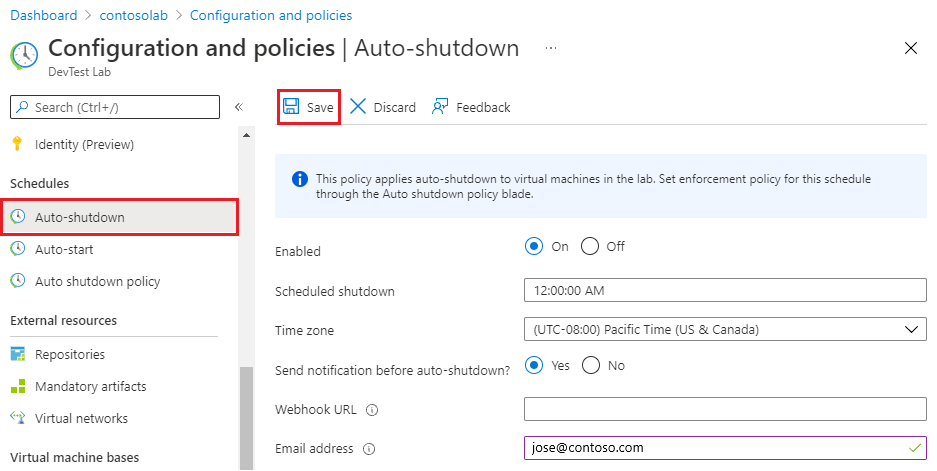
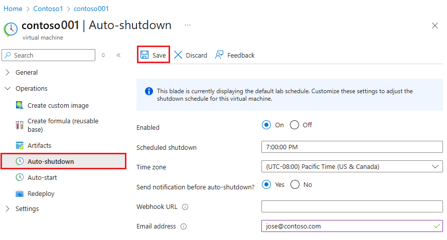

# Configure autoshutdown for DevTest Labs labs and VMs

As an Azure DevTest Labs lab owner, you can configure a shutdown schedule for all the virtual machines (VMs) in your lab. You save costs of running machines that aren't being used.

You can also set a central autoshutdown policy on all your lab VMs so lab users don't have to schedule autoshutdown for their individual machines. Autoshutdown policies range from allowing lab users to fully control their VM's shutdown schedules to allowing them no control over shutdown.

This article explains how to configure autoshutdown for DevTest Lab labs and for individual VMs. The article also describes how to set autoshutdown policies, and how to configure autoshutdown notifications.

## Configure lab autoshutdown settings

Autoshutdown helps minimize lab waste by shutting down a lab's VMs at a specific time daily. To view or change a lab's autoshutdown schedule, follow these steps:

1. On the home page for your lab, select **Configuration and policies**.
1. In the **Schedules** section of the left menu, select **Auto-shutdown**.
1. Select **On** to enable autoshutdown, or **Off** to disable it.
1. If you turned on autoshutdown, specify the time and time zone to shut down all VMs in the lab.
1. Select **Yes** or **No** for the option to send a notification 30 minutes before the specified autoshutdown time. If you choose **Yes**, enter a webhook URL endpoint or email address where you want the notification to post or be sent. For more information and instructions, see the [Autoshutdown notifications](#notifications) section.
1. Select **Save**.



By default, once enabled, this policy applies to all VMs in the current lab. To remove this setting from a specific VM, open the VM's management pane and change its **Auto-shutdown** setting.

> [!NOTE]
> If you update the autoshutdown schedule for your lab or a VM within 30 minutes of the previously scheduled shutdown time, the new shutdown time takes effect the next day.

## Configure VM autoshutdown settings

You can also set an autoshutdown schedule for an individual VM.

1. On the home page for the VM, in the **Operations** section on the left menu, select **Auto-shutdown**.
1. On the **Auto-shutdown** page, select **On** to enable autoshutdown, or **Off** to disable it.
1. If you turned on autoshutdown, specify the time and time zone to shut down the VM.
1. Select **Yes** or **No** for the option to send a notification 30 minutes before the specified autoshutdown time. If you choose **Yes**, enter a webhook URL endpoint or email address where you want the notification to post or be sent. For more information and instructions, see the [Autoshutdown notifications](#notifications) section.
1. Select **Save**.



### View activity logs for autoshutdown updates

When you update autoshutdown settings, you can see the activity logged in the activity log for the VM.

1. On the home page for the VM, select **Activity log** from the left menu.
1. Remove **Resource: \<vmname>** from filters.
1. Confirm that you see the **Add or modify schedules** operation in the activity log. If not, wait for some time and then refresh the activity log.

   

1. Select the **Add or modify schedules** operation to see a summary page showing the operation name, date and time, and the email address of the user who updated the setting.

   

1. Select **Change history (preview)** to see the change history for the setting. In the following example, the shutdown time was changed from 12 AM to 10 AM on Nov. 1, 2021 at 17:13:30 GMT, and the setting was disabled at 17:13:43 GMT.

   

1. To see more details about the operation, select the **JSON** tab.

## Set autoshutdown policy for a lab

As a lab owner, you can control cost and minimize waste in your labs by managing autoshutdown policy settings for your lab. To see how to set all lab policies, see [Define lab policies in Azure DevTest Labs](devtest-lab-set-lab-policy.md). 

> [!IMPORTANT]
> Autoshutdown policy changes apply only to new VMs created in the lab, not to the already existing VMs.

1. On the home page for your lab, select **Configuration and policies**.

1. In the **Schedules** section of the left menu, select **Auto shutdown policy**.

1. Select one of the options:

  

   - **User sets a schedule and can opt out**: Lab users can override or opt out of the lab schedule. This option grants lab users full control over their VMs' autoshutdown schedules. Lab users can set all the options on their VMs' autoshutdown schedule pages.

     

   - **User sets a schedule and cannot opt out**: Lab users can override the lab schedule, but they can't opt out of the autoshutdown policy. This option ensures that every lab VM is under an autoshutdown schedule. Lab users can update their VMs' autoshutdown schedules and set up shutdown notifications.

     

   - **User has no control over the schedule set by lab administrator**: Lab users can't override or opt out of the lab schedule. This option gives the lab administrator complete control of the schedule for all lab VMs. Lab users can only set up autoshutdown notifications for their VMs.

     

## Autoshutdown notifications

When you enable notifications in autoshutdown configuration, lab users receive a notification 30 minutes before autoshutdown if any of their VMs will be affected. The notification gives users a chance to save their work before the shutdown. The notification also provides links that allow the following actions for each VM if someone needs to keep working:

- Skip the autoshutdown this time
- Snooze the autoshutdown for an hour
- Snooze the autoshutdown for 2 hours

If an email address is specified in the autoshutdown settings, the notification sends to that email address. If a webhook is specified, the notification sends to the webhook URL.

Webhooks are extensively supported by apps like Azure Logic Apps and Slack. With webhooks, you can implement your own way of sending notifications. You set up integrations that subscribe to certain events. When one of those events happens, DevTest Labs sends an HTTP POST payload to the webhook's URL. For more information about responding to webhooks, see [Azure Functions HTTP triggers and bindings overview](../azure-functions/functions-bindings-http-webhook.md) or [add an HTTP trigger for Azure Logic Apps](../connectors/connectors-native-http.md#add-an-http-trigger).The following example shows you how to use Logic Apps to configure an autoshutdown notification that sends an email to the VM owner.


### Create a logic app that sends email notifications

[Logic Apps](../logic-apps/logic-apps-overview.md) provides many connectors that make it easy to integrate a service with other clients, like Office 365 and Twitter. At a high level, the steps to set up a Logic App for email notification are:

1. Create a logic app.
1. Configure the built-in template.
1. Integrate with your email client.
1. Get the Webhook URL.

To get started, create a logic app in Azure with the following steps:

1. In the Azure portal, enter *logic apps* into the top Search field, and then select **Logic apps**.

1. At the top of the **Logic apps** page, select **Add**.

2. On the **Create Logic App** page:

   - Select your Azure **Subscription**.
   - Select a **Resource Group** or create a new one.
   - Enter a **Logic App name**.
   - Select a **Region** for the logic app.

   

1. Select **Review + create**, and when validation passes, select **Create**.

1. When the deployment finishes, select **Go to resource** on the notification.

Next, configure the built-in template.

1. On the Logic App page, select **Logic app designer** under **Deployment Tools** in the left navigation.

1. Select **Templates** on the top menu.

1. Under **Templates**, select **HTTP Request/Response**.

   

1. On the **HTTP Request-Response** page, select **Use this template**.

   

1. Paste the following JSON code between the curly brackets in the **Request Body JSON Schema** section:

    ```json
    {
        "$schema": "http://json-schema.org/draft-04/schema#",
        "properties": {
            "delayUrl120": {
                "type": "string"
            },
            "delayUrl60": {
                "type": "string"
            },
            "eventType": {
                "type": "string"
            },
            "guid": {
                "type": "string"
            },
            "labName": {
                "type": "string"
            },
            "owner": {
                "type": "string"
            },
            "resourceGroupName": {
                "type": "string"
            },
            "skipUrl": {
                "type": "string"
            },
            "subscriptionId": {
                "type": "string"
            },
            "text": {
                "type": "string"
            },
            "vmName": {
                "type": "string"
            },
            "vmUrl": {
                "type": "string"
            },
            "minutesUntilShutdown": {
                "type": "string"
            }
        },
        "required": [
            "skipUrl",
            "delayUrl60",
            "delayUrl120",
            "vmName",
            "guid",
            "owner",
            "eventType",
            "text",
            "subscriptionId",
            "resourceGroupName",
            "labName",
            "vmUrl",
            "minutesUntilShutdown"
        ],
        "type": "object"
    }
    ```

   

Now, integrate with your email client.

1. In the designer, select **New step**.

1. Enter *Office 365 Outlook - Send an email* in the Search field, and then select **Send an email (V2)** from **Actions**.

   

1. In the **Send an email (V2)** form, fill in the **To**, **Subject**, and **Body** fields. 

   Select **Dynamic content** to automatically populate the notification with values that are used in the app and connectors. For example, for **To**, select **owner**. Populate **Subject** with **vmName** and **labName**. Add **skipUrl** and **delayUrl**s to the message body.

   

1. Select **Save** on the toolbar.

Now you can copy the webhook URL. Select the **When a HTTP request is received** step, and then select the copy button next to **HTTP POST URL** to copy the URL to the clipboard. Paste this webhook URL into the autoshutdown notification settings.


## Next steps

To learn how to set all policies, see [Define lab policies in Azure DevTest Labs](devtest-lab-set-lab-policy.md).
