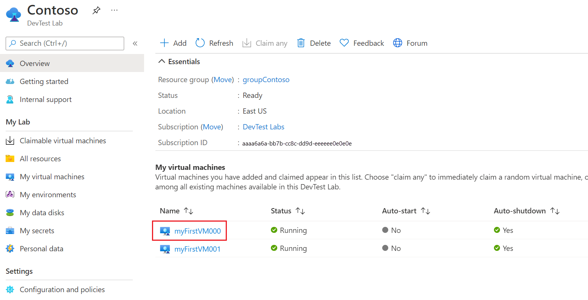

# Auto startup lab virtual machines  
Azure DevTest Labs allows you to configure virtual machines in your lab to be automatically started and shutdown based on a schedule. For information on configuring autoshutdown settings, see [Manage autoshutdown policies for a lab in Azure DevTest Labs](devtest-lab-auto-shutdown.md). 

Unlike autoshutdown, where all the VMs are included when the policy is turned on, the autostart policy requires a lab user to explicitly select a VM and opt in to this schedule. That way, you won't easily run into the situation where unwanted VMs are accidentally auto started and cause unexpected spending.

This article shows you how to configure autostart policy for a lab.

## Configure autostart settings for a lab 
1. Navigate to the home page for your lab. 
2. Select **Configuration and policies** on the left menu. 

    
3. On the **Configuration and policies** page, do the following steps:
    
    1. Select **On** for **Allow virtual machines to be scheduled for automatic start** to enable the autostart feature for this lab. 
    2. Select a start time (for example: 8:00:00 AM) for the **Schedule start** field. 
    3. Select a **time zone** to be used. 
    4. Select **days of the week** on which VMs need to be automatically started. 
    5. Then, select **Save** on the toolbar to save the settings. 

        

        > [!IMPORTANT]
        > This policy does not automatically apply auto-start to any virtual machines in the lab. To **opt in** individual virtual machines, go to the virtual machine page and enable **auto-start** for that VM.

## Enable autostart for a VM in the lab
The following procedure provides you with steps for opting in a VM into the autostart policy of the lab. 

1. On the home page for your lab, select the **VM** in the **My virtual machines** list. 

    
2. On the **Virtual machine** page, select **Autostart** on the left menu or in the **Schedules** list. 

    
3. On the **Autostart** page, select **On** for the **Allow this virtual machine to be scheduled for automatic start** option.

    
4. Then, select **Save** on the toolbar to save the setting. 

## Next steps
To learn about configuration autoshutdown policy for a lab, see [Manage autoshutdown policies for a lab in Azure DevTest Labs](devtest-lab-auto-shutdown.md)
