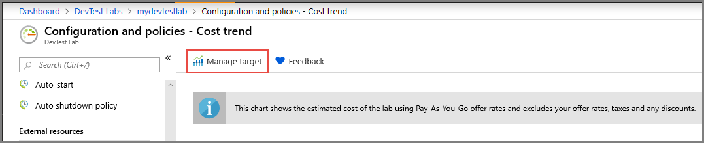
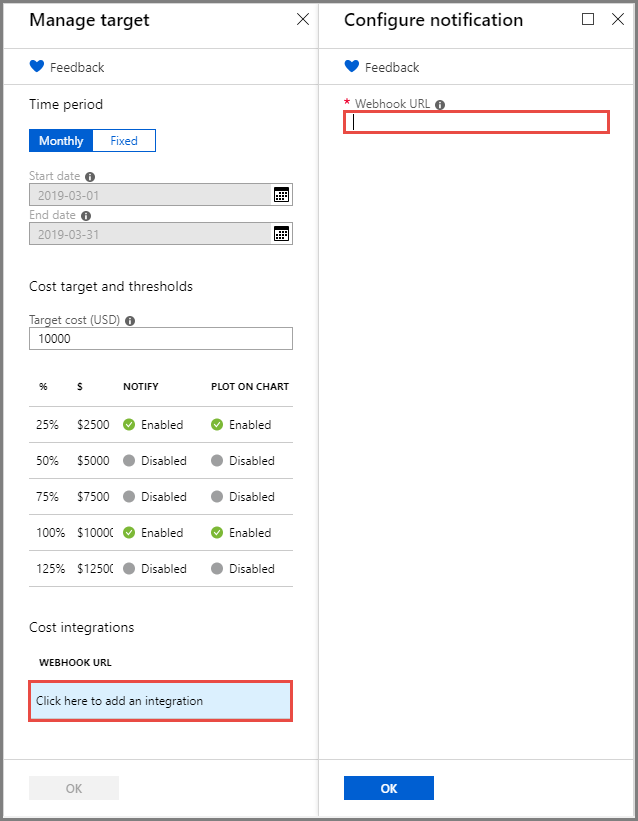
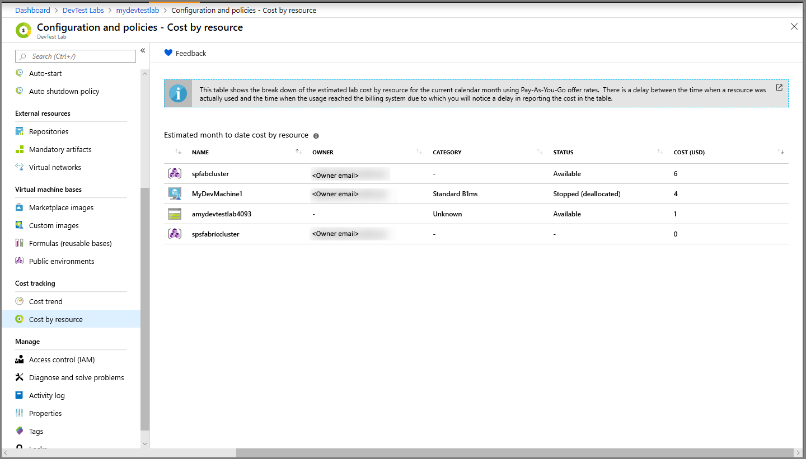

# Track costs associated with a lab in Azure DevTest Labs
This article provides information on how to track the cost of your lab. It shows you how to view the estimated cost trend for the current calendar month for the lab. The article also shows you how to view month-to-date cost per resource in the lab.

## View the monthly estimated lab cost trend 
In this section, you learn how to use the **Monthly Estimated Cost Trend** chart to view the current calendar month's estimated cost-to-date and the projected end-of-month cost for the current calendar month. You also learn how to manage lab costs by setting spending targets and thresholds that, when reached, trigger DevTest Labs to report the results to you.

To view the Monthly Estimated Cost Trend chart, follow these steps: 

1. Sign in to the [Azure portal](https://portal.azure.com).
2. Select **All Services**, and then select **DevTest Labs** from the list.
3. From the list of labs, select your lab.  
4. Select **Configuration and policies** on the left menu.  
4. Select **Cost trend** in the **Cost tracking** section on the left menu. The following screenshot shows an example of a cost chart. 
   
    

    The **Estimated cost** value is the current calendar month's estimated cost-to-date. The **Projected cost** is the estimated cost for the entire current calendar month, calculated using the lab cost for the previous five days.

    The cost amounts are rounded up to the next whole number. For example: 

   * 5.01 rounds up to 6 
   * 5.50 rounds up to 6
   * 5.99 rounds up to 6

     As it states above the chart, the costs you see by default in the chart are *estimated* costs using [Pay-As-You-Go](https://azure.microsoft.com/offers/ms-azr-0003p/) offer rates. You can also set your own spending targets that are displayed in the charts by [managing the cost targets for your lab.](#managing-cost-targets-for-your-lab)

     The following costs *aren't* included in the cost calculation:

   * CSP and Dreamspark subscriptions currently aren't supported. Azure DevTest Labs uses the Azure billing APIs to calculate the lab cost, which doesn't support CSP or Dreamspark subscriptions.
   * Your offer rates. Currently, you can't use the offer rates shown under your subscription that you've negotiated with Microsoft or Microsoft partners. Only Pay-As-You-Go rates are used.
   * Your taxes
   * Your discounts
   * Your billing currency. Currently, the lab cost is displayed only in USD currency.

### Managing cost targets for your lab
DevTest Labs helps you manage your lab costs by setting a spending target that you can view in the Monthly Estimated Cost Trend chart. DevTest Labs can send you a notification when spending reaches the specified target threshold. 

1. On the **Cost trend** page, select **Manage target**.

    
2. On the **Manage target** page, specify a spending target and thresholds. You can also set whether each selected threshold is reported on the cost trend chart or through a webhook notification.

    

   - Select a time period during which you want cost targets tracked.
      - **Monthly**: cost targets are tracked per month.
      - **Fixed**: cost targets are tracked for the date range you specify in the start and end dates. Typically, these values represent how long your project is scheduled to run.
   - Specify a **Target cost**. For example, how much you plan to spend on this lab in the time period you defined.
   - Select to enable or disable any threshold you want reported – in increments of 25% – up to 125% of your specified **Target cost**.
      - **Notify**: When results meet this threshold, a webhook URL that you specify notifies you.
      - **Plot on chart**: When results meet this threshold, the results plot on a cost trend graph that you can view.
   - If you choose to **Notify** when the threshold is met, you must specify a webhook URL. In the Cost integrations area, select **Click here to add an integration**. Enter a **Webhook URL** in the Configure notification pane and then select **OK**.

       

     - If you specify **Notify**, you must define a webhook URL.
     - Likewise, if you define a webhook URL, you must set **Notification** to **On** in the Cost threshold pane.
     - Create the webhook before you enter it here.  

       For more information about webhooks, see [Create a webhook or API Azure Function](../azure-functions/functions-bindings-http-webhook.md). 

## View cost by resource 
The monthly cost trend feature in labs allows you to see how much you spent in the current calendar month. The feature also shows your spending projection until the end of the month, based on your spending in last seven days. To help you understand why the spending in the lab is meeting thresholds early on, you can use the **cost by resource** feature that shows you the month-to-date cost **per resource** in a table.

1. Sign in to the [Azure portal](https://portal.azure.com).
2. Select **All Services**, and then select **DevTest Labs** from the list.
3. From the list of labs, select the lab you want.  
4. Select **Configuration and policies** on the left menu.
5. Select **Cost by resource** in the **Cost tracking** section on the left menu. You see the costs associated with each resource associated with a lab. 

    

This feature helps you to easily identify the resources that cost the most so you can take actions to reduce the lab spending. For example, the cost of a VM is based on the size of the VM. The larger the size of the VM, the more it costs. You could find the size of a VM and the owner, and talk to the owner about why they need the VM size and whether they can lower the size.

[Auto shutdown policy](devtest-lab-set-lab-policy.md?#set-auto-shutdown-policy) helps you to reduce the cost by shutting down lab VMs at a particular time of the day. However, a lab user can opt out of the shutdown policy, which increases the cost of running the VM. Select a VM in the table to see if it's been opted-out of the auto shutdown policy. Talk to the VM owner to find out why they opted out, and see if they can opt back in.
 
## Next steps
Here are some things to try next:

* [Define lab policies](devtest-lab-set-lab-policy.md). Learn how to set the various policies used to govern how your lab and its VMs are used. 
* [Create custom image](devtest-lab-create-template.md). When you create a VM, you specify a base. The base can be either a custom image or a Marketplace image. This article describes how to create a custom image from a VHD file.
* [Configure Marketplace images](devtest-lab-configure-marketplace-images.md). DevTest Labs supports creating VMs based on Azure Marketplace images. This article
  illustrates how to specify Azure Marketplace images you can use when creating VMs in a lab.
* [Create a VM in a lab](devtest-lab-add-vm.md). This article illustrates how to create a VM from a custom or Marketplace base image, and work with artifacts in the VM.
