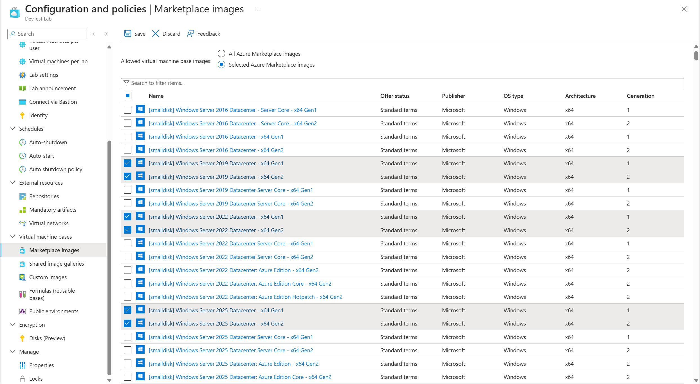

# Configure Azure Marketplace image settings in Azure DevTest Labs
DevTest Labs supports creating VMs based on Azure Marketplace images depending on how you have configured Azure Marketplace images to be used in your lab. This article shows you how to specify which, if any, Azure Marketplace images can be used when creating VMs in a lab. It ensures that your team only has access to the Marketplace images they need. 

## Specify allowed images for creating VMs
Following these steps to specify which Azure Marketplace images are allowed when creating a VM. 

1. Sign in to the [Azure portal](https://go.microsoft.com/fwlink/p/?LinkID=525040).
2. Select **All Services**, and then select **DevTest Labs** from the list.
3. From the list of labs, select your lab. 
4. On the home page for the lab page, select **Configuration and policies**.
5. On lab's **Configuration and policies** page under **Virtual Machine Bases**, select **Marketplace images**.
6. Specify whether you want all the qualified Azure Marketplace images to be available for use as a base of a new VM. If you select **Yes**, 
   then all the Azure Marketplace images that meet all the following criteria are allowed in the lab:
   
   * The image creates a single VM, **and**
   * The image uses Azure Resource Manager to provision VMs, **and**
   * The image doesn't require purchasing an extra licensing plan
     
     If you want no images to be allowed, or you want to specify which images can be used, select **No**.
     
     
7. If you select **No** to the previous step, the **Allowed images/Select all** checkbox is enabled. 
   You can use this option together with the search box to quickly select or deselect all the items displayed in the list.
   * Select the Azure Marketplace images you want to allow for VM creation individually by checking each image's corresponding checkbox.
   * Select nothing from the list if you don't want to allow any Azure Marketplace images to be used in the lab.
   
     

## Troubleshoot
If you aren't able to find a specific image to enable for the lab, follow these steps: 

- Check to see if you can view the image while creating a compute VM.
- The image may not be available in the type of the subscription you use. Check with the subscription administrator for the type of the subscription (for example: MSDN, free, pay-as-you-go, and so on.). 
- Support for Gen 2 images in DevTest Labs is limited. If both Gen 1 and Gen 2 versions are available for an image, DevTest Labs shows only the Gen 1 version of the image when creating a VM. Workaround is to create a custom Gen 2 image outside the lab and use it to create a VM. If there's only Gen 2 version of the image available, it's supported and shown in the list by DevTest Labs. 
      

## Next steps
Once you've configured how Azure Marketplace images are allowed when creating a VM, the next step is to [add a VM to your lab](devtest-lab-add-vm.md).
