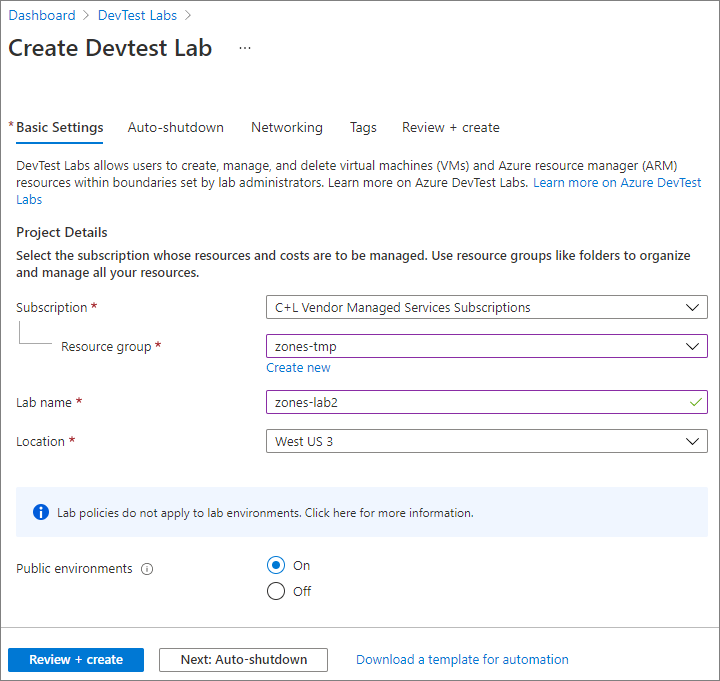
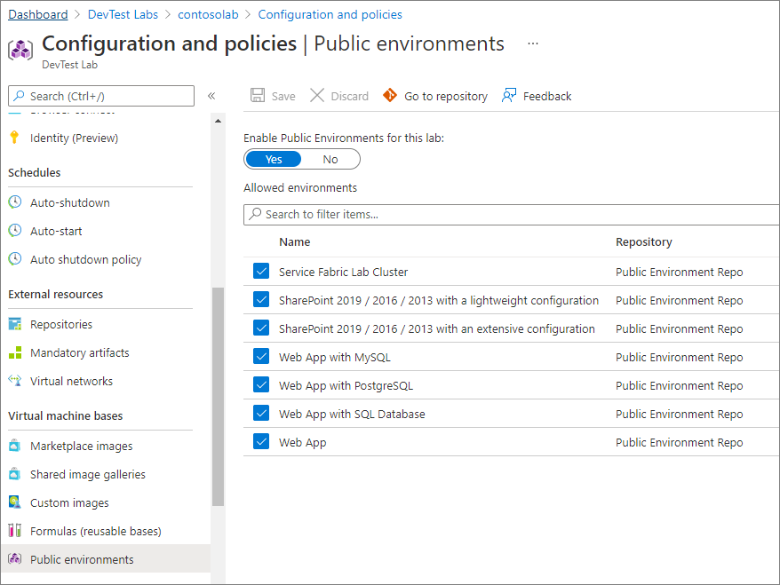
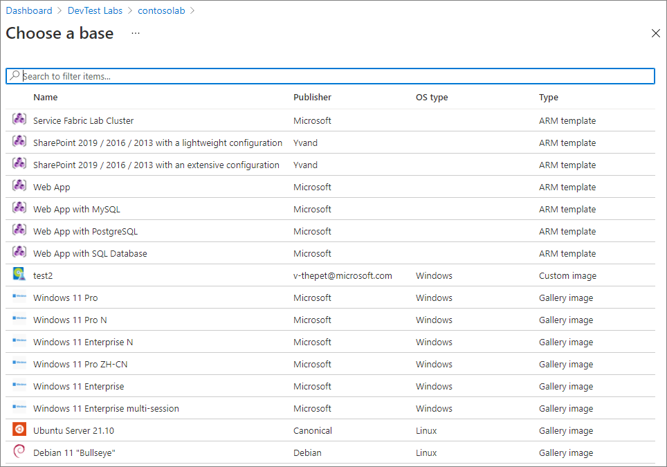

# Configure and use public environments in Azure DevTest Labs
Azure DevTest Labs has a [public repository of Azure Resource Manager templates](https://github.com/Azure/azure-devtestlab/tree/master/Environments) you can use to create environments. You don't have to connect to an external GitHub source by yourself. This repository includes frequently used templates such as Azure Web Apps, Service Fabric cluster, and a development SharePoint farm. This feature is similar to the public repository of artifacts that is included for every lab that you create. The environment repository provides pre-authored environment templates with minimum input parameters. The templates give you a smooth getting started experience for platform-as-a-service (PaaS) resources within labs.
  
## Configuring public environments
As a lab owner, you can enable the public environment repository for your lab during the lab creation. To enable public environments for your lab, select **On** for the **Public environments** field while creating a lab. 

For existing labs, the public environment repository isn't enabled. Manually enable the repository to use the templates. For labs created using Resource Manager templates, the repository is also disabled by default.

You can enable or disable public environments for your lab, and also make only specific environments available to lab users by using the following steps: 

1. Select **Configuration and policies** for your lab. 
2. In the **Virtual machine bases** section, select **Public environments**.
3. To enable public environments for the lab, select **Yes**. Otherwise, select **No**. 
4. If you enabled public environments, all the environments in the repository are enabled by default. You can deselect an environment to make it unavailable to your lab users. 

## Use environment templates as a lab user
As a lab user, you can create a new environment from the enabled list of environment templates by selecting **Add** from the tool bar in the lab page. The list of bases includes the public environments templates enabled by your lab admin at the top of the list.

## Next steps
This repository is an open-source repository that you can contribute to. To add your own frequently used and helpful Resource Manager templates, submit a pull request against the repository.
