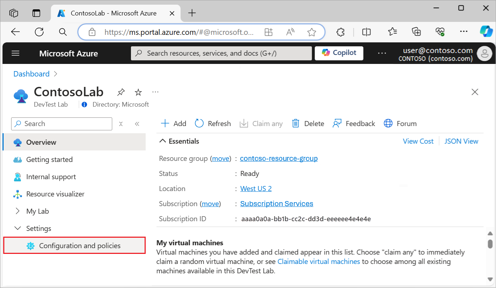
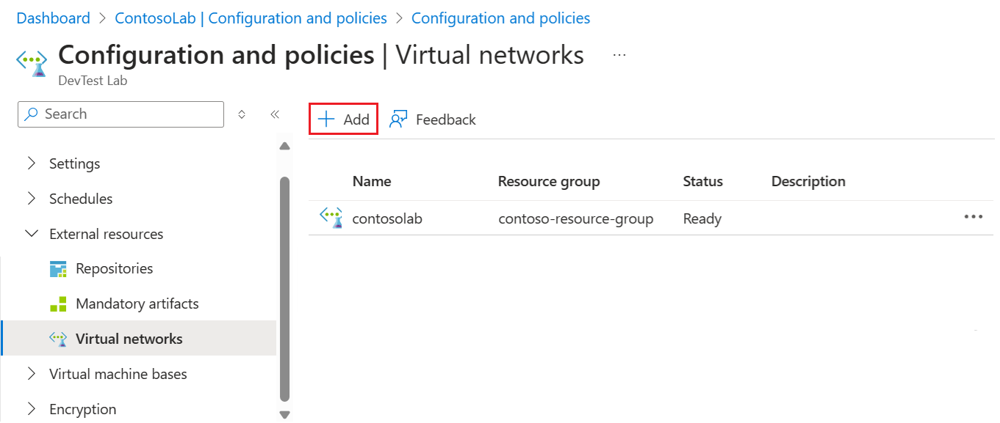
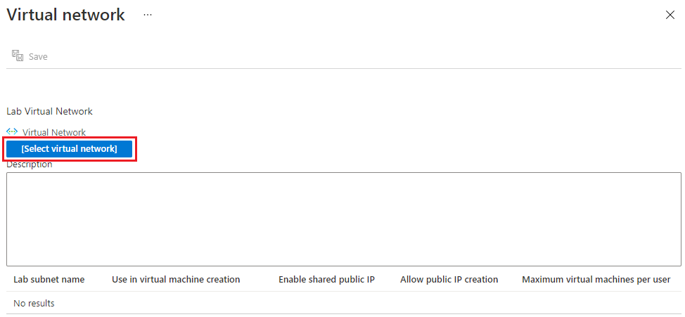
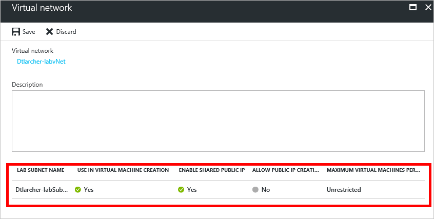
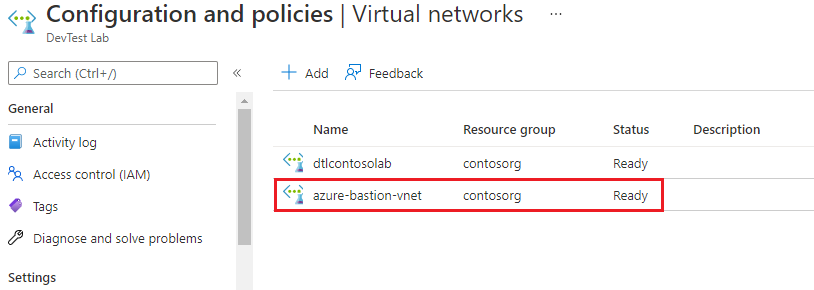

# Configure a virtual network in Azure DevTest Labs
As explained in the article [Add a VM to a lab](devtest-lab-add-vm.md), when you create a VM in a lab, you can specify a configured virtual network. 
For example, you might need to access your corpnet resources from your VMs using the virtual network that was configured with ExpressRoute or site-to-site VPN.

This article explains how to add your existing virtual network into a lab's Virtual Network settings so that it is available to choose when creating VMs.

> [!NOTE]
> To learn about costs associated with the Azure Virtual Network service, see [Pricing for Azure Virtual Network](../virtual-network/virtual-networks-overview.md#pricing).

## Configure a virtual network for a lab using the Azure portal
The following steps walk you through adding an existing virtual network (and subnet) to a lab so that it can be used when creating a VM in the same lab. 

1. Sign in to the [Azure portal](https://go.microsoft.com/fwlink/p/?LinkID=525040).
1. Select **All Services**, and then select **DevTest Labs** from the list.
1. From the list of labs, select the desired lab. 
1. On the lab's main pane, select **Configuration and policies**.

    
1. In the **EXTERNAL RESOURCES** section, select **Virtual networks**. A list of virtual networks configured for the current lab is displayed as well as the default virtual network created for your lab. 
1. Select **+ Add**.
   
    
1. On the **Virtual network** pane, select **[Select virtual network]**.
   
    
1. On the **Choose virtual network** pane, select the desired virtual network. A list is displayed showing all of the virtual networks that are under the same region in the subscription as the lab.
1. After selecting a virtual network, you are returned to the **Virtual network** pane. Select the subnet in the list at the bottom.

    
    
    The Lab Subnet pane is displayed.

    
     
   - Specify a **Lab subnet name**.
   - To allow a subnet to be used in lab VM creation, select **Use in virtual machine creation**.
   - To enable a [shared public IP address](devtest-lab-shared-ip.md), select **Enable shared public IP**.
   - To allow public IP addresses in a subnet, select **Allow public IP creation**.
   - In the **Maximum virtual machines per user** field, specify the maximum VMs per user for each subnet. If you want an unrestricted number of VMs, leave this field blank.
1. Select **OK** to close the Lab Subnet pane.
1. Select **Save** to close the Virtual network pane.

Now that the virtual network is configured, it can be selected when creating a VM. 
    To see how to create a VM and specify a virtual network, refer to the article, [Add a VM to a lab](devtest-lab-add-vm.md). 

Azure's [Virtual Network Documentation](https://docs.microsoft.com/azure/virtual-network) provides more information about how to use VNets, including how to set up and manage a VNet and connect it to your on-premises network.

[!INCLUDE [devtest-lab-try-it-out](../../includes/devtest-lab-try-it-out.md)]

## Next steps
Once you have added the desired virtual network to your lab, the next step is to [add a VM to your lab](devtest-lab-add-vm.md).

