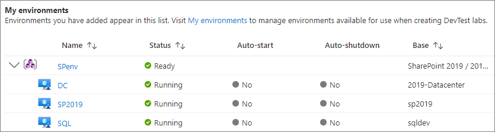

# Use ARM templates to create multi-VM DevTest Labs environments

DevTest Labs scenarios like multi-tier web apps or SharePoint farms need multiple VMs with PaaS resources installed. You can provision PaaS resources as well as infrastructure-as-a-service (IaaS) VMs by using [Azure Resource Manager (ARM)](../azure-resource-manager/templates/syntax.md) templates. An ARM environment template defines your solution's infrastructure and configuration. Lab users can use the template to easily and consistently deploy multiple VMs with preinstalled resources as a single environment.

Lab owners can configure DevTest Labs to load ARM templates directly from public or private Git source control repositories. Lab users can then create environments by selecting an environment template in the Azure portal, just as they can select and create individual [VM base images](devtest-lab-comparing-vm-base-image-types.md).

VMs in the same environment share the same lifecycle, and lab users can manage the VMs together. You can track the cost of lab environments and PaaS resources, just as you track costs for individual lab VMs.

To learn more about the benefits of using ARM templates to deploy, update, or delete many lab resources as a single environment, see [Benefits of using Resource Manager templates](../azure-resource-manager/management/overview.md#the-benefits-of-using-resource-manager).

Consider these limitations when using ARM environment templates in DevTest Labs:

- VM auto-shutdown doesn't apply to other PaaS resources.

- Not all lab policies are evaluated when deploying ARM templates. Policies that aren't evaluated include number of VMs per lab user, number of premium VMs per user, and number of premium desks per user. For example, your lab policy might limit users to only five VMs apiece. However, a user can deploy an ARM environment template that creates dozens of VMs.

## Multi-VM vs. single-VM ARM templates

There are two methods for creating VMs in DevTest Labs. Each method is used for different scenarios and requires different permissions. The ARM template's `resource` property declares the method to use.

- `Microsoft.DevTestLab/labs/virtualmachines`

  ARM templates that use a `Microsoft.DevTestLab/labs/virtualmachines` resource type provision individual VM configurations. Each VM appears as a separate item in the lab's **My virtual machines** list. For more information and instructions for creating and using single-VM ARM templates, see [Create virtual machines from ARM templates](devtest-lab-use-resource-manager-template.md).

- `Microsoft.Compute/virtualmachines`

  Resource Manager templates that use a `Microsoft.Compute/virtualmachines` resource type can provision multiple lab VMs in a single environment, such as a SharePoint farm. Lab users can use these templates to create multi-VM environments. The VMs appear under their environments in the lab's **My environments** list.

  

This article discusses using `Microsoft.Compute/virtualmachines` to create environment VMs.

## Public and private environment template repositories

Azure DevTest Labs has a [public ARM template repository](https://github.com/Azure/azure-devtestlab/tree/master/Environments) that includes environment templates for Azure Web Apps, an Azure Service Fabric cluster, and development SharePoint farms. You can configure your lab to use these templates in the Azure portal without having to connect to the external GitHub source. For more information and instructions, see [Configure and use public environments in DevTest Labs](devtest-lab-configure-use-public-environments.md).

You can use the public environment templates directly, or customize them to suit your needs. Store your custom templates in the public repository to share them with others, or store your templates and artifacts in your own Git repositories. Connect those private repositories to your lab so all your lab users can access the templates.

For more information and instructions about editing and saving ARM templates in repositories, and connecting the template repositories to DevTest Labs, see [Create virtual machines from ARM templates](devtest-lab-use-resource-manager-template.md).

## Configure access rights for lab users

Lab users have **Reader** role by default, so they can't change environment resources. For example, users can't stop or start their resources.

To give your lab users **Contributor** role so they can edit their environment resources:

1. In the [Azure portal](https://portal.azure.com), on your lab's **Overview** page, select **Configuration and policies** from the left navigation.
1. On the **Configuration and policies** page, select **Lab settings** in the left navigation.
1. In the **Lab settings** pane, select **Contributor**, and then select **Save**.

   

## Create environments from templates in the Azure portal

To use an ARM template to add an environment to a lab:

1. Make sure you have an ARM environment template [checked in to a Git repository](devtest-lab-use-resource-manager-template.md#configure-your-own-template-repositories), and the repository is [added to the lab](devtest-lab-use-resource-manager-template.md#add-template-repositories-to-the-lab).

1. On the lab's **Overview** page, select **Add** from the top toolbar.

1. On the **Choose a base** page, select the ARM template you want to use. The available environment templates appear first in the list of bases.

1. On the **Add** screen, enter an **Environment name**. The ARM template defines the rest of the input fields. Enter values for those input fields that the template *azuredeploy.parameters.json* file defines as blank or with default values.

   - For `secure string` parameters, you can use secrets from Azure Key Vault. To learn how to store secrets in a key vault and use them when creating lab resources, see [Store secrets in Azure Key Vault](devtest-lab-store-secrets-in-key-vault.md).

   - In ARM templates, the `GEN-UNIQUE`, `GEN-UNIQUE-[N]`, `GEN-SSH-PUB-KEY`, and `GEN-PASSWORD` template parameter values generate blank input fields for users to input values.

   

1. Select **Add** to create the environment.

   The environment starts provisioning immediately. You can see the provisioning status under **My environments** on the lab **Overview** page. Provisioning an environment can take a long time, depending on the environment.

1. Once the environment is created, expand **My environments** to see the list of VMs that the template provisioned.

   

   The deployment created a new resource group to provision all the environment resources that the ARM template defined. Select the environment name under **My environments** to view the resource group and all the resources the template created.

   

1. Select a VM under **My environments** to see available actions, such as managing configuration, schedules, and policies.

   

<a name="automate-deployment-of-environments"></a>
## Automate environment creation with PowerShell

When you need to create multiple environments for a development or testing scenario, you can automate the environment deployment with Azure PowerShell.

[!INCLUDE [updated-for-az](../../includes/updated-for-az.md)]

> [!NOTE]
> Only lab owners can create VMs and environments from ARM templates by using Azure PowerShell. Lab users can automate VM creation with an ARM template by using the Azure CLI commands [az lab vm create](/cli/azure/lab/vm#az_lab_vm_create). For more information, see [Deploy resources with Resource Manager templates and Azure CLI](../azure-resource-manager/templates/deploy-cli.md).

To automate ARM environment template deployment with Azure PowerShell:

1. Make sure you have an ARM environment template [checked in to a Git repository](#configure-your-own-template-repositories), and the repository is [added to the lab](#add-template-repositories-to-the-lab).

1. Save the following sample PowerShell script to your computer as *deployenv.ps1*. This script creates an environment in your lab.

   ```powershell
   #Requires -Module Az.Resources

   [CmdletBinding()]

   param (
   # ID of the Azure subscription for the lab
   [string] [Parameter(Mandatory=$true)] $SubscriptionId,

   # Name of the lab in which to create the environment
   [string] [Parameter(Mandatory=$true)] $LabName,

   # Name of the connected repository in the lab
   [string] [Parameter(Mandatory=$true)] $RepositoryName,

   # Name of the template (folder name in the Git repository)
   [string] [Parameter(Mandatory=$true)] $TemplateName,

   # Name of the environment to be created in the lab
   [string] [Parameter(Mandatory=$true)] $EnvironmentName,

   # The parameters to be passed to the template. Each parameter is prefixed with "-param_".
   # For example, if the template has a parameter named "TestVMName" with a value of "MyVMName",
   # the string in $Params will have the form: -param_TestVMName MyVMName.
   # This convention allows the script to dynamically handle different templates.
   [Parameter(ValueFromRemainingArguments=$true)]
       $Params
   )

   # Sign in to Azure.
   # Comment out the following statement to completely automate the environment creation.
   Connect-AzAccount

   # Select the subscription that has the lab.  
   Set-AzContext -SubscriptionId $SubscriptionId | Out-Null

   # Get information about the user, specifically the user ID, which is used later in the script.  
   $UserId = $((Get-AzADUser -UserPrincipalName ((Get-AzContext).Account).Id).Id)

   # Get information about the lab, such as lab location.
   $lab = Get-AzResource -ResourceType "Microsoft.DevTestLab/labs" -Name $LabName
   if ($lab -eq $null) { throw "Unable to find lab $LabName in subscription $SubscriptionId." }

   # Get information about the repository in the lab.
   $repository = Get-AzResource -ResourceGroupName $lab.ResourceGroupName `
       -ResourceType 'Microsoft.DevTestLab/labs/artifactsources' `
       -ResourceName $LabName `
       -ApiVersion 2016-05-15 `
       | Where-Object { $RepositoryName -in ($_.Name, $_.Properties.displayName) } `
       | Select-Object -First 1
   if ($repository -eq $null) { throw "Unable to find repository $RepositoryName in lab $LabName." }

   # Get information about the Resource Manager template base for the environment.
   $template = Get-AzResource -ResourceGroupName $lab.ResourceGroupName `
       -ResourceType "Microsoft.DevTestLab/labs/artifactSources/armTemplates" `
       -ResourceName "$LabName/$($repository.Name)" `
       -ApiVersion 2016-05-15 `
       | Where-Object { $TemplateName -in ($_.Name, $_.Properties.displayName) } `
       | Select-Object -First 1
   if ($template -eq $null) { throw "Unable to find template $TemplateName in lab $LabName." }

   # Build the template parameters with parameter name and values.  
   $parameters = Get-Member -InputObject $template.Properties.contents.parameters -MemberType NoteProperty | Select-Object -ExpandProperty Name
   $templateParameters = @()

   # Extract the custom parameters from $Params and format as name/value pairs.
   $Params | ForEach-Object {
       if ($_ -match '^-param_(.*)' -and $Matches[1] -in $parameters) {
           $name = $Matches[1]                
       } elseif ( $name ) {
           $templateParameters += @{ "name" = "$name"; "value" = "$_" }
           $name = $null #reset name variable
       }
   }

   # Once name/value pairs are isolated, create an object to hold the necessary template properties.
   $templateProperties = @{ "deploymentProperties" = @{ "armTemplateId" = "$($template.ResourceId)"; "parameters" = $templateParameters }; }

   # Now, create or deploy the environment in the lab by using the New-AzResource command.
   New-AzResource -Location $Lab.Location `
       -ResourceGroupName $lab.ResourceGroupName `
       -Properties $templateProperties `
       -ResourceType 'Microsoft.DevTestLab/labs/users/environments' `
       -ResourceName "$LabName/$UserId/$EnvironmentName" `
       -ApiVersion '2016-05-15' -Force

   Write-Output "Environment $EnvironmentName completed."
   ```

1. Run the script, substituting your own values for `SubscriptionId`, `LabName`, `ResourceGroupName`, `RepositoryName`, `TemplateName` or folder in the Git repository, and `EnvironmentName`.

   ```powershell
   ./deployenv.ps1 -SubscriptionId "000000000-0000-0000-0000-0000000000000" -LabName "mydevtestlab" -ResourceGroupName "mydevtestlabRG000000" -RepositoryName "myRepository" -TemplateName "My Environment template name" -EnvironmentName "myGroupEnv"
   ```

## Next steps
- Once you create a VM, you can connect to the VM by selecting **Connect** on the VM's management pane.
- You can [add a VM to a d) at a time](devtest-lab-add-vm.md) to a lab by using the [Azure portal](https://portal.azure.com). 
- Explore [ARM templates from the Azure Quickstart template gallery](https://github.com/Azure/azure-quickstart-templates).