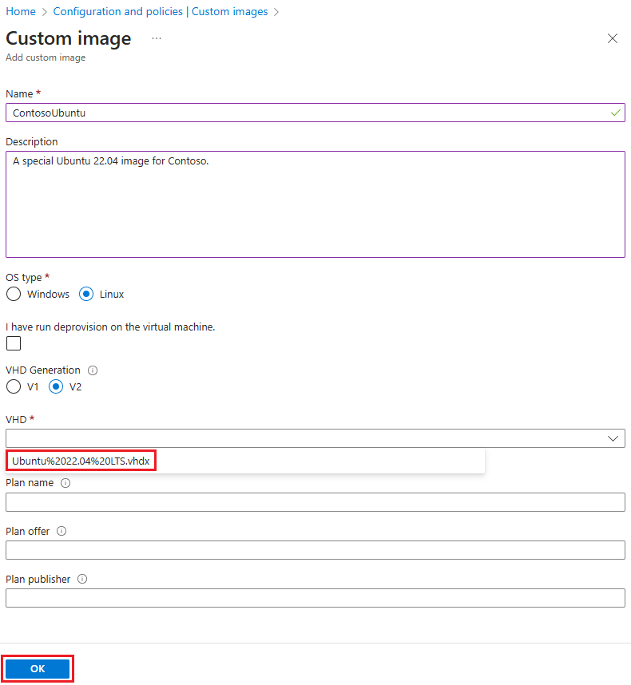

# Create a custom image for Azure DevTest Labs virtual machines from VHD files

[!INCLUDE [devtest-lab-create-custom-image-from-vhd-selector](../../includes/devtest-lab-create-custom-image-from-vhd-selector.md)]

In this article, you learn how to create a virtual machine (VM) custom image for Azure DevTest Labs by using a virtual hard drive (VHD) file.

[!INCLUDE [devtest-lab-custom-image-definition](../../includes/devtest-lab-custom-image-definition.md)]

This article describes how to create a custom image in the Azure portal. You can also [use PowerShell](devtest-lab-create-custom-image-from-vhd-using-powershell.md) to create a custom image.

[!INCLUDE [devtest-lab-upload-vhd-options](../../includes/devtest-lab-upload-vhd-options.md)]

## Create custom images for Azure DevTest Labs in Azure portal

To create a custom image from a VHD file in DevTest Labs in the Azure portal, follow these steps:

1. In the [Azure portal](https://go.microsoft.com/fwlink/p/?LinkID=525040), go to the **Overview** page for the lab that has the uploaded VHD file.

1. Select **Configuration and policies** in the left navigation.

1. On the **Configuration and policies** pane, select **Custom images** under **Virtual machine bases** in the left navigation.

1. On the **Custom images** page, select **Add**.

   

1. On the **Add custom image** page:

   - Enter a name for the custom image to display in the list of base images for creating a VM.
   - Enter an optional description to display in the base image list.
   - Under **OS type**, select whether the OS for the VHD and custom image is **Windows** or **Linux**.
     - If you choose **Windows**, select the checkbox if you ran *sysprep* on the machine before creating the VHD file.
     - If you choose **Linux**, select the checkbox if you ran *deprovision* on the machine before creating the VHD file.

1. Under **VHD**, select the uploaded VHD file for the custom image from the drop-down menu.

1. Optionally, enter a plan name, plan offer, and plan publisher if the VHD image isn't a licensed image published by Microsoft. If the image is a licensed image, these fields are pre-populated with the plan information.

   - **Plan name:** Name of the non-Microsoft Marketplace image or SKU used to create the VHD image.
   - **Plan offer:** Product or offer name for the Marketplace image.
   - **Plan publisher:** Publisher of the Marketplace image.

1. Select **OK**.

   

After creation, the custom image is stored in the lab's storage account. The custom image appears in the list of VM base images for the lab. Lab users can create new VMs based on the custom image.

## Next steps

- [Add a VM to your lab](./devtest-lab-add-vm.md)
- [Compare custom images and formulas in DevTest Labs](devtest-lab-comparing-vm-base-image-types.md)
- [Copying Custom Images between Azure DevTest Labs](https://www.visualstudiogeeks.com/blog/DevOps/How-To-Move-CustomImages-VHD-Between-AzureDevTestLabs#copying-custom-images-between-azure-devtest-labs)
