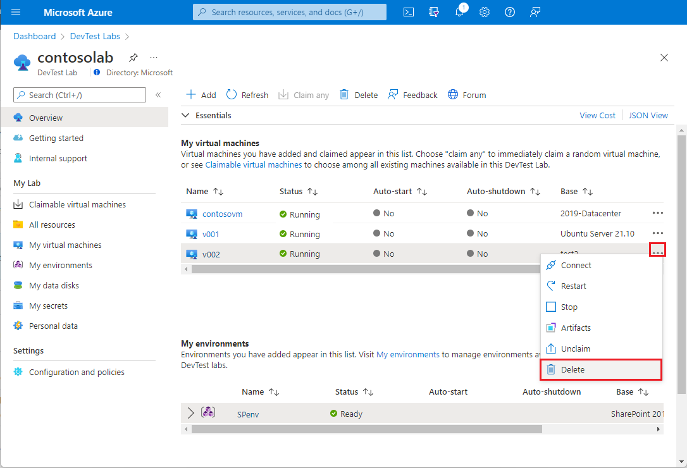
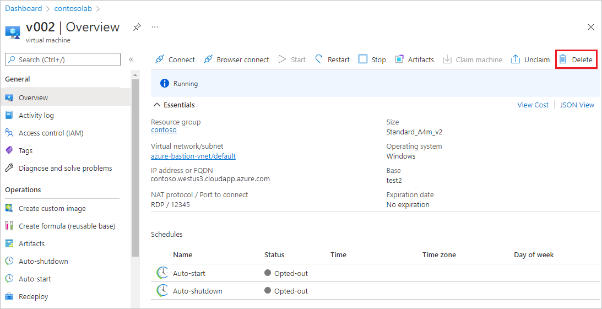
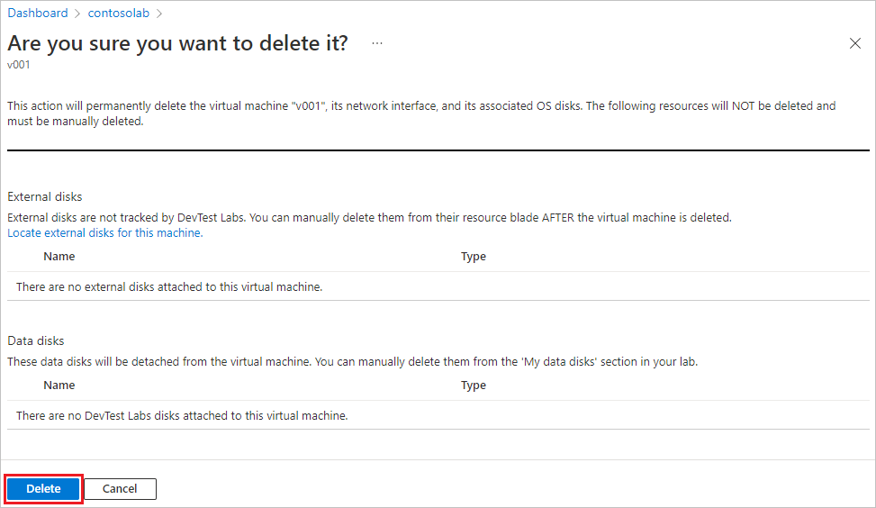
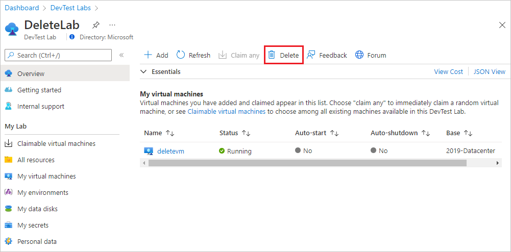
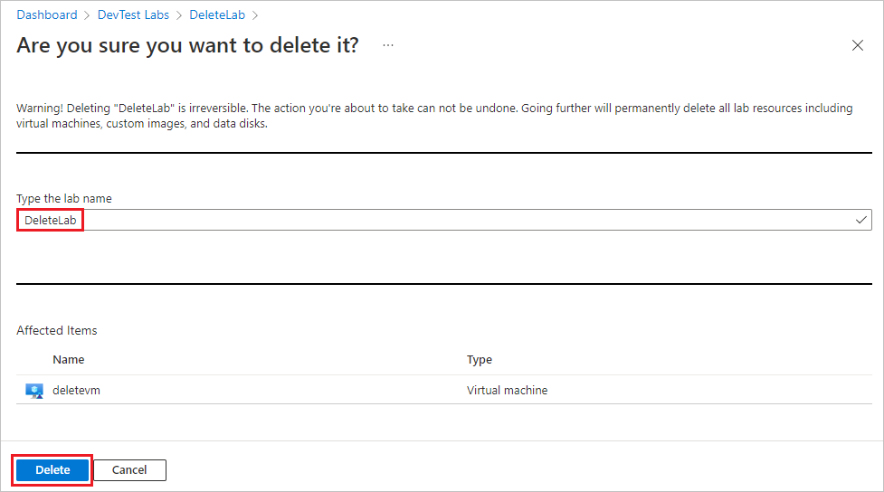
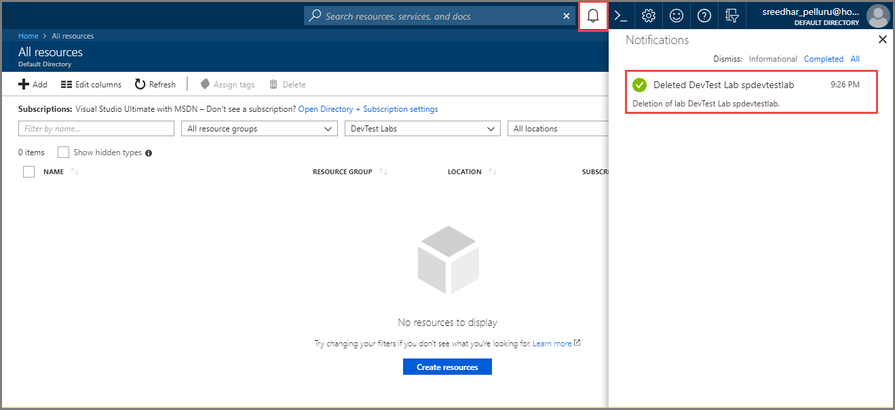

# Delete labs or lab VMs in Azure DevTest Labs

This article shows you how to delete a virtual machine (VM) from a lab or delete a lab in Azure DevTest Labs.

## Delete a VM from a lab

When you create a VM in a lab, DevTest Labs automatically creates resources for the VM, like a disk, network interface, and public IP address, in a separate resource group. Deleting the VM deletes most of the resources created at VM creation, including the VM, network interface, and disk. However, deleting the VM doesn't delete:

- Any resources you manually created in the VM's resource group.
- The VM's key vault in the lab's resource group.
- Any availability set, load balancer, or public IP address in the VM's resource group. These resources are shared by multiple VMs in a resource group.

> [!CAUTION]
> Deleting VMs and labs is permanent, and cannot be undone.

To delete a VM from a lab:

1. On the lab's **Overview** page in the Azure portal, find the VM you want to delete in the list under **My virtual machines**.

1. Either:

   - Select **More options** (**...**) next to the VM listing, and select **Delete** from the context menu.
     

   or

   - Select the VM name in the list, and then on the VM's **Overview** page, select **Delete** from the top menu.
      

1. On the **Are you sure you want to delete it?** page, select **Delete**.</br>
   The deletion of the VM, it's network interface, and it's associated OS disks is permanent, and cannot be undone.

    

1. To check deletion status, select the **Notifications** icon on the Azure menu bar. 


## Automate the process of deleting all the VMs in a lab

As a lab owner, you can delete VMs from your lab in the Azure portal. You also can delete all the VMs in your lab by using a PowerShell script. In the following example, under the **values to change** comment, modify the parameter values. You can retrieve the `subscriptionId`, `labResourceGroup`, and `labName` values from the lab pane in the Azure portal.
          
```powershell
   # Delete all the VMs in a lab.
          
   # Values to change:
   $subscriptionId = "<Enter Azure subscription ID here>"
   $labResourceGroup = "<Enter lab's resource group here>"
   $labName = "<Enter lab name here>"
          
   # Sign in to your Azure account.
   Connect-AzAccount
          
   # Select the Azure subscription that has the lab. This step is optional
   # if you have only one subscription.
   Select-AzSubscription -SubscriptionId $subscriptionId
          
   # Get the lab that has the VMs that you want to delete.
   $lab = Get-AzResource -ResourceId ('subscriptions/' + $subscriptionId + '/resourceGroups/' + $labResourceGroup + '/providers/Microsoft.DevTestLab/labs/' + $labName)
          
   # Get the VMs from that lab.
   $labVMs = Get-AzResource | Where-Object {
      $_.ResourceType -eq 'microsoft.devtestlab/labs/virtualmachines' -and
      $_.Name -like "$($lab.Name)/*"}
          
   # Delete the VMs.
   foreach($labVM in $labVMs)
      {
         Remove-AzResource -ResourceId $labVM.ResourceId -Force
      }          
```
## Delete a lab

When you delete a lab from a resource group, DevTest Labs automatically deletes:

- All VMs in the lab.
- All resource groups associated with those VMs.
- All resources that DevTest Labs automatically created during lab creation.

DevTest Labs doesn't delete the lab's resource group itself, and doesn't delete any resources you manually created in the lab's resource group.

> [!NOTE]
> If you want to manually delete the lab's resource group, you must delete the lab first. You can't delete a resource group that has a lab in it.

To delete a lab:

1. On the lab's **Overview** page in the Azure portal, select **Delete** from the top toolbar.

   

1. On the **Are you sure you want to delete it?** page, under **Type the lab name**, type the lab name, and then select **Delete**.</br>
   The deletion of the lab and all its resources is permanent, and cannot be undone.

    

1. To check deletion status, select the **Notifications** icon on the Azure menu bar. 

   

## Next steps

- [Attach and detach data disks for lab VMs](devtest-lab-attach-detach-data-disk.md)
- [Export or delete personal data](personal-data-delete-export.md)
- [Move a lab to another region](how-to-move-labs.md)

