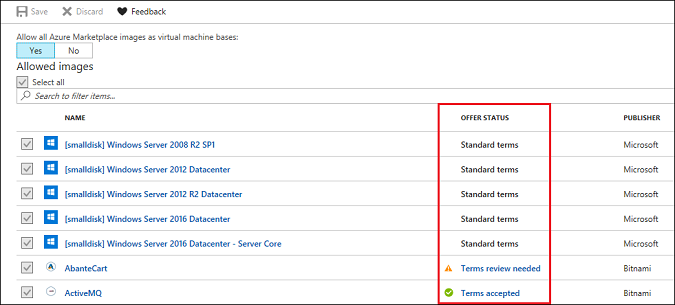
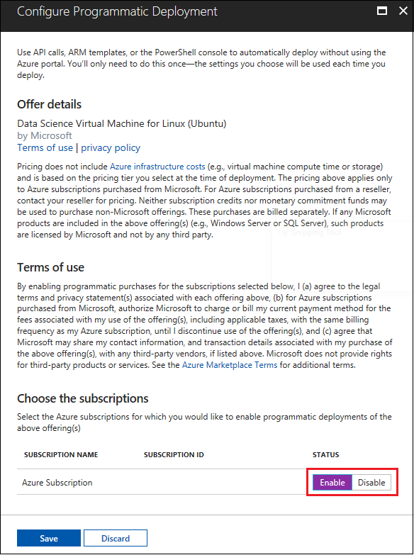

# Enable a licensed image in your lab in Azure DevTest Labs

In Azure DevTest Labs, a licensed image is one that includes terms and conditions – typically from a third party – that must be accepted before the image is accessible to users in the lab. The following sections describe how to work with licensed images so that they are available to use for creating virtual machines.

## Determining whether a licensed image is available to users
The first step to allowing users to create VMs from a licensed image is to make sure that the terms and conditions have been accepted for the licensed image. The following steps show how you can view the offer status of a licensed image and, if necessary, accept its terms and conditions.

1. Sign in to the [Azure portal](https://go.microsoft.com/fwlink/p/?LinkID=525040).

1. Select **All services**, and then select **DevTest Labs** from the list.

1. From the list of labs, select the desired lab.  

1. In the left panel under **SETTINGS**, select **Configuration and policies**.

1. In the left panel under **VIRTUAL MACHINE BASES**, select **Marketplace images**. 

	

    A list of all available marketplace images is shown, including the **OFFER STATUS** for each image.

	

	A licensed image shows an offer status of 
	
	- **Terms accepted:** the licensed image is available to users to create VMs. 
	- **Terms review needed:** the licensed image is not currently available to users. The terms and conditions of the license must be accepted before lab users can use it to create VMs. 

## Making a licensed image available to lab users
To make sure a licensed image is available to lab users, a lab owner with admin permissions must first accept the terms and conditions for that licensed image. Enabling programmatic deployment for the subscription associated with a licensed image automatically accepts the legal terms and privacy statements for that image. [Working with Marketplace Images on Azure Resource Manager](https://azure.microsoft.com/blog/working-with-marketplace-images-on-azure-resource-manager/) provides additional information about programmatic deployment of marketplace images.

You can enable programmatic deployment for a licensed image by following these steps:

1. In the [Azure portal](https://go.microsoft.com/fwlink/p/?LinkID=525040), go to the list of **Marketplace images**.

1. Identify a licensed image for which you want users to have access but whose terms have not been accepted. For example, you might see a Data Science Virtual Machine that shows a status of either **Terms accepted** or **Terms review needed**.

   	

   > [!NOTE]
   > Data Science VMs are Azure Virtual Machine images, pre-installed, configured, and tested with several popular tools that are commonly used for data analytics, machine learning and AI training. [Introduction to Azure Data Science Virtual Machine for Linux and Windows](https://docs.microsoft.com/azure/machine-learning/data-science-virtual-machine/overview) provides a great deal of information about DSVMs.
   >
   >

1. In the **OFFER STATUS** column for the image, select **Terms review needed**.

1. In the Configure Programmatic Deployment window, select **Enable**.

	

   > [!IMPORTANT]
   > You might see multiple subscriptions listed in the Configure Programmatic Deployment window. Make sure you are enabling programmatic deployment only for the intended subscription.
   >
   >

1. Select **Save**. 

    In the list of marketplace images, that image now shows **Terms accepted** and is available for users to create virtual machines.

> [!NOTE]
> Users can create a custom image from a licensed image. See [Create a custom image from a VHD file](devtest-lab-create-template.md) for more information.
>
>

## Related blog posts

- [Custom images or formulas?](https://blogs.msdn.microsoft.com/devtestlab/2016/04/06/custom-images-or-formulas/)
- [Copying Custom Images between Azure DevTest Labs](https://www.visualstudiogeeks.com/blog/DevOps/How-To-Move-CustomImages-VHD-Between-AzureDevTestLabs#copying-custom-images-between-azure-devtest-labs)

## Next steps

- [Create a custom image from a VM](devtest-lab-create-custom-image-from-vm-using-portal.md)
- [Create a custom image from a VHD file](devtest-lab-create-template.md)
- [Add a VM to your lab](devtest-lab-add-vm.md)