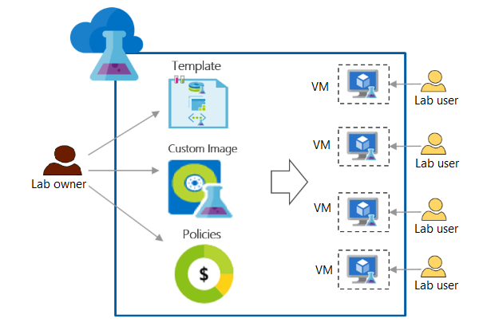

# Azure DevTest Labs scenarios

This article discusses how to use Azure DevTest Labs for several different development, test, and training scenarios. Here are some popular DevTest Labs scenarios:

- Developers need many, sometimes different virtual machines (VMs) and environments as they iterate on apps.
- Testers use many identical or different VMs and environments for performance testing and sandboxed investigations.
- Teachers and trainers periodically need new classroom, lab, and hackathon VMs and environments.

The following sections describe how DevTest Labs supports these scenarios, while helping lab owners and administrators control lab access and costs.

## Lab creation

Labs are the starting point in DevTest Labs. After you create a lab, you can:

- Add lab users.
- Create preconfigured VMs that any lab user can claim.
- Define images, formulas, and templates for lab users to quickly create their own VMs and environments.
- Use [configuration and policies](devtest-lab-set-lab-policy.md) to manage the lab and control costs.
- [Integrate with Azure DevOps](devtest-lab-dev-ops.md) to support DevOps scenarios.
- Link to public and private Git repositories for access to artifacts and ARM templates.

The following diagram shows how lab owners can configure policies and provide resources for lab users:

To create a lab in the Azure portal, see [Create a lab in Azure DevTest Labs](devtest-lab-create-lab.md).

You can also automate lab creation, including custom settings, with a reusable *Azure Resource Manager (ARM) template*. For more information, refer to [Azure Resource Manager (ARM) templates in Azure DevTest Labs](devtest-lab-use-arm-and-powershell-for-lab-resources.md)

### Add a virtual network to a lab

DevTest Labs creates a new virtual network for each lab. If you have another virtual network configured with Azure ExpressRoute or site-to-site VPN, you can add it to your lab. You can then use that virtual network for creating lab VMs. For more information, see [Configure a virtual network in Azure DevTest Labs](devtest-lab-configure-vnet.md).

### Add users to labs

Lab owners can add users to labs by using the Azure portal or a PowerShell script. For more information, see [Add lab owners, contributors, and users in Azure DevTest Labs](devtest-lab-add-devtest-user.md). Lab users don't need an Azure account, as long as they have a Microsoft account.

Lab users can view all lab resources, such as VMs, policies, and virtual networks. Lab users can't modify policies, or access VMs that other users create or claim.

### Configure lab policies to control costs

To monitor and control costs, lab administrators and owners can:

- [Limit the number of VMs each user can create or claim](devtest-lab-set-lab-policy.md#set-virtual-machines-per-user).
- Allow only certain [VM sizes](devtest-lab-set-lab-policy.md#set-allowed-virtual-machine-sizes) in the lab.
- Configure [auto-shutdown](devtest-lab-set-lab-policy.md#set-auto-shutdown) and auto-start policies to stop and restart all VMs at particular times of day. VM auto-shutdown doesn't apply to PaaS resources in environments.
- [Manage cost targets and notifications](devtest-lab-configure-cost-management.md).
- Use the [cost by resource](devtest-lab-configure-cost-management.md#view-cost-by-resource) page to track costs of environments.

## Development and test VMs

Developers and testers might need many identical VMs for performance or load testing, or need different types of VMs for different projects or iterations. DevTest Labs users can create, configure, and access VMs on demand to meet their needs. Starting with common VM images promotes consistency across teams.

In DevTest Labs, developers can:

- Quickly provision VMs on demand, or [claim existing preconfigured VMs](devtest-lab-add-claimable-vm.md).
- Self-service their own VMs without needing subscription-level permissions.
- Directly use [virtual networks](devtest-lab-configure-vnet.md) that lab owners and admins set up, without needing special permissions.
- Easily customize their VMs by [adding artifacts](devtest-lab-add-vm.md#add-artifacts-after-installation) as needed.

### Create VMs

Lab users can create lab VMs in minutes by choosing from a wide variety of ready-made Azure Marketplace images. To learn about making selected Marketplace images available for lab users, see [Configure Azure Marketplace images](devtest-lab-configure-marketplace-images.md).

Lab owners can also install needed software on a VM, save the VM as a *custom image*, and make the image available in the lab. Lab users can use the custom image to create VMs that have the software preinstalled. For more information, see [Create a custom image](devtest-lab-create-custom-image-from-vm-using-portal.md).

You can use an *image factory* to automatically build and distribute your custom images on a regular basis. This configuration-as-code solution eliminates the need to manually maintain VM images, by keeping the base OS and components up to date. For more information, see [Create a custom image factory](image-factory-create.md).

### Use reusable formulas for VMs

A DevTest Labs *formula* is a list of default property values for VMs. A lab owner can create a formula in the lab by picking a VM image, a VM size based on CPU and RAM, and a virtual network. Lab users can see the formula and use it to create VMs. For more information, see [Manage DevTest Labs formulas](devtest-lab-manage-formulas.md).

### Use artifacts for VM customization

Lab users can add *artifacts* to configure their lab VMs. Artifacts can be:

- Tools to install on the VM, like agents, Fiddler, or Visual Studio.
- Actions to run on the VM, like cloning a repo.
- Applications to test.

Many artifacts are available out-of-the-box. You can also create *custom artifacts* if you need more customization. You store custom artifacts in a private Git repo you connect to your lab, so all lab users can add the artifacts to their VMs. For more information, see [Create custom artifacts for DevTest Labs](devtest-lab-artifact-author.md) and [Add an artifact repository to a lab](add-artifact-repository.md).

You can add an Active Directory domain-join artifact to join VMs to an Active Directory domain at creation. This artifact applies only to domains.

## Multi-VM environments

Many development and test scenarios require multi-VM *environments* equipped with platform-as-a-service (PaaS) resources. Examples include Azure Web Apps, SharePoint farms, and Service Fabric clusters. Creating and managing environments across an enterprise can require significant effort.

With DevTest Labs, teams can easily create, update, or duplicate multi-VM environments. Developers can use fully configured environments to develop and test the latest versions of their apps. DevTest Labs environments ensure consistency across teams.

By using ARM templates to deploy environments, you can:

- Repeatedly deploy multiple preconfigured VMs in a consistent state.
- Define infrastructure and configuration for Windows or Linux environments.
- Provision Azure PaaS resources and track their costs.

For more information, see [Use ARM templates to create DevTest Labs environments](devtest-lab-create-environment-from-arm.md).

### Give users Contributor rights to environment resources

By default, DevTest Labs creates environments in their own resource groups, and DevTest Labs users get only read access to those environments. With read-only access, users can't add or change resources in their environments. But developers often need to investigate different technologies or infrastructure designs.

Lab owners can allow users more control by giving them Contributor rights to the environments they create. Contributors can add or change Azure resources as necessary in their development or test environments. For more information, see [Configure environment user rights](devtest-lab-create-environment-from-arm.md#configure-environment-user-rights).

## Classroom, training, and hackathon labs

DevTest Labs is well-suited for transient activities like workshops, hands-on labs, training, or hackathons. In these scenarios:

- Training leaders or lab owners can use custom templates to create identical, isolated VMs or environments.
- Trainees can [access the lab by using a URL](tutorial-create-custom-lab.md#share-a-link-to-the-lab).
- Trainees can claim already-created, preconfigured machines with a single action.
- Lab owners can control lab costs and lifespan by:
  - Configuring policies.
  - Setting VM expiration dates.
  - Deleting VMs and labs when the activity is over.

### Delete labs and VMs

Lab owners can manage costs by deleting labs and VMs when they're no longer needed.

- Set [expiration dates](devtest-lab-use-resource-manager-template.md#set-vm-expiration-date) on VMs.
- [Delete labs](devtest-lab-delete-lab-vm.md#delete-a-lab) and all related resources.
- [Delete all lab VMs by running a single PowerShell script](devtest-lab-delete-lab-vm.md#automate-the-process-of-deleting-all-the-vms-in-a-lab).

## Proof of concept and scaled deployments

To start exploring DevTest Labs, organizations can use [proof of concept](deliver-proof-concept.md) and [scaled deployments](devtest-lab-guidance-scale.md).

- Proof of concept uses a concentrated effort from a single team to establish organizational value.
- A scaled deployment uses weeks or months of reviewing and planning to deploy DevTest Labs to an enterprise with hundreds or thousands of developers.

While an immediate scaled deployment sounds tempting, this approach often fails without a proof of concept. It's best to start small, learn from a single team, repeat the same approach with a few more teams, and then plan a scaled deployment based on the knowledge gained.

For a successful proof of concept:

1. Pick one or two teams.
1. Identify the teams' scenarios, such as developer VMs or test environments.
1. Document current use cases.
1. Deploy DevTest Labs to fulfill the teams' scenarios and use cases.

## Next steps

- [DevTest Labs concepts](devtest-lab-concepts.md)

[!INCLUDE [devtest-lab-try-it-out](../../includes/devtest-lab-try-it-out.md)]
