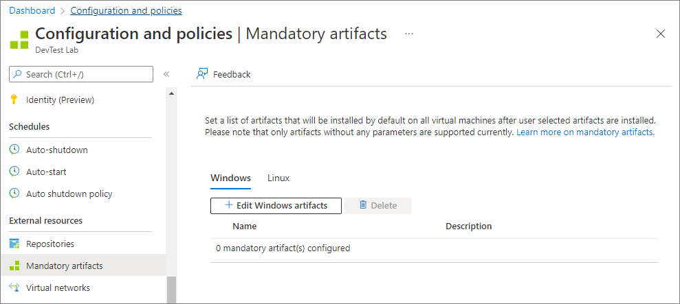
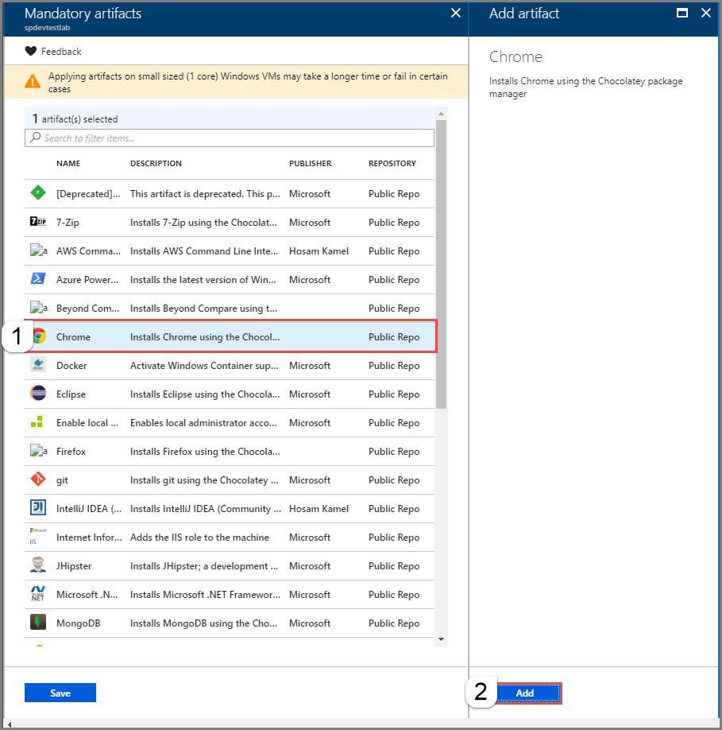
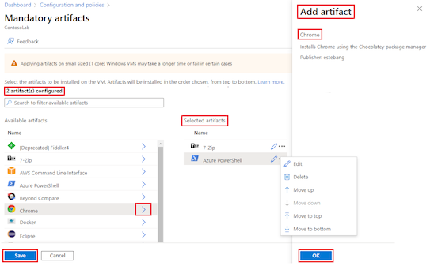
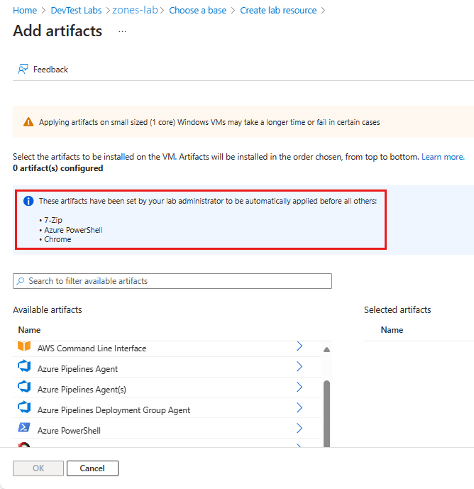
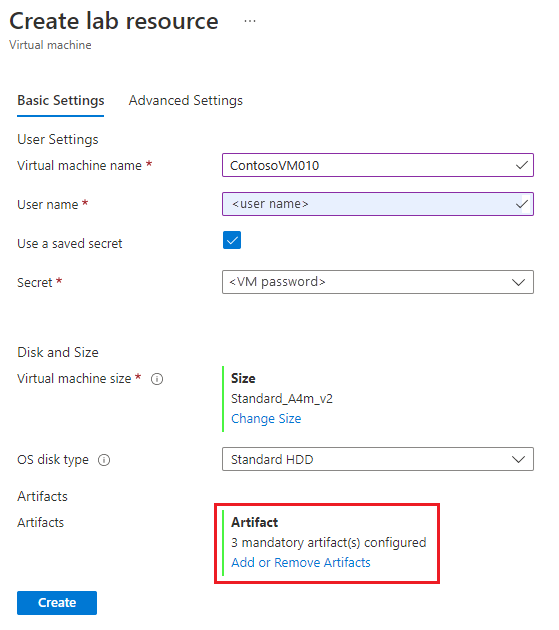
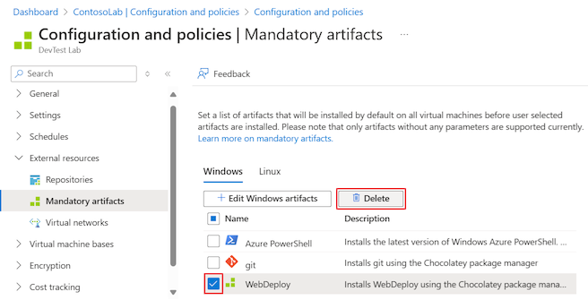

# Specify mandatory artifacts for your lab in Azure DevTest Labs
As an owner of a lab, you can specify mandatory artifacts that are applied to every machine created in the lab. Imagine a scenario where you want each machine in your lab to be connected to your corporate network. In this case, each lab user would have to add a domain join artifact during virtual machine creation to make sure their machine is connected to the corporate domain. In other words, lab users would essentially have to re-create a machine in case they forget to apply mandatory artifacts on their machine. As a lab owner, you make the domain join artifact as a mandatory artifact in your lab. This step makes sure that each machine is connected to the corporate network and saving the time and effort for your lab users.
 
Other mandatory artifacts could include a common tool that your team uses, or a platform-related security pack that each machine needs to have by default etc. In short, any common software that every machine in your lab must have becomes a mandatory artifact. If you create a custom image from a machine that has mandatory artifacts applied to it and then create a fresh machine from that image, the mandatory artifacts are reapplied on the machine during creation. This behavior also means that even though the custom image is old, every time you create a machine from it the most updated version of mandatory artifacts are applied to it during the creation flow. 
 
Only artifacts that have no parameters are supported as mandatory ones. Your lab user doesn't need to enter additional parameters during lab creation and thus making the process of VM creation simple. 

## Specify mandatory artifacts
You can select mandatory artifacts for Windows and Linux machines separately. You can also reorder these artifacts depending on the order in which you would like them to applied. 

1. On the home page of your lab, select **Configuration and policies** under **SETTINGS**. 
3. Select **Mandatory artifacts** under **EXTERNAL RESOURCES**. 
4. Select **Edit** in the **Windows** section or the **Linux** section. This example uses the **Windows** option. 

    
4. Select an artifact. This example uses **7-Zip** option. 
5. On the **Add artifact** page, select **Add**. 

    
6. To add another artifact, select the article, and select **Add**. This example adds **Chrome** as the second mandatory artifact.

    
7. On the **Mandatory artifacts** page, you see a message that specifies the number of artifacts selected. If you click the message, you see the artifacts that you selected. Select **Save** to save. 

    
8. Repeat the steps to specify mandatory artifacts for Linux VMs. 
    
    
9. To **delete** an artifact from the list, select **...(ellipsis)** at the end of the row, and select **Delete**. 
10. To **reorder** artifacts in the list, hover mouse over the artifact, select **...(ellipsis)** that shows up at the beginning of the row, and drag the item to the new position. 
11. To save mandatory artifacts in the lab, select **Save**. 

    
12. Close the **Configuration and policies** page (select **X** in the upper-right corner) to get back to the home page for your lab.  

## Delete a mandatory artifact
To delete a mandatory artifact from a lab, do the following actions: 

1. Select **Configuration and policies** under **SETTINGS**. 
2. Select **Mandatory artifacts** under **EXTERNAL RESOURCES**. 
3. Select **Edit** in the **Windows** section or the **Linux** section. This example uses the **Windows** option. 
4. Select the message with the number of mandatory artifacts at the top. 

    
5. On the **Selected artifacts** page, select **...(ellipsis)** for the artifact to be deleted, and select **Remove**. 
    
    
6. Select **OK** to close the **Selected artifacts** page. 
7. Select **Save** on the **Mandatory artifacts** page.
8. Repeat steps for **Linux** images if needed. 
9. Select **Save** to save all the changes to the lab. 

## View mandatory artifacts when creating a VM
Now, as a lab user you can view the list of mandatory artifacts while creating a VM in the lab. You can't edit or delete mandatory artifacts set in the lab by your lab owner.

1. On the home page for your lab, select **Overview** from the menu.
2. To add a VM to the lab, select **+ Add**. 
3. Select a **base image**. This example uses **Windows Server, version 1709**.
4. Notice that you see a message for **Artifacts** with the number of mandatory artifacts selected. 
5. Select **Artifacts**. 
6. Confirm that you see the **mandatory artifacts** you specified in the lab's configuration and policies. 

    

## Next steps
* Learn how to [add a Git artifact repository to a lab](devtest-lab-add-artifact-repo.md).

