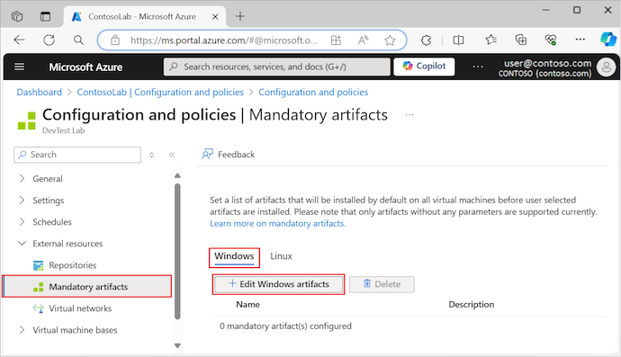

# Add mandatory artifacts to DevTest Labs VMs

This article describes how to specify mandatory artifacts to install on every lab virtual machine (VM) in Azure DevTest Labs. Artifacts are tools and applications you can add to VMs during or after VM creation. Installing mandatory artifacts ensures that all lab VM artifacts are standardized and up-to-date. Lab users don't have to spend the time and effort to add the needed artifacts individually.

Mandatory artifacts can include any software that every VM in your lab must have. If you create a custom image from a VM that has mandatory artifacts applied to it, and create new VMs from that image, those VMs also apply the mandatory artifacts. Even if the custom image is old, VM creation applies the most updated versions of the mandatory artifacts.
 
Only artifacts that have no parameters can be mandatory artifacts. Lab users don't have to enter extra parameter values, making the VM creation process simple.

## Specify mandatory artifacts

You can select mandatory artifacts for Windows and Linux lab machines separately.

1. On your lab's home page, under **Settings** in the left navigation, select **Configuration and policies**.
1. On the **Configuration and policies** screen, under **External resources** in the left navigation, select **Mandatory artifacts**.
1. For Windows VMs, select **Windows**, and then select **Edit Windows artifacts**. For Linux VMs, select **Linux**, and then select **Edit Linux artifacts**.

   

1. On the **Mandatory artifacts** page, select the arrow next to each artifact you want to add to the VM.
1. On each **Add artifact** pane, select **OK**.

   After you add each artifact, it appears in the list under **Selected artifacts**.

   By default, artifacts install in the order you add them to the list. To rearrange the order or to delete an artifact, select the ellipsis **...** next to the artifact in the **Selected artifacts** list, and select **Move up**, **Move down**, **Move to top**, **Move to bottom**, or **Delete**.

1. When you're done adding and arranging artifacts, select **Save**.

## Delete or rearrange mandatory artifacts

After you add mandatory artifacts, the lists of selected artifacts appear on the **Configuration and policies | Mandatory artifacts** screen under **Windows** and **Linux**. You can rearrange or delete the specified mandatory artifacts.

To delete a mandatory artifact from the list, select the checkbox next to the artifact, and then select **Delete**.

To rearrange the order the mandatory artifacts install in:

1. Select **Edit Windows artifacts** or **Edit Linux artifacts**.
1. On the **Mandatory artifacts** page, select the ellipsis **...** next to the artifact in the **Selected artifacts** list.
1. Select **Move up**, **Move down**, **Move to top**, or **Move to bottom**.
1. Select **Save**.

## See mandatory artifacts for a VM

Once you specify mandatory artifacts for a lab, all lab VMs for that operating system (Windows or Linux) create with those artifacts installed. Lab users can see the mandatory artifacts to be installed on their VMs.

For example, to see mandatory Windows artifacts to be installed on all lab Windows VMs:

1. On your lab's home page, select **Add**.
1. On the **Choose a base** page, select a Windows image, such as **Windows 11 Pro**.
1. On the **Create lab resource** page, under **Artifacts**, note the number of mandatory artifacts configured. To see what the mandatory artifacts are, select **Add or Remove Artifacts**.

   

1. On the **Add artifacts** screen, an informational message lists the mandatory artifacts to be installed, in order.

   

You can't remove, rearrange, or change mandatory artifacts when you create a VM. However, you can add other artifacts to the individual VM. For instructions, see [Add artifacts to DevTest Labs VMs](add-artifact-vm.md). You can also create your own artifacts to add to VMs. For instructions, see [Create custom artifacts for DevTest Labs VMs](devtest-lab-article-author.md).

## Next steps

- Learn how to [add a Git artifact repository to a lab](devtest-lab-add-artifact-repository.md).
