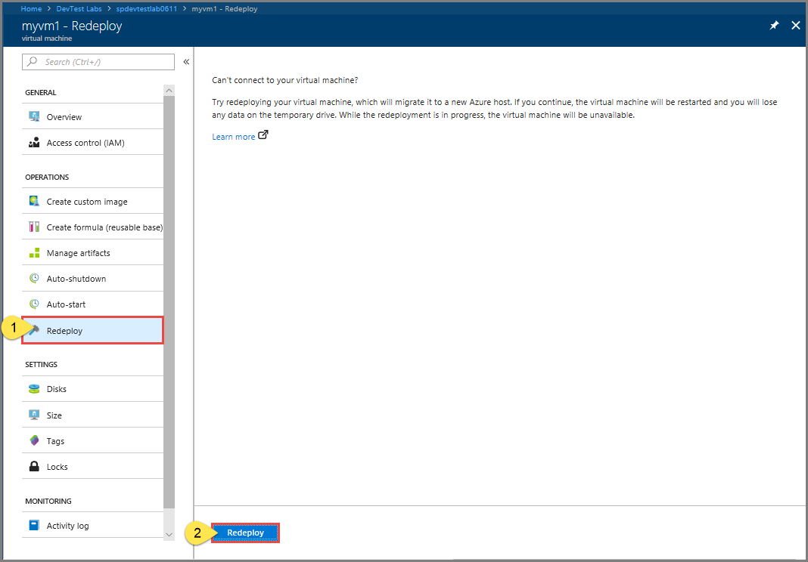

# Redeploy a VM in a lab in Azure DevTest Labs
If you can't connect to a virtual machine (VM) in a lab via a remote desktop connection, redeploy the VM and try connecting to it again. When you redeploy a VM, DevTest Labs moves the VM from the node on which it's running to a new node within the Azure infrastructure. It then starts the VM while retaining all your configuration options and associated resources. This feature saves you the time spent in troubleshooting your remote desktop connection or application access to Windows-based VMs in the lab. 

## Steps to redeploy a VM in a lab 
To redeploy a VM in a lab in Azure DevTest Labs, take the following steps: 

1. Sign in to the [Azure portal](https://portal.azure.com).
2. Select **All Services**, and then select **DevTest Labs** from the list.
3. From the list of labs, select the lab that includes the VM  you want to redeploy.  
4. In the left panel, select **My Virtual Machines**. 
5. From the list of VMs, select a VM.
6. In the Virtual Machine page for your VM, select **Redeploy** under **OPERATIONS** in the left menu.

    
7. Read the information on the page, and select **Redeploy** button. 9. Check the status of the redeploy operation in the **Notifications** window.

    

## Next steps
Learn how to resize a VM in Azure DevTest Labs, see [Resize a VM](devtest-lab-resize-vm.md).

