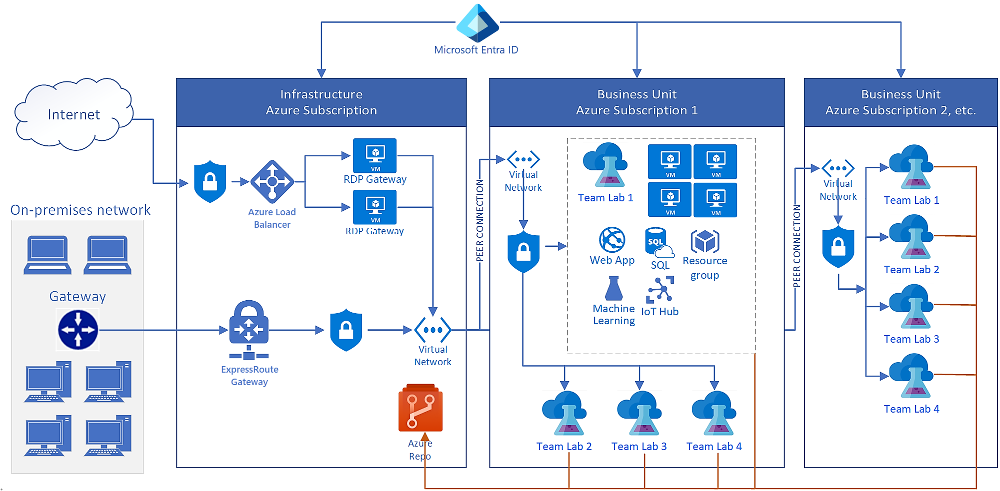

# Azure DevTest Labs reference architecture for enterprises
This article provides reference architecture to help you deploy a solution based on Azure DevTest Labs in an enterprise. It includes the following:
- On-premises connectivity via Azure ExpressRoute
- A remote desktop gateway to remotely sign in to virtual machines
- Connectivity to an artifact repository for private artifacts
- Other PaaS services that are used in labs

## Architecture
These are the key elements of the reference architecture:

- **Azure Active Directory (Azure AD)**: DevTest Labs uses the [Azure AD service for identity management](../active-directory/fundamentals/active-directory-whatis.md). Consider these two key aspects when you give users access to an environment based on DevTest Labs:
    - **Resource management**: It provides access to the Azure portal to manage resources (create virtual machines; create environments; start, stop, restart, delete, and apply artifacts; and so on). Resource management is done in Azure by using role-based access control (RBAC). You assign roles to users and set resource and access-level permissions.
    - **Virtual machines (network-level)**: In the default configuration, virtual machines use a local admin account. If there's a domain available ([Azure AD Domain Services](../active-directory-domain-services/overview.md), an on-premises domain, or a cloud-based domain), machines can be joined to the domain. Users can then use their domain-based identities to connect to the VMs.
- **On-premises connectivity**: In our architecture diagram, [ExpressRoute](../expressroute/expressroute-introduction.md) is used. But you can also use a [site-to-site VPN](../vpn-gateway/vpn-gateway-about-vpn-gateway-settings.md). Although ExpressRoute isn't required for DevTest Labs, it’s commonly used in enterprises. ExpressRoute is required only if you need access to corporate resources. Common scenarios are:
    - You have on-premises data that can't be moved to the cloud.
    - You prefer to join the lab's virtual machines to the on-premises domain.
    - You want to force all network traffic in and out of the cloud environment through an on-premises firewall for security/compliance.
- **Network security groups**: A common way to restrict traffic to the cloud environment (or within the cloud environment) based on source and destination IP addresses is to use a [network security group](../virtual-network/security-overview.md). For example, you want to allow only traffic that originates from the corporate network into the lab’s networks.
- **Remote desktop gateway**: Enterprises typically block outgoing remote desktop connections at the corporate firewall. There are several options to enable connectivity to the cloud-based environment in DevTest Labs, including:
  - Use a [remote desktop gateway](/windows-server/remote/remote-desktop-services/desktop-hosting-logical-architecture), and allow the static IP address of the gateway load balancer.
  - [Direct all incoming RDP traffic](../vpn-gateway/vpn-gateway-forced-tunneling-rm.md) over the ExpressRoute/site-to-site VPN connection. This functionality is a common consideration when enterprises plan a DevTest Labs deployment.
- **Network services (virtual networks, subnets)**: The [Azure networking](../networking/networking-overview.md) topology is another key element in the DevTest Labs architecture. It controls whether resources from the lab can communicate and have access to on-premises and the internet. Our architecture diagram includes the most common ways that customers use DevTest Labs: All labs connect via [virtual network peering](../virtual-network/virtual-network-peering-overview.md) by using a [hub-spoke model](/azure/architecture/reference-architectures/hybrid-networking/hub-spoke) to the ExpressRoute/site-to-site VPN connection to on-premises. But DevTest Labs uses Azure Virtual Network directly, so there are no restrictions on how you set up the networking infrastructure.
- **DevTest Labs**:  DevTest Labs is a key part of the overall architecture. To learn more about the service, see [About DevTest Labs](devtest-lab-overview.md).
- **Virtual machines and other resources (SaaS, PaaS, IaaS)**:  Virtual machines are a key workload that DevTest Labs supports along with other Azure resources. DevTest Labs makes it easy and fast for an enterprise to provide access to Azure resources (including VMs and other Azure resources). Learn more about access to Azure for [developers](devtest-lab-developer-lab.md) and [testers](devtest-lab-test-env.md).

## Scalability considerations
Although DevTest Labs doesn’t have built-in quotas or limits, other Azure resources that are used in the typical operation of a lab do have [subscription-level quotas](../azure-resource-manager/management/azure-subscription-service-limits.md). So, in a typical enterprise deployment, you need multiple Azure subscriptions to cover a large deployment of DevTest Labs. The quotas that enterprises most commonly reach are:

- **Resource groups**: In the default configuration, DevTest Labs creates a resource group for every new virtual machine, or the user creates an environment by using the service. Subscriptions can contain [up to 980 resource groups](../azure-resource-manager/management/azure-subscription-service-limits.md#subscription-limits). So, that's the limit of virtual machines and environments in a subscription. There are two other configurations that you should consider:
    - **[All virtual machines go to the same resource group](resource-group-control.md)**: Although this setup helps you meet the resource group limit, it affects the resource-type-per-resource-group limit.
    - **Using Shared Public IPs**: All VMs of the same size and region go into the same resource group. This configuration is a "middle ground" between resource group quotas and resource-type-per-resource-group quotas, if the virtual machines are allowed to have public IP addresses.
- **Resources per resource group per resource type**: The default limit for [resources per resource group per resource type is 800](../azure-resource-manager/management/azure-subscription-service-limits.md#resource-group-limits).  When you use the *all VMs go to the same resource group* configuration, users hit this subscription limit much sooner, especially if the VMs have many extra disks.
- **Storage accounts**: A lab in DevTest Labs comes with a storage account. The Azure quota for [number of storage accounts per region per subscription is 250](../azure-resource-manager/management/azure-subscription-service-limits.md#storage-limits). The maximum number of DevTest Labs in the same region is also 250.
- **Role assignments**: A role assignment is how you give a user or principal access to a resource (owner, resource, permission level). In Azure, there's a [limit of 2,000 role assignments per subscription](../azure-resource-manager/management/azure-subscription-service-limits.md#role-based-access-control-limits). By default, the DevTest Labs service creates a resource group for each VM. The owner is granted *owner* permission for the DevTest Labs VM and *reader* permission to the resource group. In this way, each new VM that you create uses two role assignments in addition to the assignments that are used when you give users permission to the lab.
- **API reads/writes**: There are various ways to automate Azure and DevTest Labs, including REST APIs, PowerShell, Azure CLI, and Azure SDK. Through automation, you might hit another limit on API requests: Each subscription allows up to [12,000 read requests and 1,200 write requests per hour](../azure-resource-manager/management/request-limits-and-throttling.md). Be aware of this limit when you automate DevTest Labs.

## Manageability considerations
DevTest Labs has a great administrative user interface for working with a single lab. But in an enterprise, you likely have multiple Azure subscriptions and many labs. Making changes consistently to all your labs requires scripting/automation. Here are some examples and best management practices for a DevTest Labs deployment:

- **Changes to lab settings**: A common scenario is to update a specific lab setting across all labs in the deployment. For example, a new VM instance size is available, and all labs must be updated to allow it. It’s best to automate these changes by using  PowerShell scripts, the CLI, or REST APIs.  
- **Artifact repository personal access token**:  Typically, personal access tokens for a Git repository expire in 90 days, one year, or two years. To ensure continuity, it’s important to extend the personal access token or create a new one. Then use automation to apply the new personal access token to all the labs.
- **Restrict changes to a lab setting**: Often, a particular setting must be restricted (such as allowing use of marketplace images). You can use Azure Policy to prevent changes to a resource type. Or you can create a custom role, and grant users that role instead of the *owner* role for the lab. You can do this for most settings in the lab (internal support, lab announcement, allowed VM sizes, and so on).
- **Require VMs to follow a naming convention**: Managers commonly want to easily identify VMs that are part of a cloud-based development and testing environment. You can do this by using [Azure Policy](https://github.com/Azure/azure-policy/tree/master/samples/TextPatterns/allow-multiple-name-patterns).

It’s important to note that DevTest Labs uses underlying Azure resources that are managed the same way: networking, disks, compute, and so on. For example, Azure Policy applies to virtual machines that are created in a lab. Azure Security Center can report on VM compliance. And the Azure Backup service can provide regular backups for the VMs in the lab.

## Security considerations
Azure DevTest Labs uses existing resources in Azure (compute, networking, and so on). So it automatically benefits from the security features that are built into the platform. For example, to require incoming remote desktop connections to originate only from the corporate network, simply add a network security group to the virtual network on the remote desktop gateway. The only additional security consideration is the level of permissions that you grant to team members who use the labs on a day-to-day basis. The most common permissions are [*owner* and *user*](devtest-lab-add-devtest-user.md). For more information about these roles, see [Add owners and users in Azure DevTest Labs](devtest-lab-add-devtest-user.md).

## Next steps
See the next article in this series: [Scale up your Azure DevTest Labs infrastructure](devtest-lab-guidance-scale.md).
