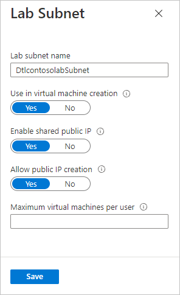
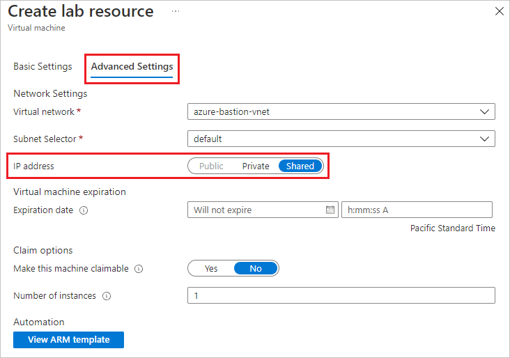
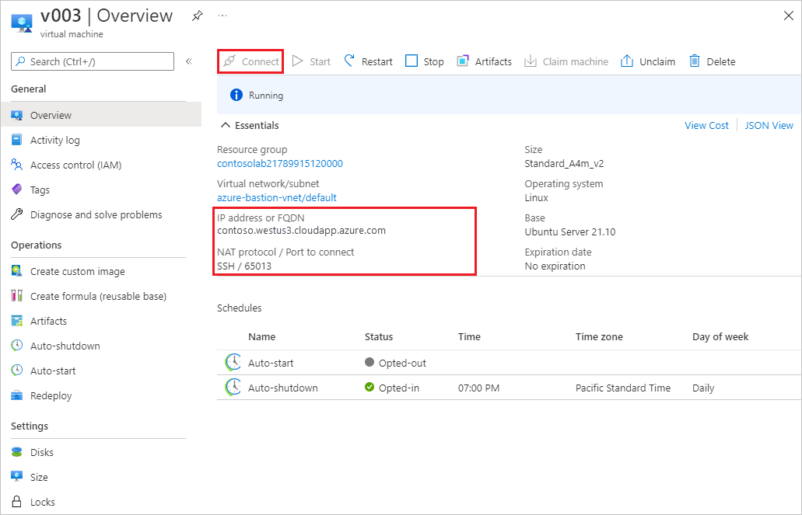

# Understand shared IP addresses in Azure DevTest Labs

Azure DevTest Labs lets lab VMs share the same public IP address to minimize the number of public IP addresses required to access your individual lab VMs.  This article describes how shared IPs work and their related configuration options.

## Shared IP setting

When you create a lab, it's created in a subnet of a virtual network.  By default, this subnet is created with **Enable shared public IP** set to *Yes*.  This configuration creates one public IP address for the entire subnet.  For more information about configuring virtual networks and subnets, see [Configure a virtual network in Azure DevTest Labs](devtest-lab-configure-vnet.md).

For existing labs, you can enable this option by selecting **Configuration and policies > Virtual Networks**. Then, select a virtual network from the list and choose **ENABLE SHARED PUBLIC IP** for a selected subnet. You can also disable this option in any lab if you don't want to share a public IP address across lab VMs.

Any VMs created in this lab default to using a shared IP.  When creating the VM, this setting can be observed in the **Advanced settings** page under **IP address configuration**.

- **Shared:** All VMs created as **Shared** are placed into one resource group (RG). A single IP address is assigned for that RG and all VMs in the RG will use that IP address.
- **Public:** Every VM you create has its own IP address and is created in its own resource group.
- **Private:** Every VM you create uses a private IP address. You can't connect to this VM directly from the internet with Remote Desktop.

Whenever a VM with shared IP enabled is added to the subnet, DevTest Labs automatically adds the VM to a load balancer and assigns a TCP port number on the public IP address, forwarding to the RDP port on the VM.  

## Using the shared IP

- **Linux users:** SSH to the VM by using the IP address or fully qualified domain name, followed by a colon, followed by the port. For example, in the image below, the RDP address to connect to the VM is `mydevtestlab597975021002.eastus.cloudapp.azure.com:50661`.

  

- **Windows users:** Select the **Connect** button on the Azure portal to download a pre-configured RDP file and access the VM.

## Next steps

* [Define lab policies in Azure DevTest Labs](devtest-lab-set-lab-policy.md)
* [Configure a virtual network in Azure DevTest Labs](devtest-lab-configure-vnet.md)

