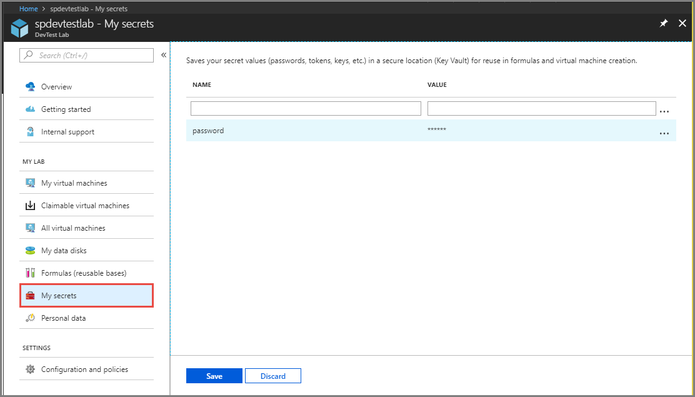
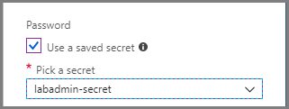
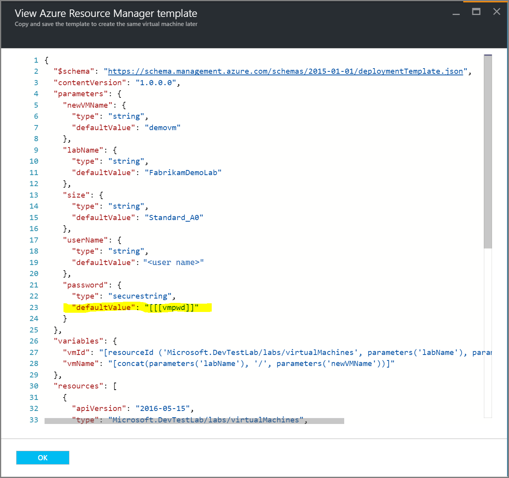

# Store secrets in a key vault in Azure DevTest Labs
You might need to enter a complex secret when you use Azure DevTest Labs. Secrets include passwords for your Windows VMs, public SSH keys for your Linux VMs, or personal access token to clone your Git repo through an artifact. Secrets are often long and have random characters. Entering them can be tricky and inconvenient, especially if you use the same secret multiple times.

To solve this problem and keep your secrets in a safe place, DevTest Labs supports storing secrets in an [Azure key vault](../key-vault/general/overview.md). The first time a user saves a secret, DevTest Labs automatically creates a key vault in the same resource group as the lab, and stores the secret. DevTest Labs creates a separate key vault for each user. 

Lab users need to create a lab virtual machine before they can create a secret in the key vault. This requirement is because DevTest Labs must associate lab users with valid user documents. DevTest Labs then allows users to create and store secrets in their key vaults.

## Save a secret in Azure Key Vault
To save your secret in Azure Key Vault, do the following steps:

1. Select **My secrets** on the left menu.
2. Enter a **name** for the secret. You see this name in the drop-down list when creating a VM, formula, or an environment. 
3. Enter the secret as the **value**.

    

## Use a secret from Azure Key Vault
When you enter a secret to create a VM, formula, or environment, you can enter the secret manually or select a saved secret from the key vault. To use a secret stored in your key vault, do the following actions:

1. Select **Use a saved secret**. 
2. Select your secret from the drop-down list for **Pick a secret**. 

    

## Use a secret in an Azure Resource Manager template
You can specify your secret name in an Azure Resource Manager template that's used to create a VM as shown in the following example:

## Next steps

- [Create a VM using the secret](devtest-lab-add-vm.md) 
- [Create a formula using the secret](devtest-lab-manage-formulas.md)
- [Create an environment using the secret](devtest-lab-create-environment-from-arm.md)
