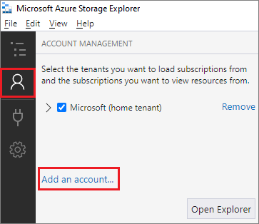
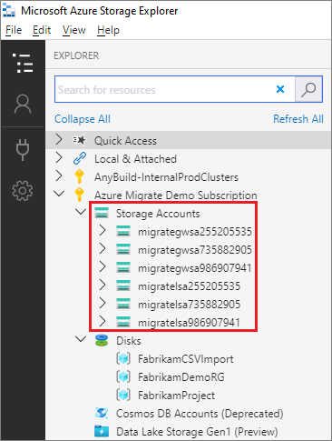
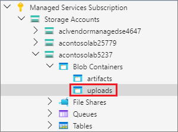
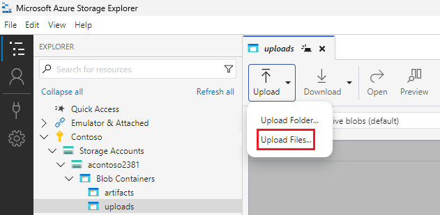
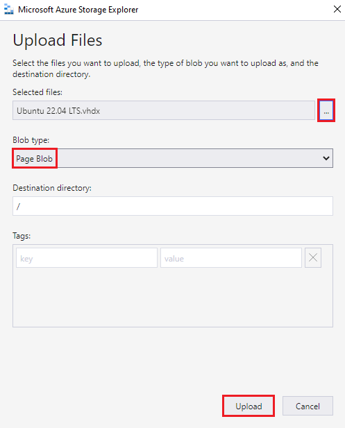
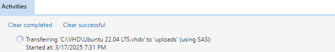

# Upload a VHD file to a lab's storage account by using Storage Explorer

[!INCLUDE [devtest-lab-upload-vhd-selector](../../includes/devtest-lab-upload-vhd-selector.md)]

In Azure DevTest Labs, you can use VHD files to create custom images for provisioning virtual machines. This article describes how to use [Microsoft Azure Storage Explorer](../vs-azure-tools-storage-manage-with-storage-explorer.md) to upload a VHD file to a lab's storage account. Once you upload the VHD file to DevTest Labs, you can [create a custom image](devtest-lab-create-custom-image-from-vhd-using-powershell.md) from the uploaded file. For more information about disks and VHDs in Azure, see [Introduction to managed disks](../virtual-machines/managed-disks-overview.md).

Storage Explorer supports several connection options. This article describes connecting to a storage account associated with your Azure subscription. For information about other Storage Explorer connection options, see [Getting started with Storage Explorer](../vs-azure-tools-storage-manage-with-storage-explorer.md).

## Prerequisites

- [Download and install the latest version of Microsoft Azure Storage Explorer](https://www.storageexplorer.com).

- Get the name of the lab's storage account by using the Azure portal:

   1. Sign in to the [Azure portal](https://go.microsoft.com/fwlink/p/?LinkID=525040).

   1. Select **All resources**, and then select your lab.  

   1. In the lab menu under **Settings**, select **Configuration and policies**.

   1. In **Activity log**, in the resource menu under **Virtual machine bases**, select **Custom images**.

   1. In **Custom images**, select **Add**.

   1. In **Custom image**, under **VHD**, select the **Upload an image using PowerShell** link.

       :::image type="content" source="media/devtest-lab-upload-vhd-using-azcopy/upload-image-powershell.png" alt-text="Screenshot that shows settings to upload a VHD by using PowerShell on the Custom image pane.":::

   1. In **Upload an image using PowerShell**, scroll right to see a call to the Add-AzureRmVhd cmdlet.

       The `-Destination` parameter contains the URI for a blob container in the following format:

       `https://<STORAGE-ACCOUNT-NAME>.blob.core.windows.net/uploads/...`

       :::image type="content" source="media/devtest-lab-upload-vhd-using-azcopy/destination-parameter.png" alt-text="Screenshot that shows an example of a URI in the Add VHD box.":::

       Copy the full `-Destination` URI to use in a later step.

   1. Copy the storage account name to use in the following steps.

## Upload a VHD file

1. When you open Storage Explorer, the Explorer pane shows all the Azure subscriptions you're signed in to.

   If you need to add a different account, select the **Account Management** icon. In the **Account Management** pane, select **Add an account**.

   

   Follow the prompts to sign in with the Microsoft account associated with your Azure subscription.

1. After you sign in, the **Explorer** pane shows the Azure subscriptions associated with your account. Select the dropdown arrow next to the Azure subscription you want to use. The left pane shows the storage accounts associated with the selected Azure subscription.

   

1. Select the dropdown arrow next to the lab storage account name you saved earlier.

1. Expand the **Blob Containers** node, and then select **uploads**.

   

1. In the Storage Explorer right pane, on the blob editor toolbar, select **Upload**, and then select **Upload Files**. 

   

1. In the **Upload Files** dialog box, select **...** next to the **Selected files** field, browse to the VHD file on your machine, select it, and then select **Open**.

1. Under **Blob type**, change **Block Blob** to **Page Blob**.

1. Select **Upload**.

   

The **Activities** pane at the bottom shows upload status. Uploading the VHD file can take a long time, depending on the size of the VHD file and your connection speed.

## Next steps

- [Create a custom image in Azure DevTest Labs from a VHD file using the Azure portal](devtest-lab-create-template.md)
- [Create a custom image in Azure DevTest Labs from a VHD file using PowerShell](devtest-lab-create-custom-image-from-vhd-using-powershell.md)
