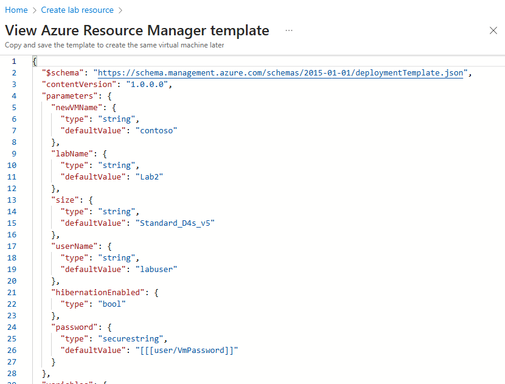

# Create virtual machines from ARM templates

You can use Azure Resource Manager (ARM) templates to create virtual machines (VMs) in Azure DevTest Labs. You can view, edit, and save a VM's ARM template, and use it to create other VMs with the same settings.

This article describes how to save and store ARM templates in source control repositories, and how to connect the repositories to DevTest Labs so lab users can access the templates.

For guidelines and suggestions to help you create reliable, easy to use ARM templates, see [Best practices for creating Azure Resource Manager templates](../azure-resource-manager/templates/best-practices.md).

## Multi-VM vs. single-VM ARM templates

There are two methods for creating VMs in DevTest Labs. Each method is used for different scenarios and requires different permissions. The ARM template's `resource` property declares the method to use.

- `Microsoft.DevTestLab/labs/virtualmachines`

  ARM templates that use a `Microsoft.DevTestLab/labs/virtualmachines` resource type provision individual VM configurations, although you can create multiple instances of the VM. Each VM appears as a separate item in the lab's **My virtual machines** list.

  

  You can automatically provision VMs with these templates by using the Azure PowerShell commands [New-AzResource](/powershell/module/az.resources/new-azresource) or [New-AzResourceGroupDeployment](/powershell/module/az.resources/new-azresourcegroupdeployment). Provisioning VMs with PowerShell requires administrator permissions, so the DevTest Labs user role can't do these deployments. Lab administrators use the templates to automate creating claimable lab VMs or image factory golden images.

  [!INCLUDE [updated-for-az](../../includes/updated-for-az.md)]

  Lab administrators and users can automatically provision VMs with the Azure CLI commands [az lab vm create](/cli/azure/lab/vm#az_lab_vm_create) or [az deployment group create](/cli/azure/deployment/group#az_deployment_group_create). For more information, see [Deploy resources with Resource Manager templates and Azure CLI](../azure-resource-manager/templates/deploy-cli.md).

- `Microsoft.Compute/virtualmachines`

  Resource Manager templates that use a `Microsoft.Compute/virtualmachines` resource type can provision multiple lab VMs in a single environment, such as a SharePoint farm. The VMs appear under their environments in the lab's **My environments** list.

  

  Lab users can use these templates to create multi-VM environments. For more information and instructions for creating and using environment templates and environments, see [Use ARM templates to create multi-VM DevTest Labs environments](devtest-lab-create-environment-from-arm.md).

## View and edit an ARM template for a VM

You can use any available VM base to create an ARM template for deploying VMs.

1. On your lab's **Overview** page, select **Add** on the top toolbar.
1. On the **Choose a base** page, select the type of VM you want.
1. On the **Create lab resource** page, configure settings and add any artifacts you want for your VM.
1. On the **Advanced Settings** tab, select **View ARM template**.
1. Copy and [save the ARM template](#save-arm-templates-in-git-repositories) to use for creating more VMs.
   
1. If you want to create a VM now, on the **Basic Settings** tab, select **Create**.

### Set VM expiration date

For scenarios such as training, demos, and trials, you might want to delete VMs automatically after a certain date so they don't keep incurring costs. Create a lab VM with an expiration date by specifying the **Expiration date** property on the **Advanced settings** tab when creating the VM. You can find an ARM template that defines the `expirationDate` property at the public [DevTest Labs GitHub repository](https://github.com/Azure/azure-devtestlab/tree/master/samples/DevTestLabs/QuickStartTemplates/101-dtl-create-vm-username-pwd-customimage-with-expiration).

<a name="configure-your-own-template-repositories"></a>
<a name="create-your-own-template-repositories"></a>
## Save ARM templates in Git repositories

As a best practice for infrastructure-as-code and configuration-as-code, manage your ARM templates in source control. Azure DevTest Labs can load all your ARM templates directly from your GitHub or Azure Repos repositories. You can use the ARM templates through the entire release cycle, from development through test to production environments.

To organize your ARM templates in a repository:

- You must name the main template file *azuredeploy.json*.

- You must update the `parameters` section before you can reuse the ARM template. You can create a *parameter.json* file that customizes just the parameters, without having to edit the actual template. The parameter file must be named *azuredeploy.parameters.json*.

  

- In the parameters file, you can use the parameters `_artifactsLocation` and `_artifactsLocationSasToken` to construct a `parametersLink` URI value for automatically managing nested templates. For more information, see [Deploy nested Azure Resource Manager templates for testing environments](deploy-nested-template-environments.md).

- You can define metadata that specifies the template display name and description in a file named *metadata.json*.

  ```json
  {
    "itemDisplayName": "<template name>",
    "description": "<template description>"
  }
  ```

The following screenshot shows a typical ARM template folder in a repository.


## Add template repositories to the lab

After you create and configure your ARM template and repository, add the repository to your lab so all your lab users can access the templates.

1. On the lab's **Overview** page, select **Configuration and policies** from the left navigation.

1. On the **Configuration and policies** page, select **Repositories** under **External resources** in the left navigation.

   The **Public Artifact Repo** and **Public Environment Repo** repositories are automatically generated for all labs, and connect to the [DevTest Labs public GitHub repository](https://github.com/Azure/azure-devtestlab). If these repos aren't enabled for lab access, you can enable them here. For more information, see [Configure and use public environments in DevTest Labs](devtest-lab-configure-use-public-environments.md).

1. To add your ARM template repository, select **Add**.

   

1. In the **Repositories** pane, enter the following information:

   - **Name**: Enter a repository name to use in the lab.
   - **Git clone URL**: Enter the Git HTTPS clone URL from GitHub or Azure Repos.
   - **Branch** (optional): Enter the branch name to access your Azure Resource Manager template definitions.
   - **Personal access token**: Enter the personal access token that is used to securely access your repository.
     - To get your token from Azure Repos, under your profile, select **User settings** > **Security** > **Personal access tokens**.
     - To get your token from GitHub, under your profile, select **Settings** > **Developer Settings** > **Personal access tokens**.
   - **Folder paths**: Enter the folder path for your ARM template definitions, relative to your Git clone URI.

1. Select **Save**.

   

After you add the ARM template repository to the lab, your lab users can use the templates in the repository to create VMs and environments.

### Next steps

- [Use ARM templates to create multi-VM DevTest Labs environments](devtest-lab-create-environment-from-arm.md)
- [Automate ARM template environment creation with Azure PowerShell](devtest-lab-create-environment-from-arm.md#automate-deployment-of-environments)
- [ARM quickstart templates for DevTest Labs automation](https://github.com/Azure/azure-quickstart-templates)