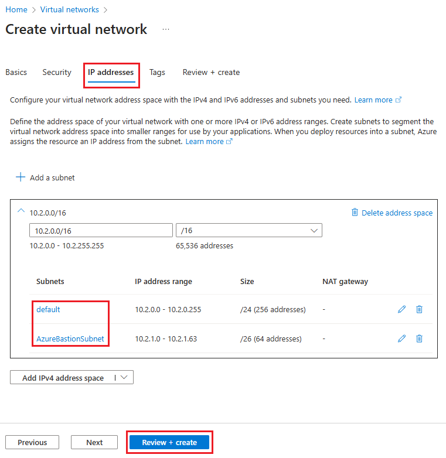
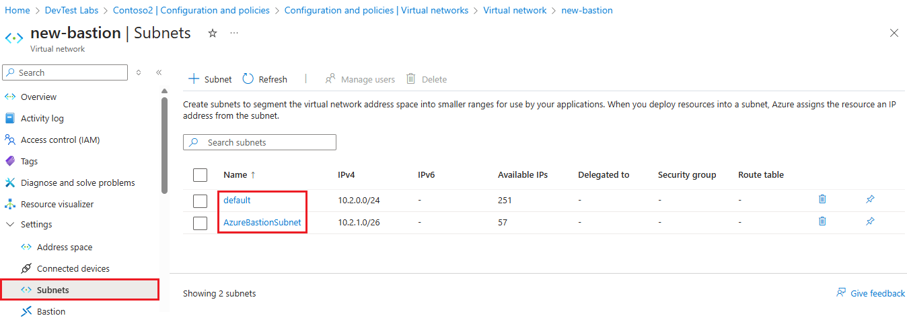
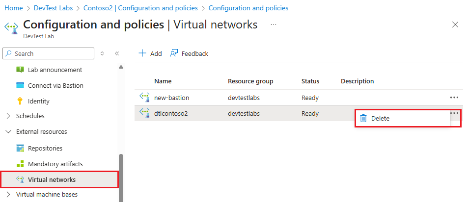
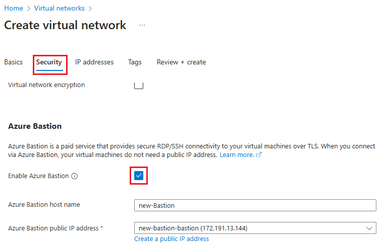

# Enable browser connection to DevTest Labs VMs with Azure Bastion

Azure DevTest Labs integrates with [Azure Bastion](../bastion/index.yml) to allow connecting to lab virtual machines (VMs) through a browser. As a lab owner, you can enable browser access to all your lab VMs through Azure Bastion.

Azure Bastion provides secure and seamless remote desktop protocol (RDP) and secure shell (SSH) connectivity over transport layer security (TLS), directly from the Azure portal. You don't need any other client, agent, or software to connect to your lab VMs through your browser. Your VMs don't need public IP addresses.

This article covers two different ways to enable Azure Bastion browser connectivity to DevTest Labs VMs:

- You can create a new Azure Bastion-enabled virtual network for your lab and its VMs.
- You can deploy Azure Bastion in your existing lab virtual network.

## Prerequisites

- Have or [create a lab](tutorial-create-custom-lab.md#create-a-lab) in DevTest Labs.
- To use Azure Bastion browser access, lab users must have **Reader** role on the Azure Bastion host and on the lab virtual network that has Azure Bastion configured.

## Option 1: Connect a lab to an Azure Bastion-enabled virtual network

First, create a new virtual network with an Azure Bastion subnet and another subnet in it. An Azure Bastion subnet doesn't allow creating non-Azure Bastion resources in it, so you need the other subnet for creating lab VMs.

1. In the Azure portal, search for and select **virtual networks**.
1. Select **+ Create** at the top of the **Virtual networks** page.
1. On the **Create virtual network** screen, enter a **Name** for the new virtual network, and select the same **Subscription**, **Resource group**, and **Region** as your lab.
1. Select **Next: IP Addresses**.
1. On the **IP Addresses** tab, there's already one subnet, **default**. Select **Add subnet**.
1. On the **Add subnet** pane, enter *AzureBastionSubnet* under **Name**.
1. Under **Subnet address range**, enter an address range that's within the virtual network's address space but doesn't overlap with the default subnet. If necessary, you can add new address spaces in the blank fields on the **Create virtual network** page.
1. Select **Add**.

   

1. Select **Review + create**, and when validation passes, select **Create**.
1. Once the new virtual network is created, go to its page, select **Subnets** in the left navigation, and confirm that there are two subnets, **default** and **AzureBastionSubnet**.

   

Next, connect your lab to the new virtual network:

1. From your lab **Overview** page, select **Configuration and policies** in the left navigation.
1. On the **Configuration and policies** page, in the left navigation under **External resources**, select **Virtual networks**.
1. On the **Configuration and policies | Virtual networks** page, select **Add**.
1. On the **Virtual network** page, select **Select virtual network**.
1. On the **Choose virtual network** page, select the Azure Bastion-enabled virtual network you just created.
1. On the **Virtual network** page, select **Save**.
1. On the **Configuration and policies | Virtual networks** page, remove any previous virtual network from the lab. Select **...** next to that virtual network, select **Delete**, and then select **Yes**. 

   

Enable VM creation in the non-Azure Bastion subnet:

1. On the **Configuration and policies | Virtual networks** page, select the Azure Bastion-enabled virtual network.
1. On the **Virtual network** page, make sure that both the **AzureBastionSubnet** subnet and the **default** subnet appear. If you don't see both subnets, close and reopen the page.
1. Select the **default** subnet.
1. On the **Lab Subnet** pane, under **Use in virtual machine creation**, select **Yes**, and then select **Save**. You can now create VMs in the default subnet of your lab virtual network.

   

## Option 2: Deploy Azure Bastion in a lab's existing virtual network

First, create a new Azure Bastion subnet in your lab's existing virtual network:

1. In the Azure portal, search for and select **Virtual networks**.
1. On the **Virtual networks** page, select your lab's existing virtual network from the list.
1. On the virtual network page, select **Subnets**.
1. On the **Subnets** page, select **+ Subnet** on the top menu.
1. On the **Add Subnet screen**, enter *AzureBastionSubnet* under **Name**.
1. Under **Subnet address range**, enter an address range that's within the virtual network's address space, but doesn't overlap with the existing lab subnet.
   >[!TIP]
   >You might have to cancel out of this dialog, select **Address space** in the virtual network's left navigation, and create a new address space for the subnet.
1. Select **Save**.

   

Next, deploy the Azure Bastion host in the new Azure Bastion subnet:

1. In the Azure portal, search for and select **Bastions**.
1. On the **Bastions** page, select **+ Create** at the top.
1. On the **Create a Bastion** page, enter a **Name**, and select the same **Subscription**, **Resource group**, and **Region** as your lab.
1. Under **Virtual networks**, select your lab's virtual network from the dropdown list, and make sure **AzureBastionSubnet** is selected under **Subnet**.
1. Select **Review + create**, and when validation passes, select **Create**.

   

## Connect to lab VMs through Azure Bastion

Once you deploy Azure Bastion in your lab virtual network, enable browser connections for the lab:

1. On the lab **Overview** page, select **Configuration and policies**, and then under **Settings**, select **Browser connect**.
1. On the **Browser connect** page, select **On**.
1. Select **Save** at the top of the page.

   

To connect to a lab VM through Azure Bastion:

1. On the lab **Overview** page, from **My virtual machines**, select a lab VM.
1. At the top of the VM's page, select **Browser connect**.
1. In the **Browser connect** pane, enter your VM's username and password, and select **Connect**.

## Next steps
- [What is Azure Bastion?](../bastion/bastion-overview.md)
- [Add a VM to your lab](devtest-lab-add-vm.md)
