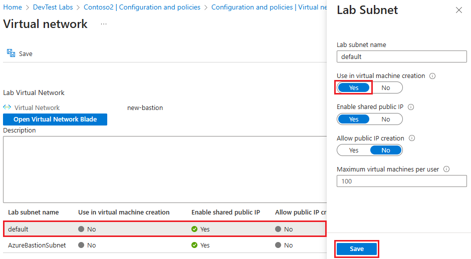
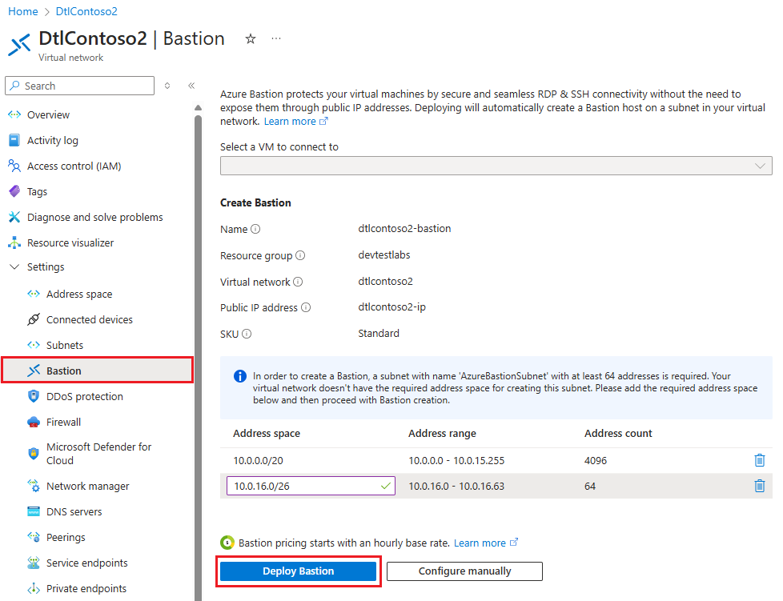
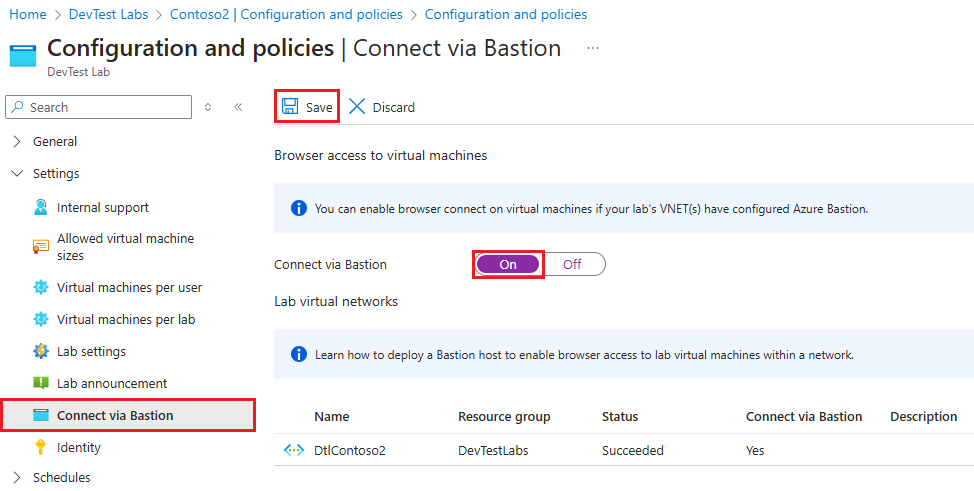

# Enable browser connection to DevTest Labs VMs with Azure Bastion

Azure DevTest Labs integrates with [Azure Bastion](/azure/bastion/index) to allow connecting to lab virtual machines (VMs) through a browser. When lab owners enable browser access to lab VMs through Bastion, all lab users can connect to the VMs through their browsers without needing any other client, agent, or software.

Azure Bastion provides secure and seamless remote desktop protocol (RDP) and secure shell (SSH) connectivity over transport layer security (TLS), directly from the Azure portal. Lab VMs don't need public IP addresses.

This article covers two ways to enable Azure Bastion browser connectivity to DevTest Labs VMs:

- [Create a new Azure Bastion-enabled virtual network for your lab](#option-1-create-a-new-azure-bastion-enabled-virtual-network). You add a subnet for creating VMs, so this option is suitable when you plan to add VMs.
- [Deploy Azure Bastion in your existing lab virtual network](#option-2-deploy-azure-bastion-in-the-existing-lab-virtual-network). This option is suitable for labs where the lab VMs already exist.

## Prerequisites

- To enable and configure Azure Bastion for a lab, you need at least Contributor permissions in the Azure subscription the lab is in, and Owner or Contributor role in the lab.
- To use Azure Bastion browser access, users need at least DevTest Lab User role in the lab that has Bastion configured.

## Option 1: Create a new Azure Bastion-enabled virtual network

You can create a new virtual network for your lab with an Azure Bastion subnet and another subnet in it. An Azure Bastion subnet allows only Bastion resources in it, so you need another subnet for creating lab VMs.

1. In the Azure portal, search for and select **virtual networks**.
1. Select **Create** at the top of the **Virtual networks** page.
1. On the **Create virtual network** page, enter a **Name** for the new virtual network, and select the same **Subscription**, **Resource group**, and **Region** as your lab.
1. Select **Next** or the **Security** tab.
1. Under **Azure Bastion**, select the **Enable Azure Bastion** checkbox.
1. Select **Next** or the **IP Addresses** tab.
1. On the **IP Addresses** tab, ensure there are two subnets named **default** and **AzureBastionSubnet**, and change or add IP address ranges if you like.

   

1. Select **Review + create**, and when validation passes, select **Create**.
1. Once the new virtual network is created, go to its page, select **Subnets** in the left navigation, and confirm that there are two subnets, **default** and **AzureBastionSubnet**.

   

### Connect your lab to the new virtual network

1. From your lab **Overview** page, select **Configuration and policies** in the left navigation.
1. On the **Configuration and policies** page, in the left navigation under **External resources**, select **Virtual networks**.
1. On the **Virtual networks** page, select **Add**.
1. On the **Virtual network** page, select **Select virtual network**.
1. On the **Choose virtual network** page, select the Azure Bastion-enabled virtual network you just created.
1. On the **Virtual network** page, select **Save**.
1. On the **Virtual networks** page, remove any previous virtual network from the lab. Select **...** next to that virtual network, select **Delete**, and then select **Yes**. 

   

### Enable VM creation in the default subnet

1. On the **Virtual networks** page, select the Azure Bastion-enabled virtual network.
1. On the **Virtual network** page, make sure that both the **AzureBastionSubnet** subnet and the **default** subnet appear.
1. Select the **default** subnet.
1. On the **Lab Subnet** pane, select **Yes** under **Use in virtual machine creation**, and then select **Save**. You can now create VMs in the default subnet of your lab virtual network.

   

## Option 2: Deploy Azure Bastion in an existing lab virtual network

You can enable connecting to existing lab VMs by creating a new Azure Bastion subnet in your lab's existing virtual network.

1. On your lab **Overview** page, select **Configuration and policies** from the left navigation.
1. On the **Configuration and policies** page, select **Virtual networks** under **Settings** in the left navigation.
1. Select your lab's existing virtual network, and on the virtual network's page, select **Open Virtual Network Blade**.
1. On the virtual network's page, select **Bastion** under **Settings** in the left navigation.
1. On the **Bastion** page, if necessary, add a new address range that's within the virtual network's address space, but doesn't overlap with the existing lab subnet.
1. Select **Deploy Bastion**.

   

## Enable connections through Azure Bastion

Once you deploy Azure Bastion in a new or existing lab virtual network, enable browser connections for the lab.

1. On the lab **Overview** page, select **Configuration and policies**, and then select **Connect via Bastion** under **Settings** in the left navigation.
1. On the **Connect via Bastion** page, set **Connect via Bastion** to **On**, and then select **Save**.

   

## Connect to lab VMs through Azure Bastion:

1. On the lab **Overview** page, select a lab VM from **My virtual machines**.
1. At the top of the VM's page, select **Connect** > **Connect via Bastion**.
1. In the **Browser connect** pane, enter your VM's username and password, and select **Connect**.

## Related content

- [What is Azure Bastion?](/azure/bastion/bastion-overview)
- [Add a VM to your lab](devtest-lab-add-vm.md)
