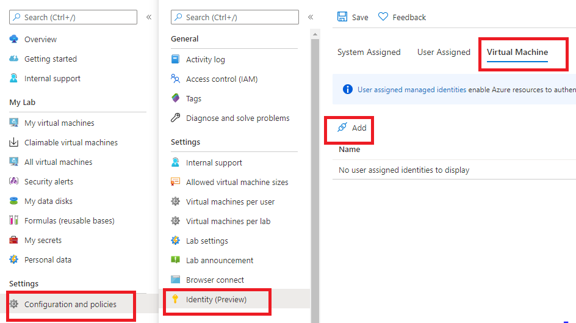
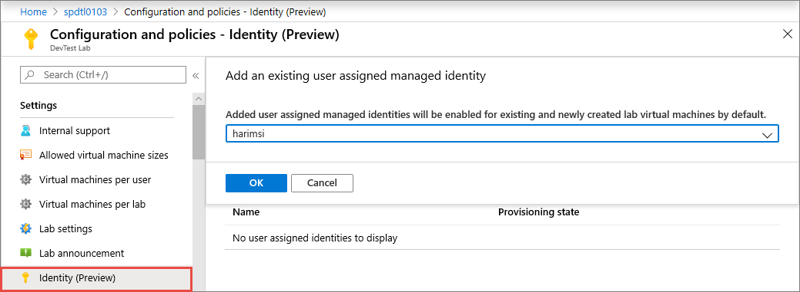

# Enable user-assigned managed identities on lab virtual machines in Azure DevTest Labs
As a lab owner, you can enable user-assigned managed identities on your lab virtual machines (VMs) in Azure DevTest Labs.

A managed identity can be used to authenticate to any service that supports Azure Active Directory (AD) authentication, including Key Vault, without passing any credentials in the code. For more information on managed identities, see [What is managed identities for Azure resources?](../active-directory/managed-identities-azure-resources/overview.md).

With this feature, lab users can share Azure resources such as Azure SQL Database in the context of the lab. The authentication to the resource is taken care by the identity itself. Once configured, every existing/newly created lab VM will be enabled with this identity. Lab users can access resources once logged in to their machines.

> [!NOTE]
> You can add multiple user assigned managed identities to be enabled on your lab VMs.

## Use Azure portal
To add a user assigned managed identity for lab VMs, follow these steps:

1. [Create a user-assigned managed identity in your subscription](../active-directory/managed-identities-azure-resources/how-to-manage-ua-identity-portal.md#create-a-user-assigned-managed-identity)
1. Navigate to the **Configuration and policies** page for your lab.
2. Select **Identity (Preview)** on the left menu.
3. Select the **Virtual machine** tab.
4. Select **Add** to select an existing identity from a pre-populated dropdown list. 

    
5. Select an existing **user-managed identity** from the dropped-down list, and select **OK**. 

    

## Use API

1.	After creating an identity, note the resource ID of the identity. It should look like the following sample: 

    `/subscriptions/0000000000-0000-0000-0000-00000000000000/resourceGroups/<RESOURCE GROUP NAME> /providers/Microsoft.ManagedIdentity/userAssignedIdentities/<NAME of USER IDENTITY>`.
2. Run a PUT HTTPS method to add a new **ServiceRunner** resource to the lab as shown in the following example. 

    Service runner resource is a proxy resource to manage and control managed identities in DevTest Labs. The service runner name can be any valid name, but we recommend you use the name of the managed identity resource.

    ```json
    {
        "identity": {
            "type": "userAssigned",
            "userAssignedIdentities": { 
                "[userAssignedIdentityResourceId]": {}
            }
			},
        "location": "southeastasia",
        "properties": {
            "identityUsageType": "VirtualMachine"
        }
    }
    ```

## Next steps
To learn more about managed identities, see [What is managed identities for Azure resources?](../active-directory/managed-identities-azure-resources/overview.md).


