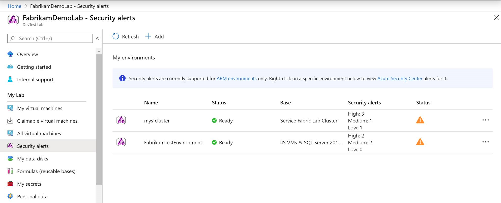
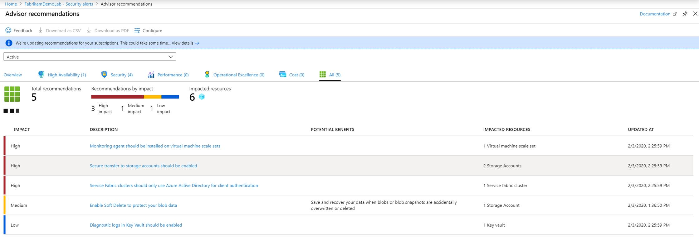

# Security alerts for environments in Azure DevTest Labs
As a lab user you can now view Azure Security Center alerts for your lab environments. Security Center automatically collects, analyzes, and integrates log data from your Azure resources, the network, and connected partner solutions, like firewall and endpoint protection solutions, to detect real threats and reduce false positives. A list of prioritized security alerts is shown in Security Center along with the information you need to quickly investigate the problem and recommendations for how to remediate an attack. [Learn more about security alerts in Azure Security Center](../security-center//security-center-alerts-overview.md).  

## Prerequisites
Currently, you can view security alerts only for platform as a service (PaaS) environments deployed into your lab. To test or use this feature, [deploy an environment into your lab](devtest-lab-create-environment-from-arm.md). 

## View security alerts for an environment

1. On the home page for your lab, select **Security alerts** on the left menu. You should see the number of security alerts (high, medium, and low). Learn more on [how alerts are classified](../security-center/security-center-alerts-overview.md#how-are-alerts-classified).

    
2. Right-click on three dots (...) in the last column, and select **View security alerts**. 

    
    
3. You see more details about the alerts and advisor recommendations. Learn more on [managing and responding to security alerts in Azure Security Center](../security-center/security-center-managing-and-responding-alerts.md).

    

## Next steps
To learn more about environments, see the following articles:

- [Create multi-vm environments and PaaS resources with Azure Resource Manager templates](devtest-lab-create-environment-from-arm.md)
- [Configure and use public environments](devtest-lab-configure-use-public-environments.md)
