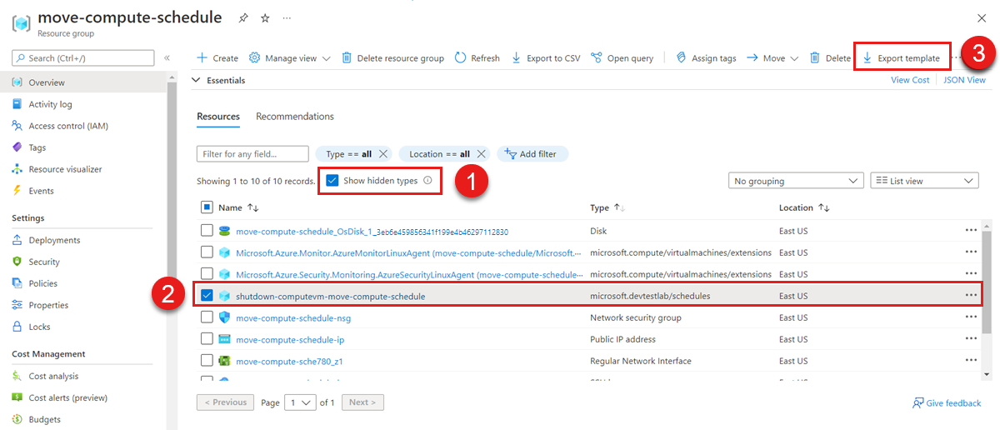
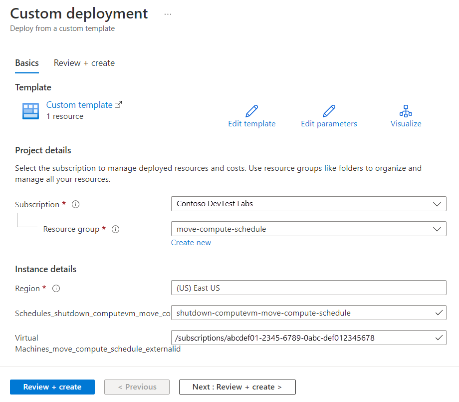

# Move a lab schedule to another region

In this article, you'll learn how to:
> [!div class="checklist"]
> >
> - Export an Azure Resource Manager (ARM) template of your lab.
> - Modify the template by adding or updating the target region and other parameters.
> - Deploy the template to create the new lab in the target region.
> - Configure the new lab.
> - Move data to the new  lab.
> - Delete the resources in the source region.

## Prerequisites

- Ensure that the services and features that your account uses are supported in the target region.
- For preview features, ensure that your subscription is allowlisted for the target region.
- DevTest Labs doesn't store or expose passwords from the exported ARM template. You will need to know the passwords/secrets for:
  - the VMs
  - the Stored Secrets
  - PAT tokens of the private Artifact Repos to move the private repos together with the lab.

## Prepare to move
To get started, you will export and modify a Resource Manager template that contains the schedule settings.

### Prepare your Virtual Network

1. Sign in to the [Azure portal](https://portal.azure.com).

1. If you don't have a [Resource Group](../azure-resource-manager/management/manage-resource-groups-portal.md#create-resource-groups) under the target region, create one now.

1. Move your current DevTest Lab to the new region and resource group by using the steps included in the article, [Move a DevTest lab to another region](./how-to-move-labs.md).

1. Optionally, you can move your current Virtual Network to the new region and resource group by using the steps included in the article, [Move an Azure virtual network to another region](../virtual-network/move-across-regions-vnet-portal.md).

   Alternately, you can create a new virtual network, if you don't have to keep the original one.

1. Move your Virtual Machines to the new region by using the steps included in the article, [Tutorial: Move Azure VMs across regions](../resource-mover/tutorial-move-region-virtual-machines.md).

## Move the schedule 
There are two ways to move a lab schedule. You can recreate any schedules you want to move on the moved VMs. This manual process can be time consuming, so it is most useful when you have a small number of schedules and VMs. 

Alternately, you can move your existing schedules by using the following steps:

1. Sign in to the [Azure portal](https://portal.azure.com).

2. Go to the source resource group that held your VMs.

3. On the **Resource Group Overview** page, under **Resources**, select **Show hidden types**.

4. Select all resources with the type **Microsoft.DevTestLab/Schedules** (1) and then select **Export template** (2).

<!-- :::image type="content" source="{./media/how-to-move-schedule-to-new-region/move-schedule-custom-deployment.png}" alt-text="{Screenshot that shows the hidden resources in a resource group, with schedules selected.}"::: -->

5. On the **Export resource group template** page, select **Deploy**.

6. On the **Custom deployment** page, select **Edit template**.
 
7. In the template code, change all instances of '"location": "<*old location*>"' to '"location": "<*new location*>"' and then select **Save**.

8. On the **Custom deployment** page, enter values that match the target VM:

   |Name|Value|
   |----|----|
   |**Subscription**|Select an Azure subscription.|
   |**Resource group**|Select the resource group name. |
   |**Region**|Select a location for the lab schedule. For example, **Central US**. |
   |**Schedule Name**|Must be a different name. |
   |**VirtualMachine_xxx_externalId**|Must be the moved one, or the new one you just created. |
 

<!-- :::image type="content" source="{./media/how-to-move-schedule-to-new-region/move-schedule-custom-deployment.png}" alt-text="{Screenshot that shows the custom deployment page, with new location values for the relevant settings.}"::: -->

>[!IMPORTANT]
>Each schedule must have a globally unique name, so remember to change the schedule name for the new location.

9. Select **Review and create** to create the deployment.

10. When the deployment is complete, verify that the new schedule is configured correctly on the new VM.

## Discard or clean up

## Next steps

In this article, you moved a DevTest lab schedule from one region to another and cleaned up the source resources.  To learn more about moving resources between regions and disaster recovery in Azure, refer to:

- [Move resources to a new resource group or subscription](../azure-resource-manager/management/move-resource-group-and-subscription.md)
- [Move Azure VMs to another region](../site-recovery/azure-to-azure-tutorial-migrate.md)
