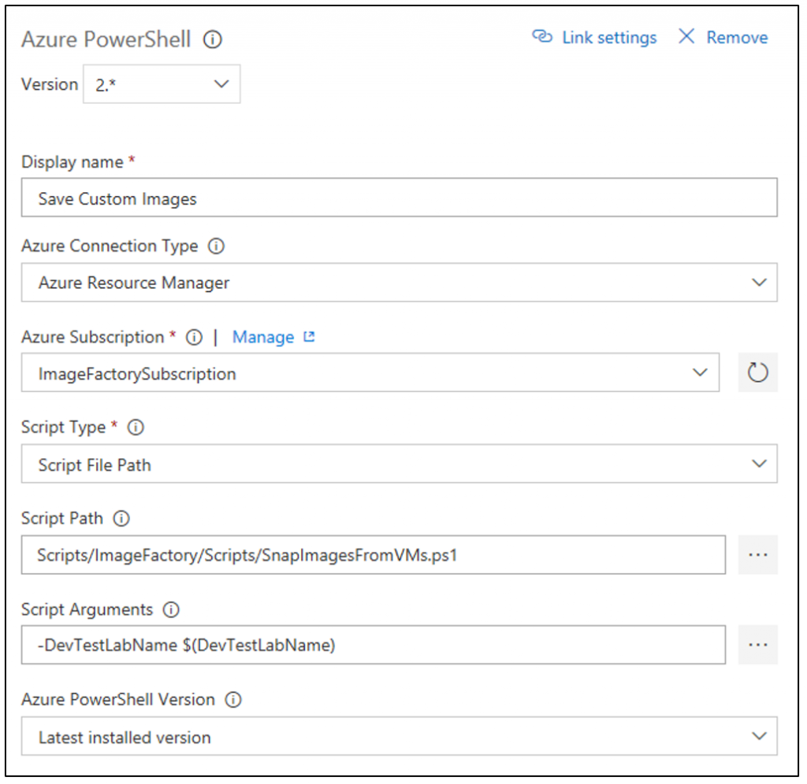
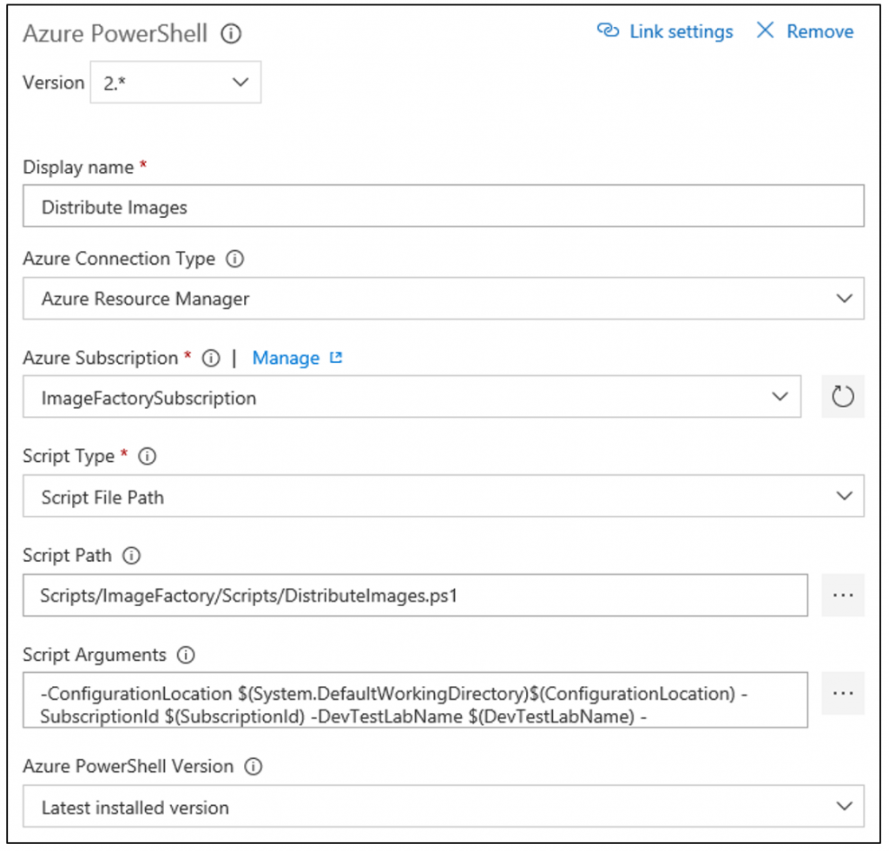

# Save custom images and distribute to multiple labs
This article gives you the steps to save custom images from the already created virtual machines (VMs). It also covers how to distribute these custom images to other DevTest Labs in the organization.

## Prerequisites
The following items should already be in place:

- A lab for the Image Factory in Azure DevTest Labs.
- An Azure DevOps Project that's used to automate the image factory.
- Source code location containing the scripts and configuration (in our example, in the same DevOps Project mentioned in the previous step).
- Build definition to orchestrate the Azure PowerShell tasks.

If needed, follow steps in the [Run an image factory from Azure DevOps](image-factory-set-up-devops-lab.md) to create or set up these items. 

## Save VMs as generalized VHDs
Save the existing VMs as generalized VHDs.  There's a sample PowerShell script to save the existing VMs as generalized VHDs. To use it, first, add another **Azure PowerShell** task to the build definition as shown in the following image:


Once you have the new task in the list, select the item so we can fill in all the details as shown in the following image: 




## Generalized vs. specialized custom images
In the [Azure portal](https://portal.azure.com), when creating a custom image from a virtual machine, you can choose to have a generalized or a specialized custom image.

- **Specialized custom image:** Sysprep/Deprovision was NOT run on the machine. It means that the image is an exact copy of the OS Disk on the existing virtual machine (a snapshot).  The new machine has the same files, applications, user accounts, and computer name as this custom image.
- **Generalized Custom Image:** Sysprep/Deprovision was run on the machine.  This process removes user accounts, removes the computer name, and strips out the user registry hives. The goal is to generalize the image so you can customize it when creating another virtual machine.  When you generalize a virtual machine by running sysprep, the process destroys the current virtual machine. The current virtual machine is no longer functional.

The script for snapping custom images in the Image Factory saves VHDs for any virtual machines created in the prior step. The script identifies the VHDs based on a tag on the resource in Azure.

## Update configuration for distributing images
The next step in the process is to push the custom images from the image factory lab out to any other labs that need them. The core part of this process is the **labs.json** configuration file. You can find this file in the **Configuration** folder included in the image factory.

There are two key things listed in the labs.json configuration file:

- Uniquely identifying a specific destination lab using the subscription ID and the lab name.
- The specific set of images that should be pushed to the lab as relative paths to the configuration root. You can specify entire folder (to get all the images in that folder) too.

Here's an example labs.json file with two labs listed. In this case, you're distributing images to two different labs.

```json
{
   "Labs": [
      {
         "SubscriptionId": "<subscription ID that contains the lab>",
         "LabName": "<Name of the DevTest Lab>",
         "ImagePaths": [
               "Win2012R2",
               "Win2016/Datacenter.json"
         ]
      },
      {
         "SubscriptionId": "<subscription ID that contains the lab>",
         "LabName": "<Name of the DevTest Lab>",
         "ImagePaths": [
               "Win2016/Datacenter.json"
         ]
      }
   ]
}
```

## Create a build task
Using the same steps as earlier in this article, add an **Azure PowerShell** build task to your  build definition. Fill in the details as shown in the following image: 



The parameters are: `-ConfigurationLocation $(System.DefaultWorkingDirectory)$(ConfigurationLocation) -SubscriptionId $(SubscriptionId) -DevTestLabName $(DevTestLabName) -maxConcurrentJobs 20`

This task takes any custom images present in the image factory and pushes them out to any labs defined in the Labs.json file.

## Queue the build
Once the distribution build task is complete, queue up a new build to make sure everything is working. After the build completes successfully, the new custom images show up in the destination lab that you entered into the Labs.json configuration file.

## Next steps
In the next article in the series, you update the image factory with a retention policy and cleanup steps: [Set retention policy and run cleanup scripts](image-factory-set-retention-policy-cleanup.md).
