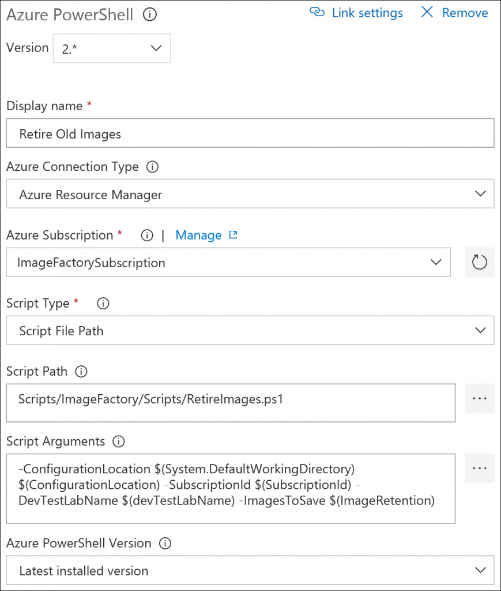

# Set up retention policy in Azure DevTest Labs
This article covers setting a retention policy, cleaning up the factory, and retiring old images from all the other DevTest Labs in the organization. 

## Prerequisites
Make sure that you follow these articles before proceeding further:

- [Create an image factory](image-factory-create.md)
- [Run an image factory from Azure DevOps](image-factory-set-up-devops-lab.md)
- [Save custom images and distribute to multiple labs](image-factory-save-distribute-custom-images.md)

The following items should already be in place:

- A lab for the image factory in Azure DevTest Labs
- One or more target Azure DevTest Labs where the factory will distribute golden images
- An Azure DevOps Project used to automate the image factory.
- Source code location containing the scripts and configuration (in our example, in the same DevOps Project used above)
- A build definition to orchestrate the Azure PowerShell tasks
 
## Setting the retention policy
Before you configure the cleanup steps, define how many historic images you want to keep in DevTest Labs. When you followed the [Run an image factory from Azure DevOps](image-factory-set-up-devops-lab.md) article, you configured various build Variables. One of them was **ImageRetention**. You set this variable to `1`, which means that the DevTest Labs won't maintain a history of custom images. Only the latest distributed images will be available. If you change this variable to `2`,  the latest distributed image plus the previous ones will be maintained. You can set this value to define the number of historic images you want to maintain in your DevTest Labs.

## Cleaning Up the factory
The first step in cleaning Up the factory is to remove the golden Image VMs from the image factory. There's a script to do this task just like our previous scripts. The first step is to add another **Azure PowerShell** task to the build definition as shown in the following image:

Once you have the new task in the list, select the item, and fill in all the details as shown in the following image:

The script parameters are: `-DevTestLabName $(devTestLabName)`.

## Retire old images 
This task removes any old images, keeping only a history matching the **ImageRetention** build variable. Add an additional **Azure PowerShell** build task to our build definition. Once it's added, select the task, and fill in the details as shown in the following image: 

The script parameters are: `-ConfigurationLocation $(System.DefaultWorkingDirectory)$(ConfigurationLocation) -SubscriptionId $(SubscriptionId) -DevTestLabName $(devTestLabName) -ImagesToSave $(ImageRetention)`

## Queue the build
Now that you completed the build definition, queue up a new build to make sure everything is working. After the build completes successfully, the new custom images show up in the destination lab. If you check the image factory lab, you see no provisioned VMs. If you queue up further builds, you see the cleanup tasks retiring old custom images from the DevTest Labs. The retirement accords with the retention value set in the build variables.

> [!NOTE]
> If you executed the build pipeline at the end of the last article in the series, manually delete the virtual machines that you created in the image factory lab before queuing a new build.  You only need the manual cleanup step while you set everything up and verify it works.

## Summary
Now you have a running image factory that can generate and distribute custom images to your labs on demand. At this point, it's just a matter of getting your images set up properly and identifying the target labs. As mentioned in the previous article, the **Labs.json** file located in your **Configuration** folder specifies which images should be made available in each of the target labs. As you add other DevTest Labs to your organization, you simply need to add an entry in the Labs.json for the new lab.

Adding a new image to your factory is also simple. When you want to include a new image in your factory, open the [Azure portal](https://portal.azure.com) and navigate to your factory lab. Select the button to add a VM, and choose the marketplace image and artifacts you want. Instead of selecting the **Create** button to make the new VM, select **View Azure Resource Manager template**. Save the template as a .json file somewhere within the **GoldenImages** folder in your repository. The next time you run your image factory, it will create your custom image.

## Next steps
1. [Schedule your build/release](/azure/devops/pipelines/build/triggers?tabs=designer) to run the image factory periodically. It refreshes your factory-generated images regularly.
2. Make more golden images for your factory. You may also consider [creating artifacts](devtest-lab-artifact-author.md) to script more pieces of your VM setup tasks and include the artifacts in your factory images.
4. Create a [separate build/release](/azure/devops/pipelines/overview) to run the **DistributeImages** script separately. You can run this script when you make changes to Labs.json and get images copied to target labs without having to recreate all the images again.
