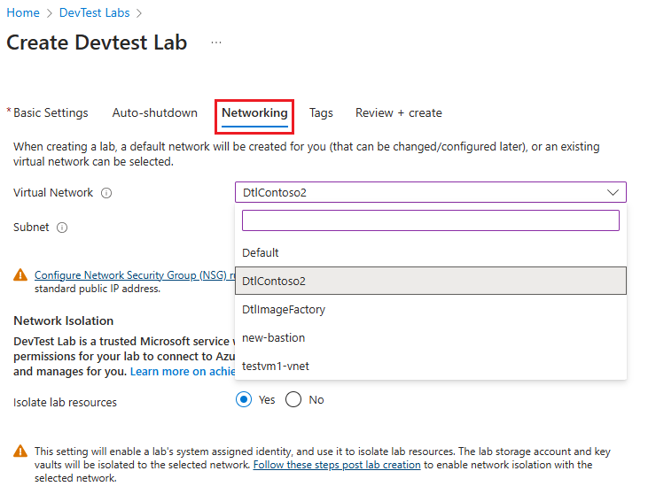
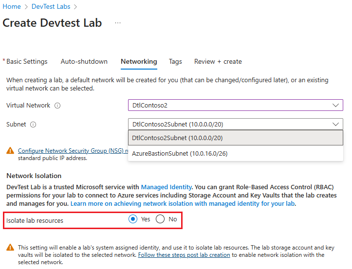
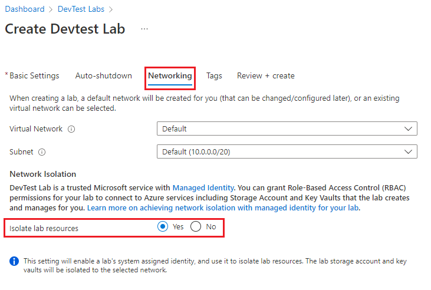
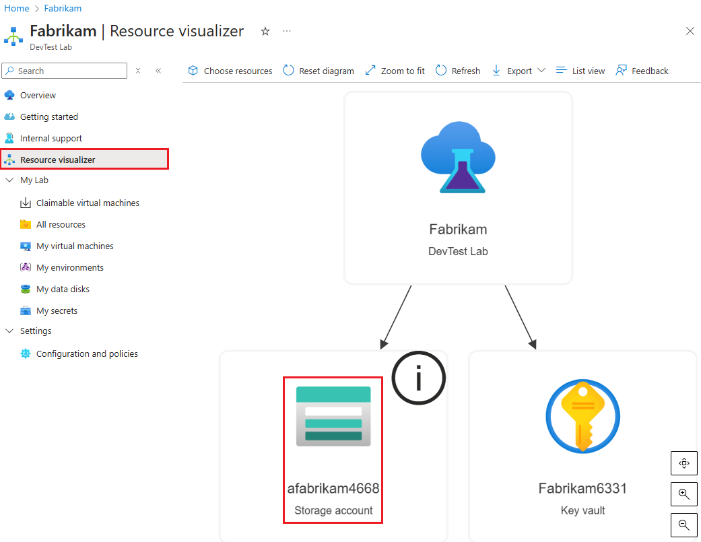

# Network isolation in DevTest Labs

An [Azure virtual network](../virtual-network/virtual-networks-overview.md) acts as a security boundary, isolating your Azure resources from the public internet. You can also join an Azure virtual network to your on-premises network to be able to securely connect to your on-prem resources. In DevTest Labs, you can choose to [isolate all lab virtual machines](devtest-lab-configure-vnet.md) and [environments to your network](connect-environment-lab-virtual-network.md) to ensure lab resources follow organizational networking policies. 

As a lab owner, you can also choose to completely isolate the lab, meaning, alongside isolating virtual machines and environments to the selected network, you can also isolate lab storage account and key vaults created in your subscription. This article walks you through creating a network isolated lab. 

Also review the following articles:

- [How DevTest Labs uses lab storage account](encrypt-storage.md)
- [How DevTest Labs uses key vaults](devtest-lab-store-secrets-in-key-vault.md)
 
> [!NOTE]
> Network isolation is currently supported for new labs creations only.

## Steps to enable network isolation during lab creation

1. During lab creation, go to the **Networking** tab.
1. You can either select a **Default** network that the lab will create for you or select an existing network from the drop-down. You will only be able to select networks that are in the same region and subscription as that of lab. 

    > [!div class="mx-imgBorder"]
    > 
1. Select a subnet.

    > [!div class="mx-imgBorder"]
    > 
1. If you choose to isolate lab resources (lab storage account and key vault) to the default network, no further action is needed and the lab will handle isolating resources going forward.
 
    > [!div class="mx-imgBorder"]
    > 
1. If you choose to isolate lab resources (lab storage account and key vault) to an existing network you selected, then you need to complete the following steps post lab creation to ensure the lab continues to function in the isolated mode. 
 
    > [!div class="mx-imgBorder"]
    > 

    > [!IMPORTANT]
    > Lab owner needs to complete these steps prior to configuring and/or creating any resources in the lab.

### Steps to follow post lab creation

1. On the home page for the lab, select the **resource group** on the **Overview** page. You should see the **Resource group** page for the resource group that contains the lab. 
 
   > [!div class="mx-imgBorder"]
   > 
1. Select the Azure storage account of the lab. The naming convention for the lab storage account is : a<*labNameWithoutInvalidCharacters*>*<4-digit number*>. For example, if the lab name is contosolab, the storage account name could be acontosolab1234.
 
   > [!div class="mx-imgBorder"]
   > 
1. On the storage account, go to Firewalls and virtual networks and ensure ‘Allow trusted Microsoft Services to access this storage account’ check box is checked. As [DevTest Labs is a trusted Microsoft service](../storage/common/storage-network-security.md#trusted-microsoft-services), this option will enable the lab to operate normally in a network isolated mode. 

   > [!div class="mx-imgBorder"]
   > 
1. Next, click on **+Add existing virtual network**, select the virtual network and subnet you picked while creating the lab and click on **Enable**. 

   > [!div class="mx-imgBorder"]
   > 
5.	Once the service endpoint is successfully enabled for the selected virtual network, click on **Add**. 

   > [!div class="mx-imgBorder"]
   > 
 
With this, Azure storage will allow inbound connections from the added virtual network and enable the lab to operate successfully in a network isolated mode. 

You can also choose to automate these steps to configure this setting for multiple labs. 

[Learn more on managing default network access rules for Azure Storage using PowerShell and CLI](../storage/common/storage-network-security.md?toc=%2fazure%2fvirtual-network%2ftoc.json#powershell)

## Network isolation for an existing lab

As a lab owner, you can choose to isolate the network for an existing lab. [This sample script](https://github.com/Azure/azure-devtestlab/blob/master/Tools/ConvertDtlLabToIsolatedNetwork/Convert-DtlLabToIsolatedNetwork.ps1) demonstrates how to convert an existing lab and associated lab resources to an isolated network mode. 

## Things to remember while using a lab in a network isolated mode

### Accessing lab's storage account outside the lab 

Within a network isolated lab, for actions such as uploading a VHD to the lab’s storage account to create custom images from, lab owner will need to explicitly enable accessing the storage account from an allowed endpoint. You can do so by creating a virtual machine and securely access lab’s storage account from that virtual machine. 

[Learn more on accessing a storage account privately from a virtual machine](../private-link/tutorial-private-endpoint-storage-portal.md)

### Exporting usage data from the lab 

Within a network isolated lab, to [export personal usage data for the lab](personal-data-delete-export.md), lab owner will explicitly need to provide storage account and generate a blob within the account to store the data. 

If a storage account is not provided, this operation will fail in the network isolated mode as the lab’s storage account is not accessible for the lab to use it in case of no storage account provided by the customer. 

[Learn more on exporting lab usage data in a specified storage account](personal-data-delete-export.md#azure-powershell)

## Next steps

[Create or modify labs automatically using Azure Resource Manager templates and PowerShell](devtest-lab-use-arm-and-powershell-for-lab-resources.md)
