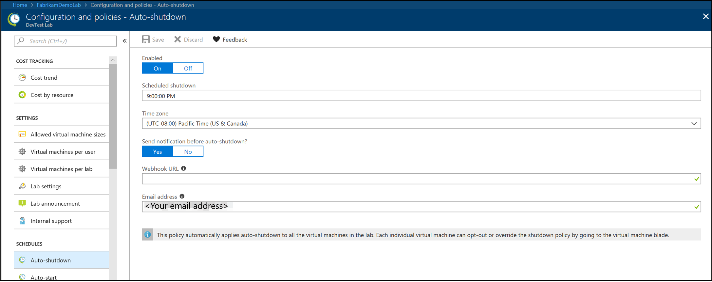
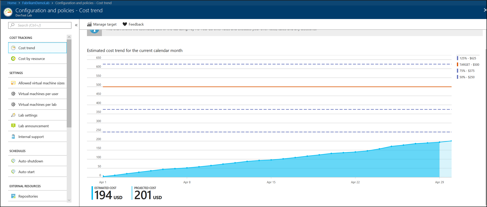
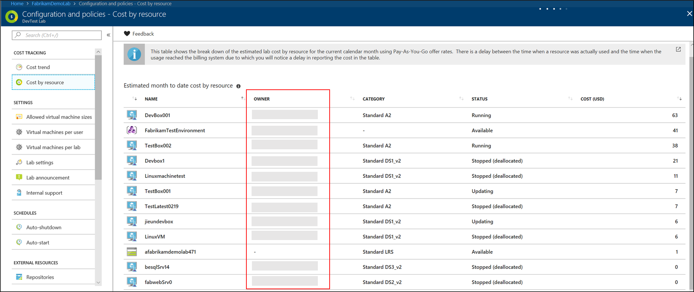
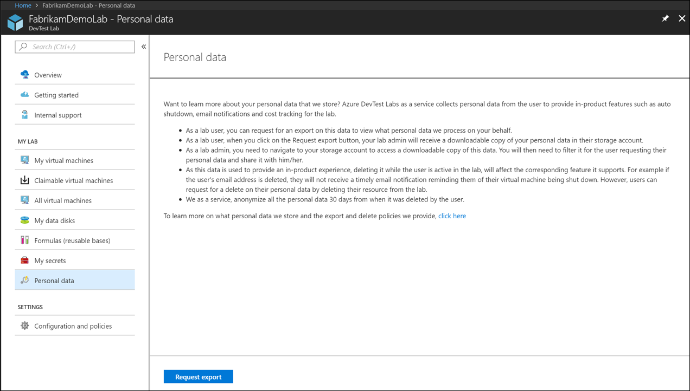
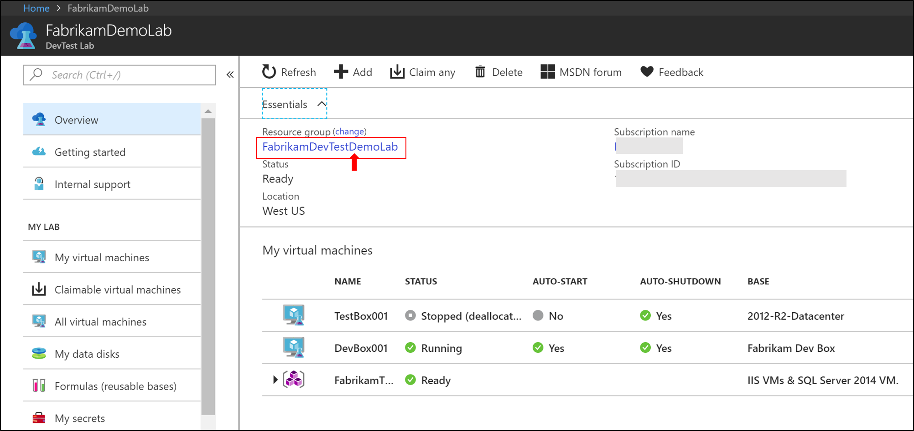
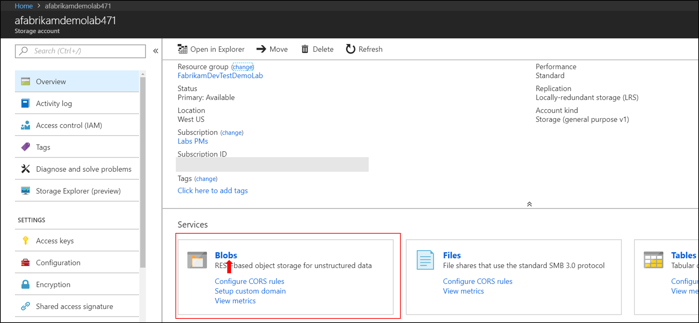
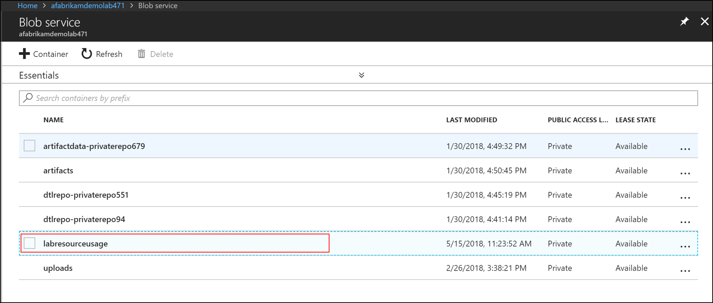
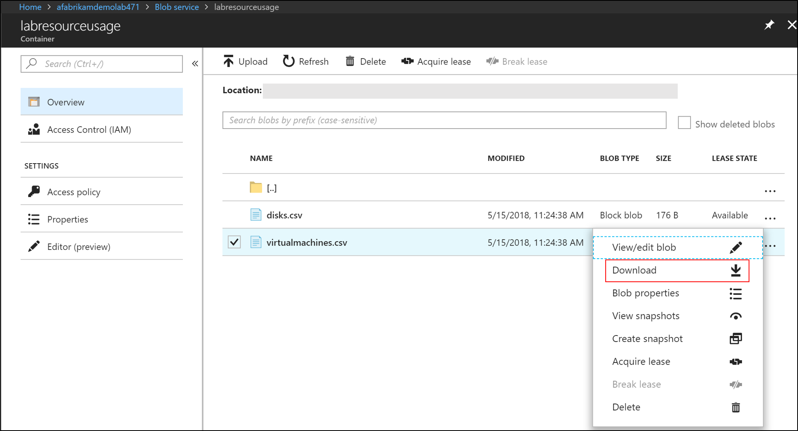

# Export or delete personal data from Azure DevTest Labs
This article provides steps for deleting and exporting personal data from the Azure DevTest Labs service. 

## What personal data does DevTest Labs collect?
DevTest Labs collects two main pieces of personal data from the user. They are: user email address and user object ID. This information is critical for the service to provide in-service features to lab admins and lab users.

### User email address
DevTest Labs uses the user email address to send auto shutdown email notifications to lab users. The email notifies users of their machine being shut down. The users can either postpone or skip the shutdown if they wish to do so. You configure the email address at the lab level or at the VM level.

**Setting email at the lab:**



**Setting email at the VM:**


### User object ID
DevTest Labs uses the user object ID to show month-over-month cost trends and cost by resource information to lab admins. It allows them to track costs and manage thresholds for their Lab. 

**Estimated cost trend for the current calendar month:**


**Estimated month-to-date cost by resource:**



## Why do we need this personal data?
The DevTest Labs service uses the personal data for operational purposes. This data is critical for the service to deliver key features. If you set a retention policy on the user email address, lab users do not receive timely auto shutdown email notifications after their email address is deleted from our system. Similarly, the lab admin can't view month-over-month cost trends and cost by resource for machines in their labs if the user object IDs are deleted based on a retention policy. Therefore, this data needs to be retained for as long as the user's resource is active in the Lab.

## How can I have the system to forget my personal data?
As a lab user, if you like to have this personal data deleted, you can do so by deleting the corresponding resource in the Lab. The DevTest Labs service anonymizes the deleted personal data 30 days after it's deleted by the user.

For example, If you delete your VM, or removed your email address, the DevTest Labs service anonymizes this data 30 days after the resource is deleted. The 30-day retention policy after deletion is to make sure that we provide an accurate month-over-month cost projection to the lab admin.

## How can I request an export on my personal data?
You can export personal and lab usage data by using the Azure portal or PowerShell. The data is exported as two different CSV files:

- **disks.csv** - contains information about the disks being used by the different VMs
- **virtualmachines.csv** - contains information about the VMs in the lab.

### Azure portal
As a lab user, you can request an export on the personal data that the DevTest Labs service stores. To request for an export, navigate to the **Personal data** option on the **Overview** page of your lab. Select the **Request export** button kicks off the creation of a downloadable excel file in your Lab admin's storage account. You can then contact your lab admin to view this data.

1. Select **Personal data** on the left menu. 

    
2. Select the **resource group** that contains the lab.

    
3. Select the **storage account** in the resource group.
4. On the **Storage account** page, select **Blobs**.

    
5. Select the container named **labresourceusage** in the list of containers.

    
6. Select the **folder** named after your lab. You find **csv** files for **disks** and **virtual machines** in your lab in this folder. You can download these csv files, filter the content for the lab user requesting an access, and share it with them.

    

### Azure PowerShell

```powershell
Param (
    [Parameter (Mandatory=$true, HelpMessage="The storage account name where to store usage data")]
    [string] $storageAccountName,

    [Parameter (Mandatory=$true, HelpMessage="The storage account key")]
    [string] $storageKey,

    [Parameter (Mandatory=$true, HelpMessage="The DevTest Lab name to get usage data from")]
    [string] $labName,

    [Parameter (Mandatory=$true, HelpMessage="The DevTest Lab subscription")]
    [string] $labSubscription
    )

#Login
Login-AzureRmAccount

# Set the subscription for the lab
Get-AzureRmSubscription -SubscriptionId $labSubscription  | Select-AzureRmSubscription

# DTL will create this container in the storage when invoking the action, cannot be changed currently
$containerName = "labresourceusage"

# Get the storage context
$Ctx = New-AzureStorageContext -StorageAccountName $storageAccountName -StorageAccountKey $storageKey 
$SasToken = New-AzureStorageAccountSASToken -Service Blob, File -ResourceType Container, Service, Object -Permission rwdlacup -Protocol HttpsOnly -Context $Ctx

# Generate the storage blob uri
$blobUri = $Ctx.BlobEndPoint + $SasToken

# blobStorageAbsoluteSasUri and usageStartDate are required
$actionParameters = @{
    'blobStorageAbsoluteSasUri' = $blobUri    
}

$startdate = (Get-Date).AddDays(-7)

$actionParameters.Add('usageStartDate', $startdate.Date.ToString())

# Get the lab resource group
$resourceGroupName = (Find-AzureRmResource -ResourceType 'Microsoft.DevTestLab/labs' | Where-Object { $_.Name -eq $labName}).ResourceGroupName
    
# Create the lab resource id
$resourceId = "/subscriptions/" + $labSubscription + "/resourceGroups/" + $resourceGroupName + "/providers/Microsoft.DevTestLab/labs/" + $labName + "/"

# !!!!!!! this is the new resource action to get the usage data.
$result = Invoke-AzureRmResourceAction -Action 'exportLabResourceUsage' -ResourceId $resourceId -Parameters $actionParameters -Force
 
# Finish up cleanly
if ($result.Status -eq "Succeeded") {
    Write-Output "Telemetry successfully downloaded for " $labName
    return 0
}
else
{
    Write-Output "Failed to download lab: " + $labName
    Write-Error $result.toString()
    return -1
}
```

The key components in the above sample are:

- The Invoke-AzureRmResourceAction command.
   
    ```
    Invoke-AzureRmResourceAction -Action 'exportLabResourceUsage' -ResourceId $resourceId -Parameters $actionParameters -Force
    ```
- Two action parameters
    - **blobStorageAbsoluteSasUri** - The storage account URI with the Shared Access Signature (SAS) token. In the PowerShell script, this value could be passed in instead of the storage key.
    - **usageStartDate** - The beginning date to pull data, with the end date being the current date on which the action is executed. The granularity is at the day level, so even if you add time information, it will be ignored.

### Exported data - a closer look
Now let’s take a closer look at the exported data. As mentioned earlier, once the data are successfully exported, there will be two CSV files. 

The **virtualmachines.csv** contains the following data columns:

| Column name | Description |
| ----------- | ----------- | 
| SubscriptionId | The subscription identifier that the lab exists in. |
| LabUId | Unique GUID identifier for the lab. |
| LabName | Name of the lab. |
| LabResourceId | Fully qualified lab resource ID. |
| ResourceGroupName | Name of the resource group that contains the VM | 
| ResourceId | Fully qualified resource ID for the VM. |
| ResourceUId | GUID for the VM |
| Name | Virtual machine name. |
| CreatedTime | The date-time at which the VM was created. |
| DeletedDate | The date-time at which the VM was deleted. If it's empty, deletion hasn't occurred, yet. |
| ResourceOwner | Owner of the VM. If the value is empty, then it's either a claimable VM or created by a service principal. |
| PricingTier | Pricing tier of the VM |
| ResourceStatus | Availability state of the VM. Active, if still exists or Inactive, if the VM has been deleted. |
| ComputeResourceId | Fully qualified virtual machine compute resource identifier. |
| Claimable | Set to true if the VM is a claimable VM | 
| EnvironmentId | The environment resource identifier within which the Virtual machine was created in. It's empty when the VM wasn't created as part of an environment resource. |
| ExpirationDate | Expiration date for the VM. It's set to empty, if an expiration date hasn't been set.
| GalleryImageReferenceVersion |  Version of the VM base image. |
| GalleryImageReferenceOffer | Offer of the VM base image. |
| GalleryImageReferencePublisher | Publisher of the VM base image. |
| GalleryImageReferenceSku | Sku of the VM base image |
| GalleryImageReferenceOsType | OS type of the VM base image |
| CustomImageId | Fully qualified ID of the VM base custom image. |

The data columns contained in **disks.csv** are listed below:

| Column name | Description | 
| ----------- | ----------- | 
| SubscriptionId | ID of the subscription that contains the lab |
| LabUId | GUID for the lab |
| LabName | Name of the lab | 
| LabResourceId | Fully qualified resource ID for the lab | 
| ResourceGroupName | Name of the resource group that contains the lab | 
| ResourceId | Fully qualified resource ID for the VM. |
| ResourceUId | GUID for the VM |
 |Name | The name of the attached disk |
| CreatedTime |The date and time at which the data disk was created. |
| DeletedDate | The date and time at which the data disk was deleted. |
| ResourceStatus | Status of the resource. Active, if the resource exists. Inactive, when deleted. |
| DiskBlobName | Blob name for the data disk. |
| DiskSizeGB | The size of the data disk. |
| DiskType | Type of the data disk. 0 for Standard, 1 for Premium. |
| LeasedByVmId | Resource ID of the VM to which the data disk has been attached. |


> [!NOTE]
> If you are dealing with multiple labs and want to get overall information, the two key columns are the **LabUID** and the **ResourceUId**, which are the unique ids across subscriptions.

The exported data can be manipulated and visualized using tools, like SQL Server, Power BI, etc. This feature is especially useful when you want to report usage of your lab to your management team that may not be using the same Azure subscription as you do.

## Next steps
See the following article: 

- [Set policies for a lab](devtest-lab-set-lab-policy.md)
