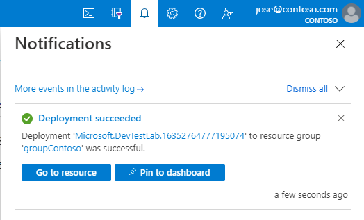

# Tutorial: Set up a lab by using Azure DevTest Labs
In this tutorial, you create a lab by using the Azure portal. A lab admin sets up a lab in an organization, creates VMs in the lab, and configures policies. Lab users (for example: developer and testers) claim VMs in the lab, connect to them, and use them. 

In this tutorial, you do the following actions:

> [!div class="checklist"]
> * Create a lab
> * Add virtual machines (VM) to the lab
> * Add a user to the Lab User role

If you don't have an Azure subscription, create a [free account](https://azure.microsoft.com/free/) before you begin.

## Create a lab
The following steps illustrate how to use the Azure portal to create a lab in Azure DevTest Labs. 

1. Sign in to the [Azure portal](https://portal.azure.com).
2. From the main menu on the left side, select **Create a resource** (at the top of the list), point to **Developer tools**, and click **DevTest Labs**. 

	
1. In the **Create a DevTest Lab** window, do the following actions: 
    1. For **Lab name**, enter a name for the lab. 
    2. For **Subscription**, select the subscription in which you want to create the lab. 
    3. For **Resource group**, select **Create new**, and enter a name for the resource group. 
    4. For **Location**, select the location/region in which you want the lab to be created. 
    5. Select **Create**. 
    6. Select **Pin to dashboard**. After you create the lab, the lab shows up in the dashboard. 

        
2. Confirm that the lab is created successfully by looking at the notifications. Select **Go to resource**.  

    
3. Confirm that you see the **DevTest Lab** page for your lab. 

    

## Add a VM to the lab

1. On the **DevTest Lab** page, select **+ Add** on the toolbar. 

	
1. On the **Choose a base** page, search with a keyword (for example: Windows, Ubuntu), and select one of the base images in the list. 
1. On the **Virtual machine** page, do the following actions: 
    1. For **Virtual machine name**, enter a name for the virtual machine. 
    2. For **User name**, enter a name for the user that has access to the virtual machine. 
    3. For **Password**, enter the password for the user. 

        
1. Select **Advanced settings** tab.
    1. For **Make this machine claimable**, select **Yes**.
    2. Confirm that the **instance count** is set to **1**. If you set it to **2**, 2 VMs are created with names: `<base image name>00' and <base image name>01`. For example: `win10vm00` and `win10vm01`.     
    3. Select **Submit**. 

        
    9. You see the status of the VM in the list of **Claimable virtual machines** list. Creation of the virtual machine may take approximately 25 minutes. The VM is created in a separate Azure resource group, whose name starts with the name of the current resource group that has the lab. For example, if the lab is in `labrg`, the VM may be created in the resource group `labrg3988722144002`. 

        
1. After the VM is created, you see it in the list of **Claimable virtual machines** in the list. 

    > [!NOTE] 
    > On the **Advanced Settings** page, you can configure public, private or a shared IP address for the VM. When the **shared IP** is enabled, Azure DevTest Labs automatically enables RDP for Windows VMs and SSH for Linux VMs. If you create VMs with **public IP** addresses, RDP and SSH are enabled without any changes from DevTest Labs.  

## Add a user to the Lab User role

1. Sign in to the [Azure portal](https://portal.azure.com) as [User Access Administrator](../role-based-access-control/built-in-roles.md#user-access-administrator) or [Owner](../role-based-access-control/built-in-roles.md#owner).

1. Open the resource group containing the lab you created

1. In the navigation menu, select **Access control (IAM)**.

1. Select **Add** > **Add role assignment**.

    

1. On the **Role** tab, select the **DevTest Labs User** role.

    

1. On the **Members** tab, select the user you want to give the desired role to.

1. On the **Review + assign** tab, select **Review + assign** to assign the role.

## Clean up resources
The next tutorial shows how a lab user can claim and connect to a VM in the lab. If you don't want to do that tutorial, and clean up the resources created as part of this tutorial, follow these steps: 

1. In the Azure portal, select **Resource groups** in the menu. 

	
1. Select your resource group in which you created the lab. 
1. Select **Delete resource group** from the toolbar. Deleting a resource group deletes all the resources in the group including the lab. 

	
1. Repeat these steps to delete the additional resource group created for you with the name `<your resource group name><random numbers>`. For example: `splab3988722144001`. The VMs are created in this resource group rather than in the resource group in which the lab exists. 

## Next steps
In this tutorial, you created a lab with a VM and gave a user access to the lab. To learn about how to access the lab as a lab user, advance to the next tutorial:

> [!div class="nextstepaction"]
> [Tutorial: Access the lab](tutorial-use-custom-lab.md)
