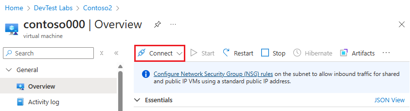

# Tutorial: Access a lab in Azure DevTest Labs
In this tutorial, you use the lab that was created in the [Tutorial: Create a lab in Azure DevTest Labs](tutorial-create-custom-lab.md) .

In this tutorial, you do the following actions:

> [!div class="checklist"]
> * Claim a virtual machine (VM) in the lab
> * Connect to the VM
> * Unclaim the VM

If you don't have an Azure subscription, create a [free account](https://azure.microsoft.com/free/) before you begin.

## Access the lab

1. Sign in to the [Azure portal](https://portal.azure.com).
2. Select **All resources** on the left menu. 
3. Select **DevTest Labs** for resource type. 
4. Select the lab. 

    

## Claim a VM

1. In the list of **Claimable virtual machines**, select **...** (ellipsis), and select **Claim machine**.

    
1. Confirm that you see the VM in the list **My virtual machines**.

    

## Connect to the VM

1. Select your VM in the list. You see the **Virtual Machine page** for your VM. Select **Connect** on the toolbar.

    
2. Save the downloaded **RDP** file your hard disk and use it to connect to the virtual machine. Specify the user name and password you mentioned when the VM was created in the previous section. 

    To connect to a Linux VM, SSH and/or RDP access must be enabled for the VM. For steps to connect to a Linux VM via RDP, see [Install and configure Remote Desktop to connect to a Linux VM in Azure](../virtual-machines/linux/use-remote-desktop.md). 

    > [!NOTE]
    > There are other ways to get to the Virtual Machine page for your VM. Here are some of them: 
    > 
    > 1. Search for all VMs in your subscription. Select your VM in the list of VMs to get to the **Virtual Machine** page.
    > 2. Navigate to the **Resource Group** page for the resource group. Then, select your VM from the list of resources in the resource group to get to the **Virtual Machine** page. 
    >
    > Don't use the **Connect** button on the toolbar on the **Virtual Machine** page that you get to by using the these options. Instead, navigate to the **Virtual Machine** page from the **DevTest Labs** page as shown in this article, and then use the **Connect** button on the toolbar.

## Unclaim the VM
After you are done with using the VM, unclaim the VM by following these steps: 

1. On the virtual machine page, and select **Unclaim** on the toolbar. 

    
1. The VM is shut down before it's unclaimed. You can see the status of this operation in notifications.  
3. Navigate back to the DevTest Lab page by clicking your lab name in the breadcrumb menu at the top. 
    
    
1. Confirm that you see the VM in the list of **Claimable virtual machines** list at the bottom.

    
## Next steps
This tutorial showed you how to access and use a lab that was created by using Azure DevTest Labs. For more information about accessing and using VMs in a lab, see 

> [!div class="nextstepaction"]
> [How to: Use VMs in a lab](devtest-lab-add-vm.md)

