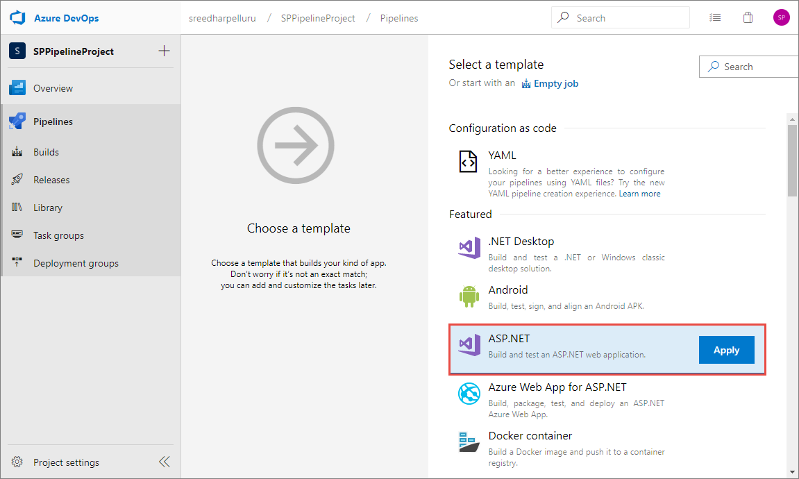
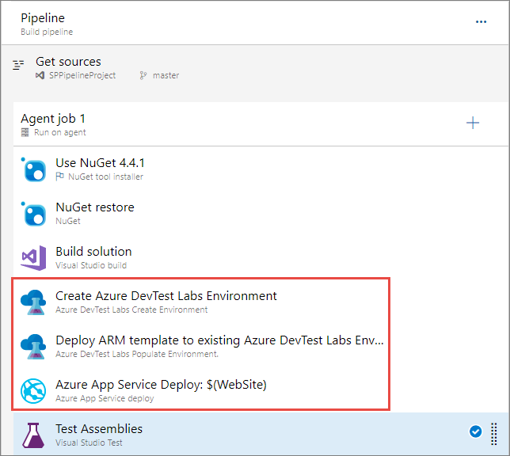
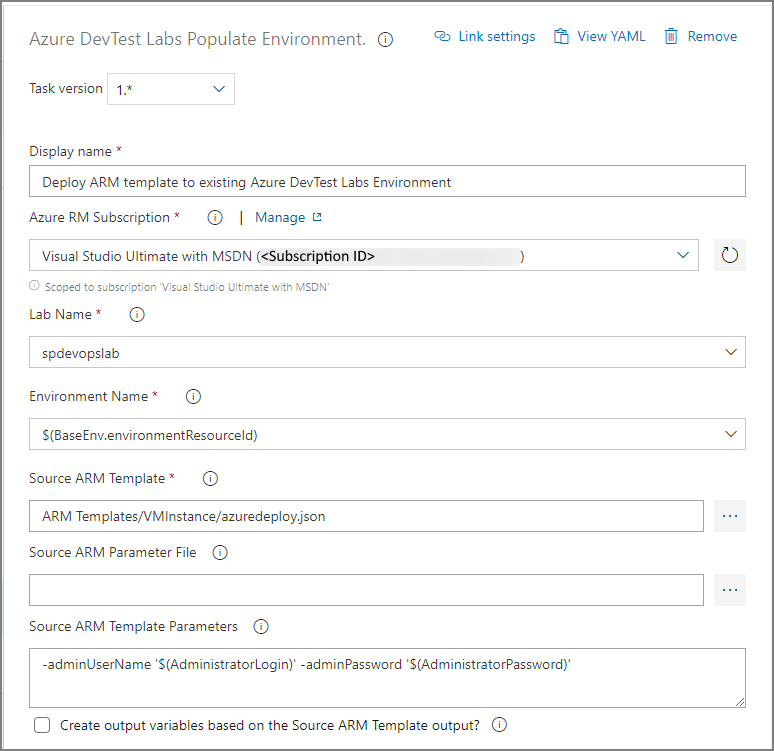
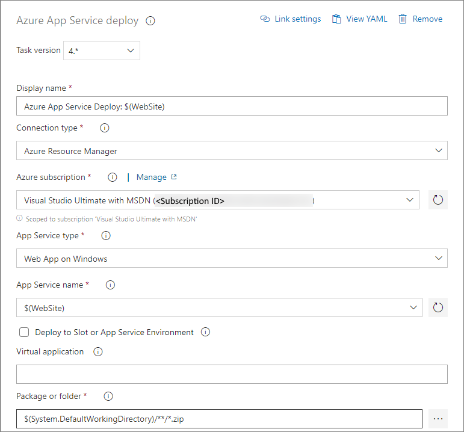

# Use DevTest Labs in Azure Pipelines build and release pipelines
This article provides information on how DevTest Labs can be used in Azure Pipelines build and release pipelines. 

## Overall flow
The basic flow is to have a **build pipeline** that does the following tasks:

1. Build the application code.
1. Create the base environment in DevTest Labs.
1. Update the environment with custom information.
1. Deploy the application to the DevTest Labs environment
1. Test the code. 

Once the build has been completed successfully, the **release pipeline** will use the build artifacts to deploy staging, or production. 

One of the necessary premises is that all the information needed to recreate the tested ecosystem is available within the build artifacts, including the configuration of the Azure resources. As Azure resources incur a cost when used, companies want to either control or track the use of these resources. In some situations, Azure Resource Manager templates that are used to create and configure the resources may be managed by another department like IT. And, these templates might be stored in a different repository. It leads to an interesting situation where a build will be created and tested, and both the code and the configuration will need to be stored within the build artifacts to properly recreate the system in production. 

Using DevTest Labs during the build/test phase, you can add Azure Resource Manager templates and supporting files to the build sources so that during the release phase the exact configuration used to test with is deployed to production. The **Create Azure DevTest Labs Environment** task with the proper configuration will save the Resource Manager templates within the build artifacts. For this example, you’ll be using the code from the [Tutorial: Build a .NET Core and SQL Database web app in Azure App Service](../app-service/app-service-web-tutorial-dotnetcore-sqldb.md), to deploy and test the web app in Azure.

## Set up Azure resources
There are a couple of items that need to be created beforehand:

- Two repositories. The first one with the code from the tutorial and a Resource Manager template with two additional VMs. The second one will contain the base Azure Resource Manager template (existing configuration).
- A Resource Group for deployment of the production code and configuration.
- A lab needs to be set up with a [connection to the configuration repository](devtest-lab-create-environment-from-arm.md) for the build pipeline. The Resource Manager template needs to be checked into the configuration repository as azuredeploy.json with the metadata.json to allow DevTest Labs to recognize and deploy the template.

The build pipeline will create a DevTest Labs environment and deploy the code for testing.

## Set up a build pipeline
In Azure Pipelines, create a build pipeline using the code from the [Tutorial: Build a .NET Core and SQL Database web app in Azure App Service](../app-service/app-service-web-tutorial-dotnetcore-sqldb.md). Use the **ASP.NET Core** template, which will populate the necessary task to build, test, and publish the code.

You need to add three additional tasks to create the environment in DevTest Labs and deploy to the environment.

### Create environment task
In the create environment task (**Azure DevTest Labs Create Environment** task) use the drop-down lists to select the following values:

- Azure subscription
- name of the lab
- name of the repository
- name of the template (which shows the folder where the environment is stored). 

We recommend that you use drop-down lists on the page instead of entering the information manually. If you manually enter the information, enter fully qualified Azure Resource Ids. The task displays the friendly names instead of resource Ids. 

The environment name is the displayed name shown within DevTest Labs. It should be a unique name for each build. For example: **TestEnv$(Build.BuildId)**. 

You can specify either parameters file or parameters to pass information into the Resource Manager template. 

Select the **Create output variables based on the environment template output** option and enter a reference name. For this example, enter **BaseEnv** for the reference name. You will use this BaseEnv when configuring the next task. 

### Populate environment task
The second task (**Azure DevTest Labs Populate Environment** task) is to update the existing DevTest Labs environment. The Create environment task outputs **BaseEnv.environmentResourceId** that's used to configure environment name for this task. The Resource Manager template for this example has two parameters - **adminUserName** and **adminPassword**. 

## App Service deploy task
The third task is the **Azure App Service Deploy** task. The app type is set to **Web App** and the App Service name is set to **$(WebSite)**.

## Set up release pipeline
You create a release pipeline with two tasks: **Azure Deployment: Create Or Update Resource Group** and **Deploy Azure App Service**. 

For the first task, specify the name and location of the resource group. The template location is a linked artifact. If the Resource Manager template includes linked templates, a custom resource group deployment needs to be implemented. The template is in the published drop artifact. Override template parameters for the Resource Manager template. You can leave remaining settings with default values. 

For the second task **Deploy Azure App Service**, specify the Azure subscription, select **Web App** for the **App type**, and **$(WebSite)** for the **App Service name**. You can leave remaining settings with default values. 

## Test Run
Now that both pipelines are set up, manually queue up a build and see it work. The next step is to set the appropriate trigger for the build and connect the build to the release pipeline.

## Next steps
See the following articles:

- [Integrate Azure DevTest Labs into your Azure Pipelines continuous integration and delivery pipeline](devtest-lab-integrate-ci-cd.md)
- [Integrate environments into your Azure Pipelines CI/CD pipelines](integrate-environments-devops-pipeline.md)
