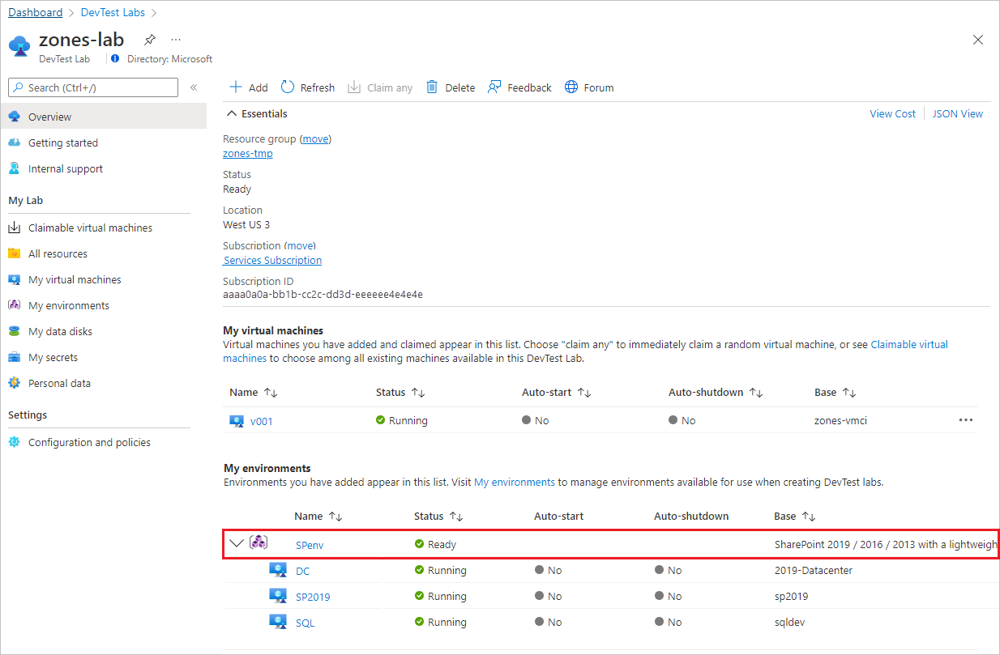

# Use PaaS services in Azure DevTest Labs

This article describes platform-as-a-service (PaaS) support in Azure DevTest Labs. DevTest Labs supports PaaS through *environments*, which can include both PaaS and infrastructure-as-a-service (IaaS) resources. Environments contain services and software like virtual machines (VMs), databases, virtual networks, and web apps that are customized to work together.

The following image shows a SharePoint farm created as an environment in a lab.

## PaaS scenarios

DevTest Labs PaaS environments support the following scenarios:

- Developers can create multiple, independent environments.
- Testers can test different configurations asynchronously and automatically.
- Staging and production pipeline integration can happen without any template changes.
- Lab owners can configure policies and track costs for the environment as a whole.

### Developer scenarios

To create an environment, a developer selects an environment template rather than a machine image, and enters any required information. Individual developer environments allow faster change deployment and improved inner loop debugging. Developers can destroy their environments anytime, and recreate them by using the latest templates. This capability helps reduce downtime from creating systems manually or recovering from faults.

### Test scenarios

DevTest Labs environments allow independent, asynchronous testing of specific code and configurations. Testers can use continuous integration and continuous deployment (CI/CD) pipelines to set up environments, apply code from individual pull requests, and do automated and manual testing. Automation can manage and track multiple environments across subscriptions and labs.

### Cost tracking

The overall cost trend for a lab includes Azure resources within environments. The cost by resources doesn't break out the different resources within an environment, but displays the environment as a single cost. For more information, see [Track costs associated with a lab in Azure DevTest Labs](devtest-lab-configure-cost-management.md).

### Access and roles

Lab owners can grant lab access and assign user roles. For more information, see [Add lab owners, contributors, and users in Azure DevTest Labs](devtest-lab-add-devtest-user.md).

The DevTest Labs resource provider creates resources on the lab user's behalf, so lab users don't need any extra permissions to create and use environments. However, lab owners can extend Contributor permissions to lab users so they can configure and manage their own PaaS resources, such as adding or removing resources. For more information, see [Configure environment user rights](devtest-lab-create-environment-from-arm.md#configure-environment-user-rights).

Lab owners can customize resource access or permissions without granting subscription-level access. The lab user can add or remove Azure resources only within the managed resource group. To further customize lab user roles and access, see [Grant user permissions to specific lab policies](devtest-lab-grant-user-permissions-to-specific-lab-policies.md).

## Environment templates

DevTest Labs creates environments by using preconfigured Azure Resource Manager (ARM) templates from Git repositories. Keeping the ARM templates under source control promotes consistent environment deployment and management.

In large organizations, development teams typically provide customized or isolated testing environments. The IT group provides environments that all teams within a business unit or a division can use.

To enable and configure environment creation for labs, see [Use ARM templates to create DevTest Labs environments](devtest-lab-create-environment-from-arm.md). DevTest Labs has a public repository of preconfigured ARM templates for creating certain environments. For more information about the public environments, see [Enable and configure public environments](devtest-lab-create-environment-from-arm.md#configure-public-environment-settings-for-your-lab).

You can also [create or configure your own ARM templates](devtest-lab-use-resource-manager-template.md#store-arm-templates-in-git-repositories), [store them in private Git repositories](devtest-lab-use-resource-manager-template.md#store-arm-templates-in-git-repositories), and [connect those repositories to labs](devtest-lab-use-resource-manager-template.md#store-arm-templates-in-git-repositories).

## Template customization

You can provide certain custom lab information in ARM templates when creating environments, including:

- Lab virtual network identification
- Lab location
- Lab storage account where the ARM templates files are copied
 
### Use an existing virtual network

When you create an environment, DevTest Labs can replace the `$(LabSubnetId)` token with the first lab subnet where **Use in virtual machine creation** is set to **true**. This modification allows the environment to use previously created virtual networks.

[Connect environments to the lab's virtual network](connect-environment-lab-virtual-network.md) describes how to modify an ARM template to use the `$(LabSubnetId)` token. To use the same ARM template in test, staging, and production environments, use `$(LabSubnetId)` as a value in an ARM template parameter.

### Use nested templates

DevTest Labs supports [nested ARM templates](../azure-resource-manager/templates/linked-templates.md). To use `_artifactsLocation` and `_artifactsLocationSasToken` tokens to create a URI to a nested ARM template, see [Deploy DevTest Labs environments by using nested templates](deploy-nested-template-environments.md). For more information, see the **Deployment artifacts** section of the [Azure Resource Manager Best Practices Guide](https://github.com/Azure/azure-quickstart-templates/blob/master/1-CONTRIBUTION-GUIDE/best-practices.md#deployment-artifacts-nested-templates-scripts).

## Next steps

- [Use ARM templates to create DevTest Labs environments](devtest-lab-create-environment-from-arm.md)
- [Create an environment with a self-contained Service Fabric cluster in Azure DevTest Labs](create-environment-service-fabric-cluster.md)
- [Connect an environment to your lab's virtual network in Azure DevTest Labs](connect-environment-lab-virtual-network.md)
- [Integrate environments into your Azure DevOps CI/CD pipelines](integrate-environments-devops-pipeline.md)