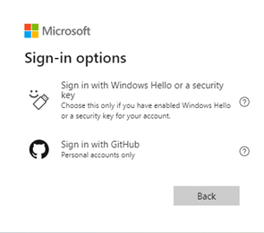
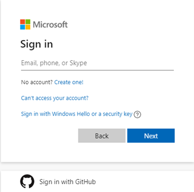

---
# This basic template provides core metadata fields for Markdown articles on docs.microsoft.com.

# Mandatory fields.
title: Sign-in with your GitHub Credentials to your individual Azure Dev/Test credit subscription.
description: An overview of signing into an individual Monthly Azure Credit Subscription using GitHub credentials. Includes how to activate individual developer Azure Credits.
author: j-martens
ms.author: jmartens
ms.date: 9/29/2021
ms.topic: how-to
ms.prod: visual-studio-windows
ms.custom: devtestoffer
---
## Sign into your Monthly Azure Credit Subscription and Visual Studio using your GitHub credentials 

Across all of Microsoft, we are focused on empowering developers to build better apps, faster. One way we accomplish that is by providing a range of products and services, covering all stages of the software development lifecycle.  

This includes IDEs and DevOps tools, application and data platforms on the cloud, operating systems, Artificial Intelligence, IoT solutions, and more. All of these are centered around developers, both as individuals working in teams and organizations, and as members of developer communities.  

GitHub is one of the largest developer communities, and for millions of developers around the world their GitHub identity has become a critical aspect of their digital life. Recognizing that, we’re excited to announce improvements that help GitHub users get started more easily with our developer services, including Monthly Azure Credits for Visual Studio Subscribers.  

## Your GitHub credentials can now log you in to Microsoft services  

We are enabling developers to sign in with their existing GitHub account to Microsoft online services, on any Microsoft log in page. Using your GitHub credentials, you can now sign in via OAuth anywhere a personal Microsoft account does, including Azure Credit Subscriptions and Visual Studio.  

After signing into GitHub and authorizing the Microsoft application, you will get a new Microsoft account that is linked to your GitHub identity. During this process, you also be able to link it to an existing Microsoft account if you already have one.  

## Sign-in to Azure Credit Subscription  

[Azure Credit Subscription for Visual Studio Subscribers](https://azure.microsoft.com/en-us/pricing/member-offers/credit-for-visual-studio-subscribers) offers a suite of services to create, deploy, and manage applications on your preferred platforms and devices. Credits can be used in Azure for learning, development, and test services, plus collaboration tools and access to Azure DevOps.  

With support for GitHub authentication, we are making it easier to get started experimenting with different Azure services from Virtual Machines, Websites, and SQL Databases to Mobile Services. Using skills you already have and the technologies you know, leverage Windows Virtual Desktop to quickly deploy and manage hundreds of VMs for development and testing purposes. 

To get started with the Azure Monthly Credit Subscription using your GitHub account, click “Sign in using GitHub” on any [Microsoft sign-in page](https://login.microsoftonline.com)  

  

  

If you haven’t activated your credits yet, go to the [Monthly Azure Credits for Visual Studio Subscribers](https://azure.microsoft.com/en-us/pricing/member-offers/credit-for-visual-studio-subscribers) page, click “Activate Your Credits” then “Sign in with GitHub” to get started.  

  

  

Once you complete the sign-in process, you will be taken directly to the last Azure Visual Studio organization you visited. If you’re brand new to Azure Visual Studio and Credits Subscription, you’ll land within a new organization created for you.  

## Access all of Microsoft online services  

In addition to accessing developer services such as Azure Dev/Test, Monthly Credits, and Visual Studio, your GitHub account can be used to access all Microsoft online services, from Excel Online to Xbox.  

When authenticating with those services, you can find your GitHub account after clicking on “Sign-in options”.  

## Our commitment to your privacy  

When you first use your GitHub account to sign in with Microsoft, GitHub will ask for permission to release your profile information.  

If you consent, GitHub will share the email addresses on your GitHub account (both public and private) as well as profile information, like your name. We’ll use this data to check if you already have an account with us or to create a new account if you don’t. Connecting your GitHub identity to a Microsoft one does not give Microsoft access to your repositories in GitHub. Apps like Visual Studio will request access to your repositories separately if they need to work with your code, which you’ll need to consent to separately.  

While your GitHub account is used to log into your Microsoft account, they’re still separate entities – one just uses the other as a login method. Changes you make to your GitHub account (like changing the password or enabling two-factor authentication) won’t change your Microsoft account, and vice versa. You can manage the connection between your GitHub and Microsoft identities in your [account management page](https://account.live.com/proofs/manage/) under the Security tab.  

## Start exploring Azure Visual Studio and Monthly Credit Subscription now  

Go to the [Monthly Azure Credits for Visual Studio Subscribers](https://azure.microsoft.com/en-us/pricing/member-offers/credit-for-visual-studio-subscribers/) page to learn more to get started.  

If you have questions, check out [this support page](https://support.microsoft.com/en-us/help/4501231/microsoft-account-link-your-github-account). Let us know what you think in the comments below. As always, we’d love to hear any feedback or suggestions you have.