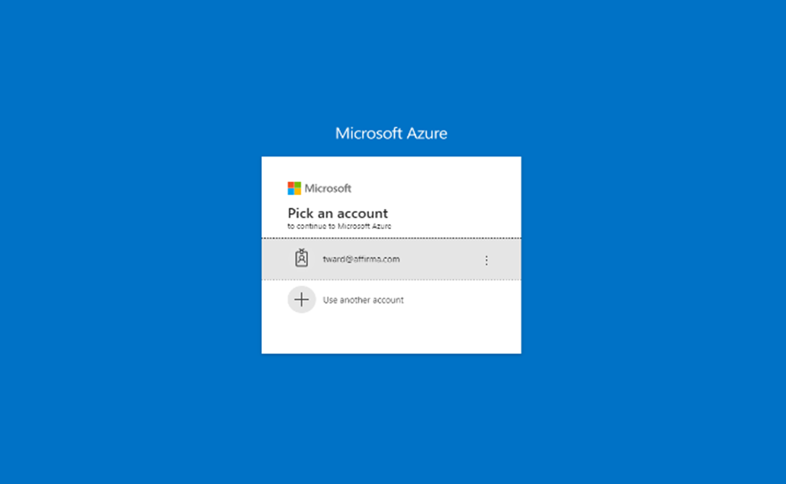
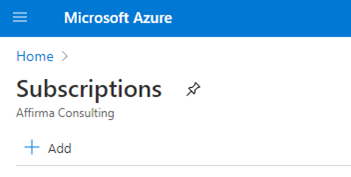

---
# This basic template provides core metadata fields for Markdown articles on docs.microsoft.com.

# Mandatory fields.
title: How to get started with your individual VSS Azure Dev/Test credit subscription.
description: Presents two options for an individual to access an Azure Credit Subscription.
author: j-martens  
ms.author: jmartens
ms.date: 9/30/2021
ms.topic: how-to
ms.prod: visual-studio-windows
ms.custom: devtestoffer
---

## How to get started with your individual Azure Credit Subscription  

When accessing your Azure Credit Subscription there are two ways to sign-in and use your credits.  

You have the opportunity to use a personal or corporate email address when signing in.  

**It’s important to note that the email address you use for sign in dictates what Azure Active Directory (Azure AD) Tenant your subscription is associated with.**  

## Using a personal email address versus a work account  

The email you use at sign-in should follow your organization’s requirements – either you use a personal email OR your organization’s provided email.

1. **Using a Personal Email Account or Microsoft Account (MSA)**  
 If you sign-in using a personal account like Gmail, Yahoo or Hotmail, your organization will not have access to your work nor will you have access to their Active Directory unless that email is added by an admin. When signing-in with a personal email, a new Azure Directory will be created along with an Azure Tenancy on your behalf. Your profile will be created as the Top-Level Admin with access to adding other admins and users.  
2. **Using a Corporate Email Account or Work School Account (WSA)**  
 If you sign-in with your organization’s account, you will be added as a user within your organizations Active Directory giving your organization access to manage your account and work.  

## How to activate your Azure Credit Subscription  

Once you receive a my.visualstudio.com license, you can login via my.visualstudio.com or portal.azure.com.
Remember, the account you sign-in with will dictate what tenant your directory will be under.  

### Sign-In through Visual Studio - my.visualstudio.com

1. Click Activate to access the appropriate subscription

   

2. Enter the email you want associated with your credit subscription in the pop up  

   

3. Click Next to finish subscription activation  

> [!NOTE]  
> Signing in this way provides more flexibility to whether or not you use a personal email or a corporate email account.  

For more details to sign in go to my.visualstudio.com, or follow this link: [Use Microsoft Azure in Visual Studio subscriptions](https://docs.microsoft.com/en-us/visualstudio/subscriptions/vs-azure#:~:text=Eligibility%20%20%20%20Subscription%20Level%20%2F%20Program,%20%20Yes%20%2013%20more%20rows%20>)

### Sign-in through Azure - [portal.azure.com](https://portal.azure.com)

1. Choose or enter the email address to authenticate  

   

2. Once you’re logged in, go to Subscriptions under Azure Services  

   

3. Click “add”  

   

4. This will take you to a page where you can find the eligible offers  
5. Select the correct subscription offer to associate with your account  

> [!NOTE]
> This method uses the login credentials you used when signing in through your Azure Portal. This way of signing in has a higher probability of associating your subscription with your organization’s directory through your corporate Microsoft Account.
