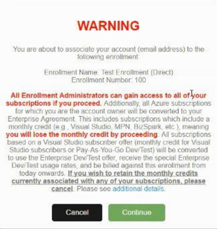
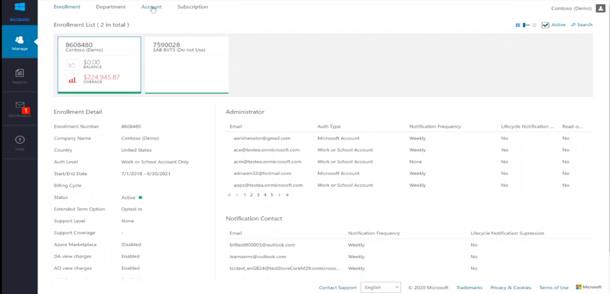
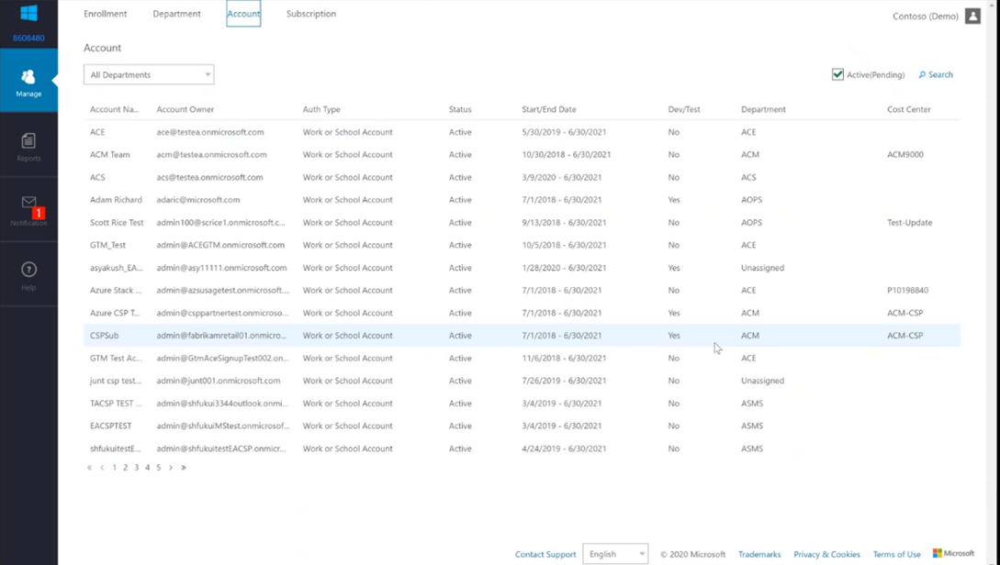

# Creating Enterprise and Organization Azure Dev/Test Subscriptions

Enterprise Dev/Test Subscriptions are available for team development in large organizations

- For team development in large enterprises  
- Enterprise-wide billing – no separate payments  
- Create an enterprise dev/test offer subscription through the Azure Enterprise Portal  

### Prerequisites

To create an enterprise Azure dev/test subscription, you must have an account owner role on an Enrollment Account to make the subscription. There are two ways to access this role:  

- The Enterprise Administrator of your enrollment can [make you an account owner](../../cost-management-billing/manage/grant-access-to-create-subscription.md)  
- An existing owner of the account [can grant you access](../../cost-management-billing/manage/grant-access-to-create-subscription.md).  

### Important information before you add Account Owners

An EA Account Owner **cannot** use the same login for the EA Portal and other Azure offers. Suppose you were added to the EA Portal as an Account Owner and used the same credentials you used for your individual Visual Studio Benefits. In that case, that Visual Studio subscription will be converted to the EA Dev/Test offer.  

The first time you log in to the EA Portal as an account owner, you will see a warning pop-up. It’s essential to read and understand because your existing subscriptions will be converted to a billable EA offer. If you are a Visual Studio subscriber added as an Account Owner, you will lose your individual monthly Azure credit until you take further action.

 *poor quality, must be replaced*  

To recover your individual Visual Studio Azure Benefits after you authenticate your role as an EA Account Owner, you can either:  

- Delete your role as Account Owner in the EA Portal (after removing or moving any Azure subscriptions you own) and sign up for your own individual Visual Studio Azure benefits anew, or
- Delete the subscriber from the Visual Studio Administrator site in the VLSC and reassign the subscription, using a different login – then you can sign up for an individual Visual Studio Azure benefits anew  

## Create your subscription

To create your enterprise dev/test subscriptions, you must designate an enrollment account as a dev/test account.  

1. To get started, go to [Ea.azure.com](https://microsoft.sharepoint.com/teams/DevTest598/Shared%20Documents/General/Managing%20DevTest%20subscriptions%20in%20your%20organization/ea.azure.com). The Azure Enterprise Portal is where you can manage your company's enrollments  
2. Within the Manage tab, select your agreement number  

 [!Note:] the enrollment can change based on your Enterprise Agreement renewal cycle  

  *poor quality – must be replaced*  
...
3. Once you’ve selected the appropriate enrollment number, select the “Account” tab  

  *poor quality – must be replaced*  
...
4. From here, you can edit the Account\(s\) and toggle the dev/test flag to “Yes.”  
...

To add an account:  

1. In the Azure Enterprise portal, select Manage in the left navigation area.  
2. Select the Account tab on the Account page, select +Add Account.  
3. Select a department, or leave it as unassigned, and then select the desired authentication type.  
4. Enter a friendly name to identify the Account in reporting.  
5. Enter the Account Owner Email address to associate with the new Account.  
6. Confirm the email address and then select Add.  

## Add your Azure Enterprise Dev/Test Subscription

After designating your Account to create an enterprise Azure dev/test subscription, you can add the appropriate subscription offer. There are two ways to accomplish this. Either way you kick off your subscription, the experience is the same.  

1. In the subscription tab in each portal will be a “+/Add” button  
    a. This will take you to a sign-in page  
    b. Sign in with your Microsoft Azure credentials  
    c. Once you’re signed in, you will be directed to a page that lists the different offer types available – you HAVE to toggle yes in the EA portal to see enterprise offer  
2. Select the enterprise dev/test offer and create your subscription  
    a. Note: You must have access and permissions associated with your identity
    b. You must designate the Account as a dev/test account within the enrollment portal  

See Also:  

- [Azure EA portal administration](../../cost-management-billing/manage/ea-portal-administration.md)
- [Get started with the Azure Enterprise portal](../../cost-management-billing/manage/ea-portal-get-started.md)
