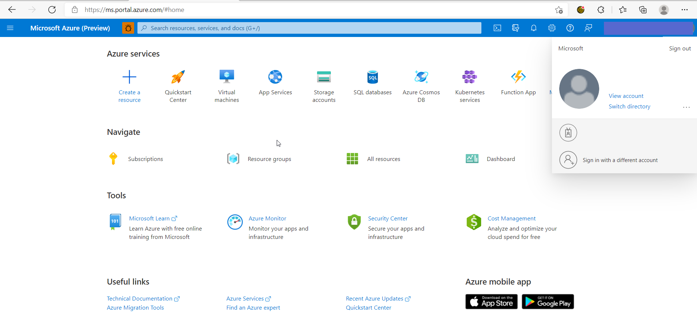
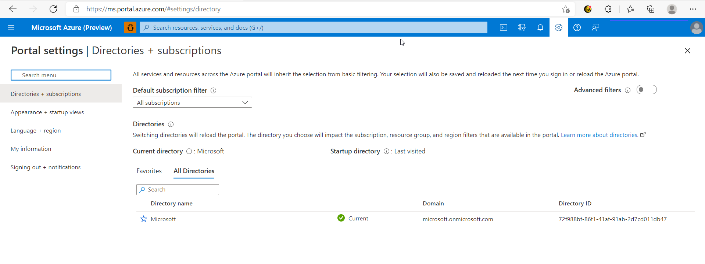
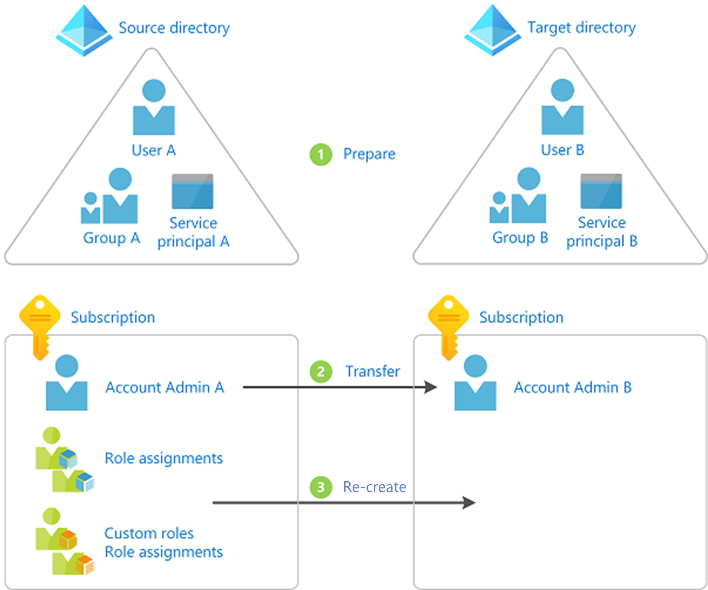
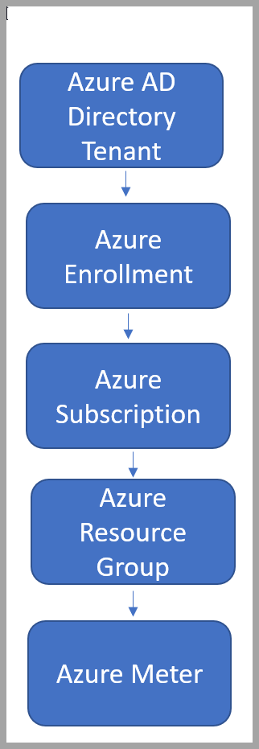
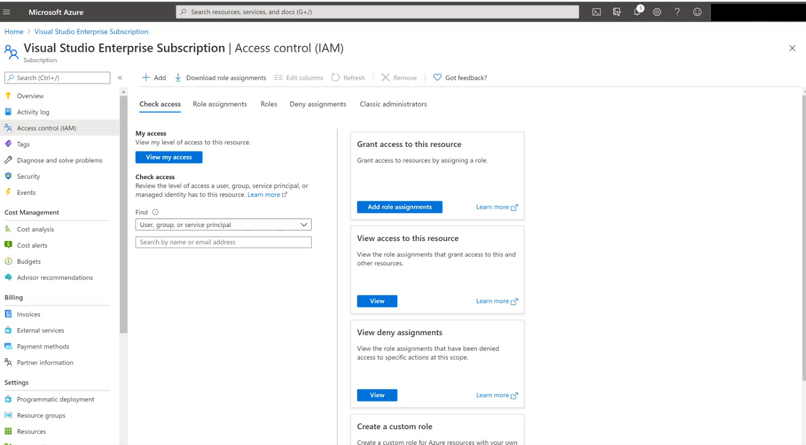

# Change Directory Tenants with your Azure Subscriptions  

Organizations might have several Azure credit subscriptions. Each subscription an organization sets up is associated with a [Microsoft Entra ID](../../active-directory/fundamentals/active-directory-whatis.md). 

Microsoft Entra ID is Microsoft’s cloud-based identity and access management service that helps your employees sign in and access internal and external resources.  

You might need to change the Active Directory you’re working in or [transfer your subscription to another Active Directory](../../role-based-access-control/transfer-subscription.md).  

When you activate your subscription, your identity is created based on the email you use. That identity is either associated with your organization’s Active Directory tenant or a new directory tenant is created for that identity. You can see the identity you’re using in the upper right-hand side of your Azure portal.  

  

From here, you can either switch identities or switch directories. You might need to change your identity to access certain directories.  

If the identity you’re logged in as is associated with multiple directories, switch by selecting "Switch directory." You can see the directories your current identity is associated with.  

  

Your experience within the portal is highly dependent on the directory associated with the identity you used. To change directory tenants, an Admin has to add your identity as a user within the target directory.  

## Importance of Changing Your Microsoft Entra tenant  

When you set up your Azure Credit Subscription through a Visual Studio license, you can use a work email or a personal email to create your identity.  

If you set up your credit subscription using a personal account, your identity and work are isolated from your organization’s active directory. Let’s say you've been working on an app that needs its own subscription to test and learn before deployment. Now, you need access to your organization’s work or references. Changing your directory’s tenant lets you access your organization’s resources and lets them access yours.  

The following diagram shows the basic steps to take when you change or transfer your subscription.

  

## Identity and Access Management

Where and how you have access dictates what you see based on your logged in credentials. This access can be given at different levels within the organization’s hierarchy. You can be given access at the directory level, subscription level or within resource groups.  

  

You can see and manage your access levels within Access Control. You can also manage others' access to the subscription depending on your access levels.  

## How to Change the Entra directory of your Azure subscription

To change the Entra Directory of your Azure subscription, you need to complete the following two-party request and accept workflow.

1. To initiate a change directory request, you need to be a subscription owner of the subscription in the source directory.
2. To accept a change directory request, you or another party need to be an Entra admin in the destination directory.

This process requires coordination between the source and destination directories. For the complete workflow—including prerequisites, role requirements, and approval steps—visit [How to change the Entra directory of your Azure subscription](/azure/cost-management-billing/manage/subscription-change-directory).
