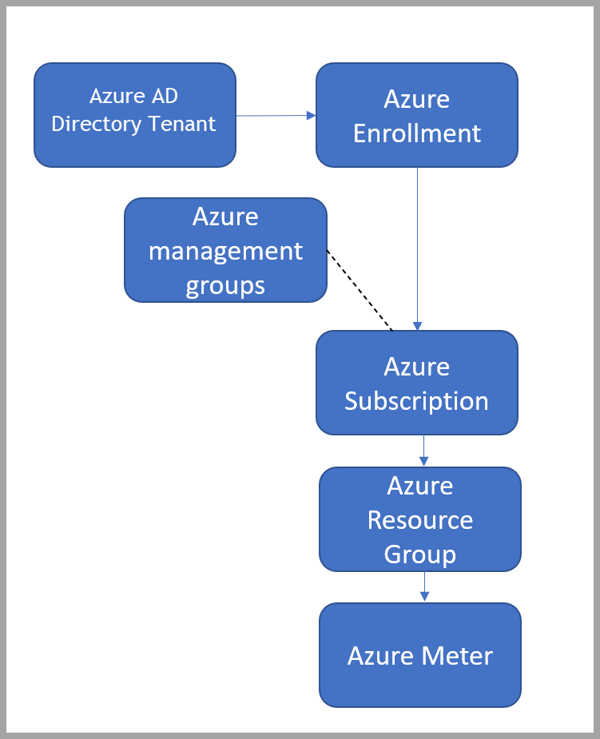

# Managing Azure DevTest Subscriptions

Managing your Azure Dev/Test Subscriptions is important. Managing cost, monitoring the stages of production, the resources you deploy and the processes you configure is a top priority in subscription management.  

Azure’s cloud environment gives you flexibility in managing cost and workloads. On-premises management boxes you into  managing capability against expense.  

Services within the subscription and resource group levels is zero cost – only the resources themselves have cost to them.  

When managing from an operational expense perspective, you only pay for what you use. There are several tools with Azure dev/test subscriptions that help you manage cost during deployment.  

## Monitoring through a different lens

[Azure Monitor](../../azure-monitor/overview.md) helps maximize availability and performance for your applications and services. Deliver comprehensive solutions for collecting, analyzing, and acting on data from your cloud and on-premises environments. Understand how your applications are performing. Azure Monitor proactively identifies issues affecting your applications and the resources they depend on.  

Within Azure, use monitoring to accelerate time to market and ensure performance data in your production services. You can aggregate and analyze metrics, logs, and traces. Through monitoring, you can also fire alerts and send notifications or call automated solutions.  

Azure Monitor allows you to use dev/test benefits to optimize your apps’ time to market and deliver those applications.  

Monitoring allows you to maximize your dev/test benefits with net new applications and existing applications.  

- Pre-Production with Net New Green Field Applications – with new apps, you create and enable custom metrics with log analytics or smart alerts in preproduction that you use in production. Using monitoring early refines your performance data for your production services  
- Post-Production with Existing Applications – when deploying new features or adding new functionality with an API to existing apps, you can deploy this feature in preproduction and tweak your monitoring to ensure correct data feeds early. Using tracking in the new feature's preproduction gives you clear visibility and allows you to blend this monitoring with your overall monitoring system after production. Integrates recent performance data with existing logs to ensure monitoring is used  
- Monitoring different stages of nonproduction deployment mirrors monitoring during production. You manage your costs and analyze your spending before production and in post-production.  

## Cost Management

[Microsoft Cost Management](../../cost-management-billing/cost-management-billing-overview.md) allows you to improve the technical performance of your business workloads significantly. It can also reduce your costs and the overhead required to manage organizational assets.  

Using monitoring, you can use cost-analysis tools in preproduction before you deploy your services to run an analysis of your current preproduction compute to forecast production costs and potentially save money.  

## Performance Management

Besides monitoring and cost management, you also have to run performance tests in preproduction to validate against expected workloads.  

In preproduction, you might set up scaling to expand based on load. When you test your application in a dev/test environment under load, you get better cost-analysis and monitoring figures. You have a better idea whether you need to start at a higher or lower scale.  

Load and duress analysis provide another data in preproduction so you can continue to optimize your time to market and the delivery of your application.  

As you perform load and duress testing with your application or service, the method for scaling up or out depends on your workloads. You can learn more about scaling your apps in Azure:  

- [Scale up an app in Azure App Service](../../app-service/manage-scale-up.md)  
- [Get started with Autoscale in Azure](../../azure-monitor/platform/autoscale-get-started.md?toc=/azure/app-service/toc.json)  

Enable monitoring for your application with [Application Insights](../../azure-monitor/app/app-insights-overview.md) to collect detailed information including page views, application requests, and exceptions.  

## Azure Automation

[Azure Automation](../../automation/automation-intro.md) delivers a cloud-based automation and configuration service that supports consistent management across your Azure and non-Azure environments. This tool gives you control during deployment, operations, and decommission of workloads and resources. Azure Automation is always on. It works with existing resources. Azure Automation lets you create resources or subscriptions on demand. You only pay for what you use.  

Example: If you're following a dev/test production deployment, some of the resources and stages need to be up and running all the time. Others only need to update and run a few times a year.  

Azure Automation becomes important in this scenario. When you're going into a new round of app development and you submit your first pull request (PR), you can kick off an automation job. The job deploys infrastructure as code through an Azure Resource Manager (ARM) template to create all your resources in your Azure dev/test subscription during preproduction.  

## Azure Resource Manager

[Azure Resource Manager (ARM) templates](../../azure-resource-manager/templates/overview.md) implement infrastructure as code for your Azure solutions. The template defines the infrastructure and configuration for your project. You can automate your deployments.  

You can deploy your configurations as many times as you want to update the preproduction environment and track your costs. Using Azure Automation you can run and delete your ARM templates as needed.  

When a service or resource only needs to be updated twice a year, use DevOps tools to deploy your ARM template. Let the automation job turn off your resource, and then redeploy it as needed.  
