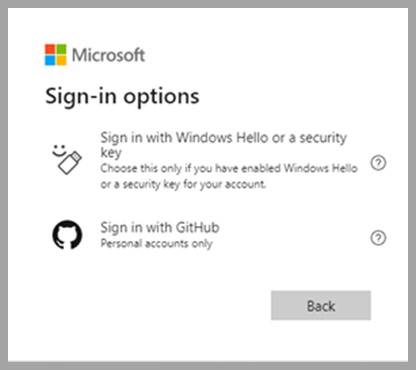
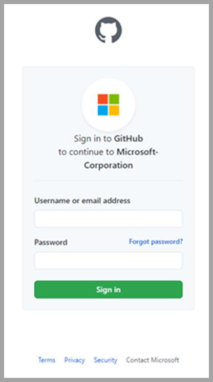
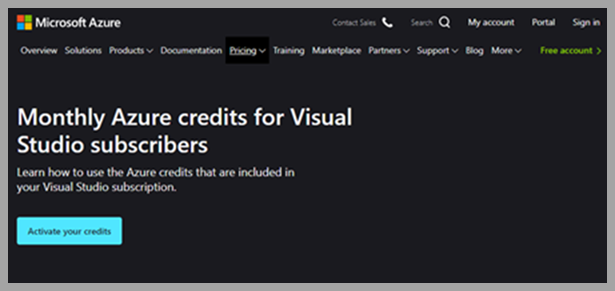

# Sign into your Monthly Azure Credit Subscription and Visual Studio using your GitHub credentials 

Across Microsoft, we're focused on empowering developers to build better apps, faster. By providing a range of products and services, we cover all stages of the software development lifecycle, including:

- IDEs and DevOps tools
- Application and data platforms on the cloud
- Operating systems
- Artificial Intelligence
- IoT solutions and more  

We're centered around developers, both as individuals working in teams and organizations, and as members of developer communities.  

GitHub is one of the largest developer communities. For millions of developers around the world, their GitHub identity is a critical aspect of their digital life. Recognizing that, we’re excited to announce improvements that help GitHub users get started with our developer services, including Monthly Azure Credits for Visual Studio Subscribers.  

## Your GitHub credentials can now log you in to Microsoft services  

We're enabling developers to sign in with their existing GitHub account to Microsoft online services. Using your GitHub credentials, you can sign in via OAuth anywhere a personal Microsoft account does, including Azure Credit Subscriptions and Visual Studio.  

After signing into GitHub and authorizing the Microsoft application, you'll get a new Microsoft account that is linked to your GitHub identity. During this process, you can also link to an existing Microsoft account if you have one.  

## Sign in to Azure Credit Subscription  

[Azure Credit Subscription for Visual Studio Subscribers](https://azure.microsoft.com/pricing/member-offers/credit-for-visual-studio-subscribers) offers a suite of services to create, deploy, and manage applications on your preferred platforms and devices. Use your credits in Azure for learning, development, and test services, plus collaboration tools and access to Azure DevOps.  

Support for GitHub authentication makes it easier to experiment with Azure services. Choose from Virtual Machines, Websites, SQL Databases, and Mobile Services. Use [Azure Virtual Desktop](../../virtual-desktop/overview.md) to deploy and manage hundreds of VMs for development and testing purposes.  

To get started with the Azure Monthly Credit Subscription using your GitHub account, select “Sign in using GitHub” on any [Microsoft sign in page](https://login.microsoftonline.com)  

  

  

If you haven’t activated your credits yet, go to the [Monthly Azure Credits for Visual Studio Subscribers](https://azure.microsoft.com/pricing/member-offers/credit-for-visual-studio-subscribers) page, select “Activate Your Credits” then “Sign in with GitHub” to get started.  

  

  

Once you complete the sign-in process, you're taken to the last Azure Visual Studio organization you visited. If you’re brand new to Azure Visual Studio and Credits Subscription, you land within a new organization created for you.  

## Access all of Microsoft online services  

Beside accessing developer services such as Azure Dev/Test, Monthly Credits, and Visual Studio, use your GitHub account to access all Microsoft online services, from Excel Online to Xbox.  

When authenticating with those services, you can find your GitHub account after selecting **Sign-in options**.  

## Our commitment to your privacy  

When you first use your GitHub account to sign in with Microsoft, GitHub requests permission to release your profile information.  

If you agree, GitHub shares the email addresses on your GitHub account and profile information. This data is used to check whether you have an account with us. We'll create an account if you don’t. Connecting your GitHub identity to a Microsoft identity doesn't give Microsoft access to your repositories in GitHub. Apps like Visual Studio will request access to your repositories if they need to work with your code. You’ll need to consent to that request separately.  

While your GitHub account is used to log into your Microsoft account, they’re separate accounts. One account just uses the other as a sign-in method. Changes you make to your GitHub account (like changing the password or enabling two-factor authentication) don’t change your Microsoft account or the other way around. Manage your GitHub and Microsoft identities in your [account management page](https://account.live.com/proofs/manage/). Just look under the Security tab.  

## Start exploring Azure Visual Studio and Monthly Credit Subscription now  

Go to the [Monthly Azure Credits for Visual Studio Subscribers](https://azure.microsoft.com/pricing/member-offers/credit-for-visual-studio-subscribers/) page to learn more to get started.  

If you have questions, check out [the support page](https://support.microsoft.com/help/4501231/microsoft-account-link-your-github-account).