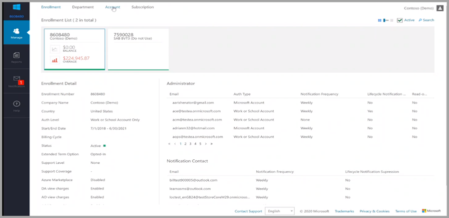
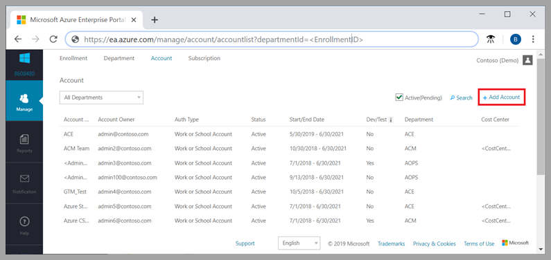

# Creating Enterprise and Organization Azure Dev/Test Subscriptions

Enterprise Dev/Test Subscriptions are available for team development in large organizations

- For team development in large enterprises  
- Enterprise-wide billing – no separate payments  
- Create an enterprise dev/test offer subscription through the Azure Enterprise Portal  

## Prerequisites

To create an enterprise Azure dev/test subscription, you must have an account owner role on an Enrollment Account to make the subscription. There are two ways to access this role:  

- The Enterprise Administrator of your enrollment can [make you an account owner](../../cost-management-billing/manage/grant-access-to-create-subscription.md)  
- An existing owner of the account [can grant you access](../../cost-management-billing/manage/grant-access-to-create-subscription.md).  

### Important information before you add Account Owners

An EA Account Owner **cannot** use the same sign-in account for the EA Portal and other Azure offers. Suppose you were added to the EA Portal as an Account Owner and used the same credentials you used for your individual Visual Studio Benefits. In that case, that Visual Studio subscription is converted to the EA Dev/Test offer.  

> [!Note]  
> The first time you sign in to the EA Portal as an account owner, you'll see a warning pop-up. It’s essential to read and understand. Your existing subscriptions will be converted to a billable EA offer. If you're a Visual Studio subscriber added as an Account Owner, you'll lose your individual monthly Azure credit until you take further action.

### To recover your individual Visual Studio Azure Benefits  

After you authenticate your role as an EA Account Owner, you can either:  

- Remove or move any Azure subscriptions you own  
- Delete your role as Account Owner in the EA Portal  
- Sign up for your individual Visual Studio Azure benefits again  
- Or delete the subscriber from the Visual Studio Administrator site in the VLSC and reassign the subscription, using a different sign-in, then you can sign up for an individual Visual Studio Azure benefits anew  

## Create your subscription

To create your enterprise dev/test subscriptions, first choose an enrollment account as a dev/test account.  

1. To get started, go to [Ea.azure.com](https://ea.azure.com). The Azure Enterprise Portal is where you can manage your company's enrollments  
2. Within the Manage tab, select your agreement number  

    > [!Note]
    > The enrollment can change based on your Enterprise Agreement renewal cycle.
    
    
    
3. Once you’ve selected the appropriate enrollment number, select the **Account** tab  
4. From here, you can edit the Account(s) and toggle the dev/test flag to **Yes**.  

To add an account:  

1. In the Azure Enterprise portal, select Manage in the left navigation area.  
2. Select the Account tab on the Account page, select +Add Account.  
3. You can pick a department, or leave it blank.
4. Pick the desired authentication type.  
5. Enter a friendly name to identify the Account in reporting.  
6. Enter the Account Owner Email address to associate with the new Account.  
7. Confirm the email address and then select Add.  

## Add your Azure Enterprise Dev/Test Subscription

After you've chosen the account to create an enterprise Azure dev/test subscription, add the appropriate subscription offer. There are two ways. No matter what you pick, the experience is the same.  

1. The subscription tab in each portal has a **+/Add** button.

    1. Go to a sign-in page.
    1. Sign in with your Microsoft Azure credentials.
    1. After you sign in, you're directed to a page that lists the offers available. Toggle **Yes** in the EA portal to see enterprise offers.
    
1. Select the enterprise dev/test offer and create your subscription.

    1. You must have access and permissions associated with your identity.
    1. You must designate the Account as a dev/test account within the enrollment portal.

### Next steps  

- [Azure EA portal administration](../../cost-management-billing/manage/ea-portal-administration.md)
- [Get started with the Azure Enterprise portal](../../cost-management-billing/manage/ea-portal-get-started.md)
