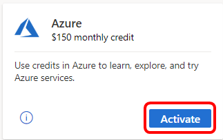
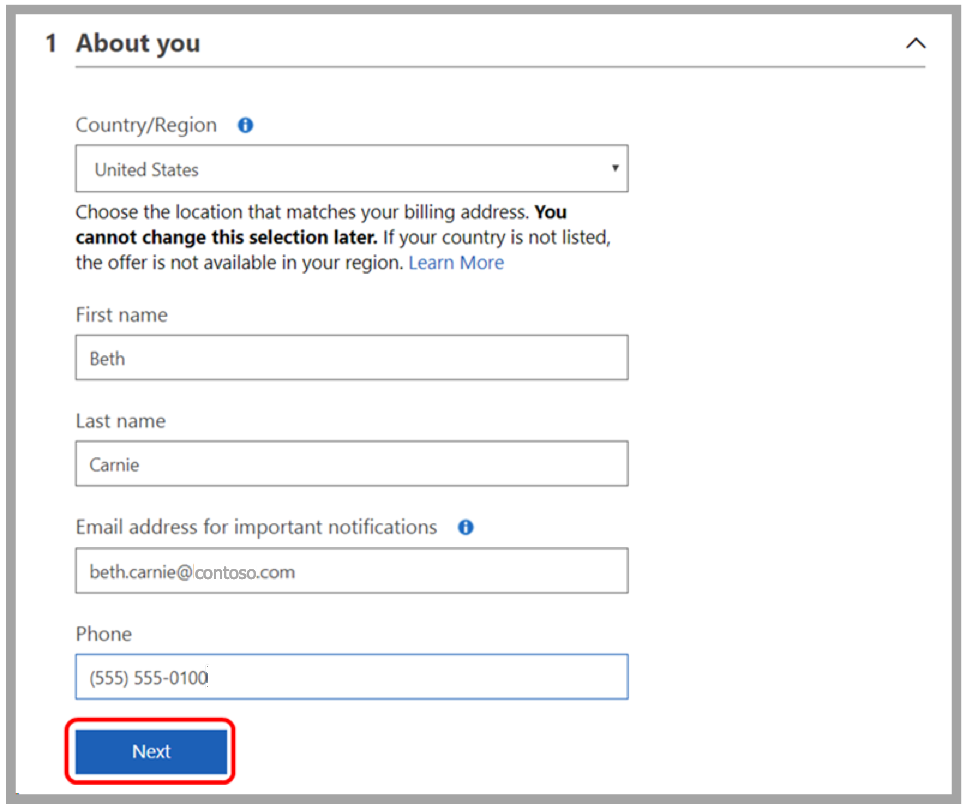
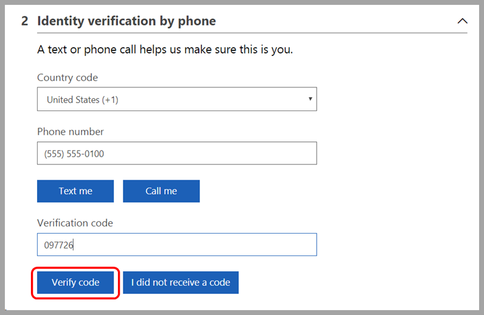
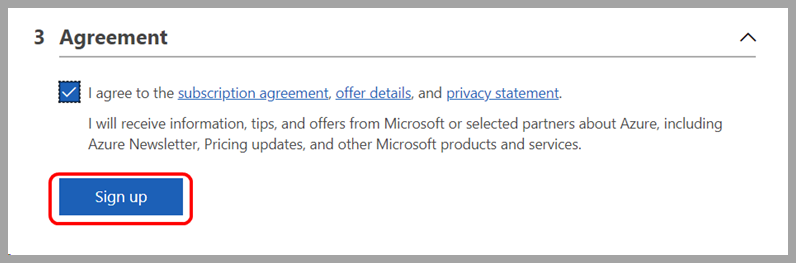
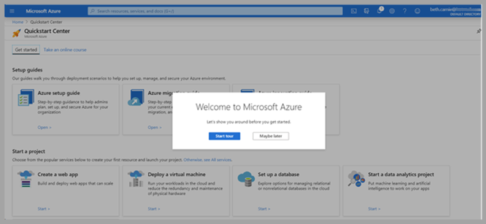
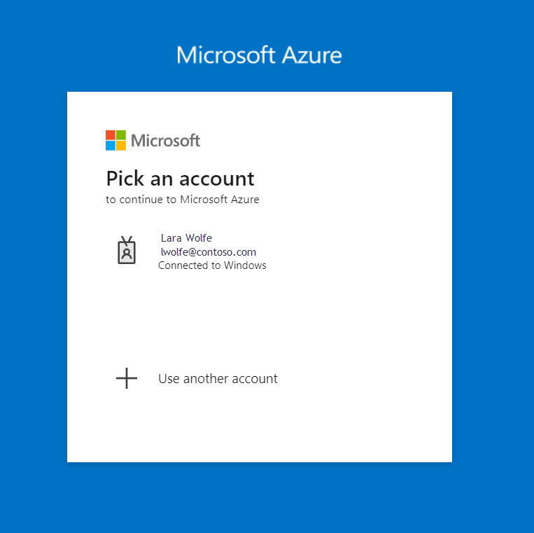
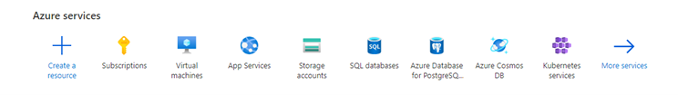
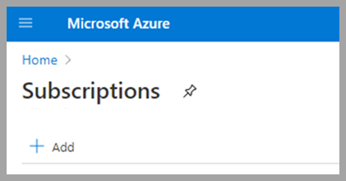

# Get started with your individual Azure Credit Subscription  

When you access your Azure Credit Subscription, you have two ways to sign in and use your credits.  

You have the opportunity to use a personal or corporate email address when signing in.  

> [!NOTE]
> The email address you use for sign in dictates what Microsoft Entra tenant your subscription is associated with.  

## Choose the email address  

The email you use should follow your organization’s requirements – either you use a personal email OR your organization’s provided email.

**Using a Personal Email Account or Microsoft Account (MSA)**  
If you sign in using a personal account like Gmail, Yahoo, or Hotmail, your organization doesn't have access to your work, nor do you have access to their Active Directory unless that email is added by an admin. When you sign in with a personal email, a new Azure Directory is created along with an Azure Tenancy on your behalf. Your profile is created as the Top-Level Admin with access for adding other admins and users.  

**Using a Corporate Email Account or Work School Account (WSA)**  
If you sign in with your organization’s account, you're added as a user within your organization's Active Directory, giving your organization access to manage your account and work.  

## Activate your Azure Credit Subscription  

Once you receive a my.visualstudio.com license, you can sign in via my.visualstudio.com or portal.azure.com.
Remember, the account you sign in with dictates what tenant your directory is under.  

### Sign-In through [Visual Studio](https://my.visualstudio.com/benefits) - my.visualstudio.com/benefits

1. Locate the Azure tile in the Tools section on the Benefits page and select **Activate** to access the appropriate subscription  

     
2. If you don't have an existing Azure subscription, you're asked to fill in the required information to create your Azure subscription. The first step is to provide your personal information and then select **Next**.  

     
3. Next, you need to verify your identity using a simple verification code. Provide your phone number, and choose whether you'd like to receive the code by text or phone. Enter the code you receive, and select **Verify code**.  

     
4. For the final step, select the checkbox to accept the terms, then select **Sign up**.  

     
5. The Azure Dashboard Quickstart Center loads.  

     
6. Bookmark the [Azure portal](https://portal.azure.com) for easy access in the future.  

For more details go to my.visualstudio.com, or follow this link: [Use Microsoft Azure in Visual Studio subscriptions](/visualstudio/subscriptions/vs-azure#:~:text=Eligibility%20%20%20%20Subscription%20Level%20%2F%20Program,%20%20Yes%20%2013%20more%20rows%20)  

### Sign in via the [Azure portal](https://portal.azure.com)

1. Choose or enter the email address to authenticate.

   

2. Once you’re logged in, go to **Subscriptions** under **Azure Services**.

     
3. Select **+ Add**.

     

4. This action takes you to a page where you can find the eligible offers.

5. Select the correct subscription offer to associate with your account.

> [!NOTE]
> This method uses the login credentials you used when signing in to the Azure portal. This way of signing in has a higher probability of associating your subscription with your organization’s directory through your corporate Microsoft Account.

## Troubleshoot removed/expired subscriptions

If your Visual Studio subscription expires or is removed, all the subscription benefits, including the monthly Azure dev/test individual credit are no longer available. To learn how to continue using Azure with a monthly credit, read [Renew an expired subscription, purchase a new one, or transfer your Azure resources](troubleshoot-expired-removed-subscription.md).
