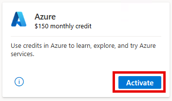
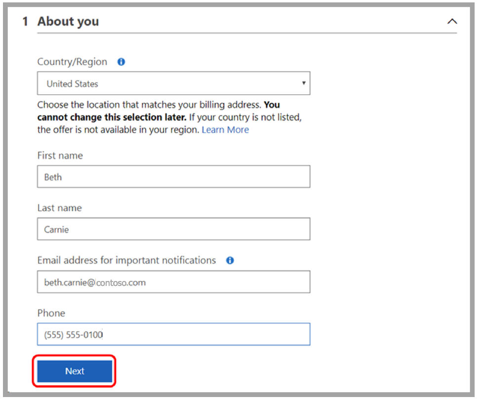
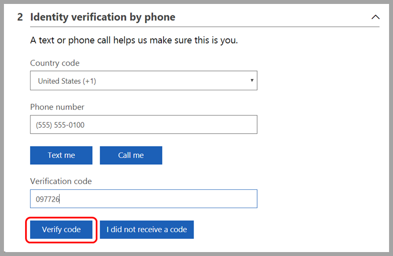
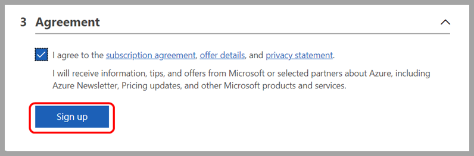
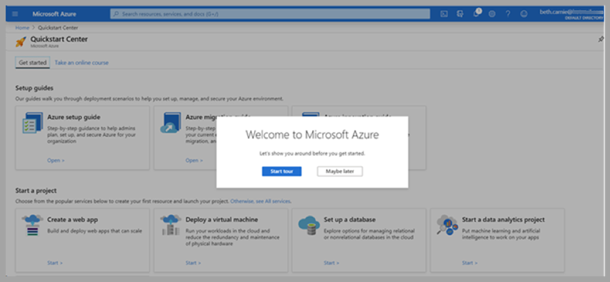
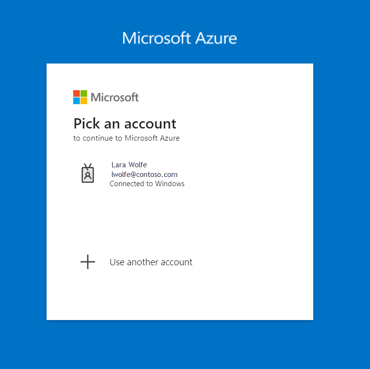
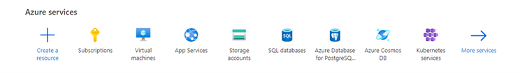
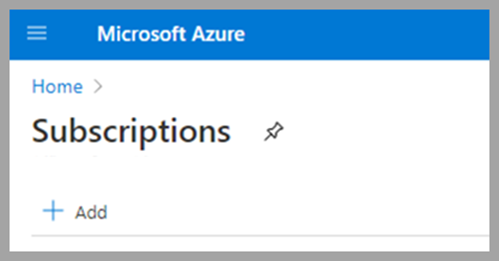

# Get started with your individual Azure Dev/Test credit subscription

When you access your Azure Dev/Test credit subscription, you have two ways to sign in and use your credits.

You can use a personal or corporate email address when signing in.  

These credits are intended for development and testing workloads only and aren't designed for production use.

> [!NOTE]
> The email address you use for sign in dictates what Microsoft Entra tenant your subscription is associated with.

## Choose the email address  

The email you use should follow your organization's requirements - either use a personal email or your organization's email.

**Using a Personal Email Account or Microsoft Account (MSA)**  
If you sign in using a personal account like Gmail, Yahoo, or Hotmail, your organization doesn't have access to your work, nor do you have access to their Microsoft Entra tenant unless that email is added by an admin. When you sign in with a personal email, a new Microsoft Entra tenant is created on your behalf. Your profile is created as a global administrator with access for adding other admins and users.  

**Using a Corporate Email Account or Work School Account (WSA)**  
If you sign in with your organization's account, you're added as a user within your organization's Microsoft Entra tenant, giving your organization access to manage your account and work.  

## Activate your Azure Dev/Test credit subscription  

Azure Dev/Test credits are only available with select Visual Studio Subscription levels. If your subscription doesn't include this benefit, you don't see the Azure credit option.  

After you get a Visual Studio Subscription, sign in through my.visualstudio.com or portal.azure.com. Remember, the account you sign in with dictates what Microsoft Entra tenant your account is associated with.

### Sign in through the [Visual Studio Subscriptions portal](https://my.visualstudio.com/benefits)

1. Locate the Azure tile in the Tools section on the Benefits page and select **Activate** to access the appropriate subscription  

     
2. If you don't have an existing Azure subscription, you're asked to fill in the required information to create your Azure subscription. The first step is to provide your personal information and then select **Next**.  

     
3. Next, you need to verify your identity using a simple verification code. Provide your phone number, and choose whether you'd like to receive the code by text or phone. Enter the code you receive, and select **Verify code**.  

     
4. For the final step, select the checkbox to accept the terms, then select **Sign up**.  

     
5. The Azure Dashboard Quickstart Center loads.  

     
6. Bookmark the [Azure portal](https://portal.azure.com) for easy access in the future.  

For more details, go to my.visualstudio.com.

### Sign in via the [Azure portal](https://portal.azure.com)

1. Choose or enter the email address to authenticate.

   

2. Once you're logged in, go to **Subscriptions** under **Azure Services**.

     
3. Select **+ Add**.

     

4. This action takes you to a page where you can find the eligible offers.

5. Select the correct subscription offer to associate with your account.

> [!NOTE]
> This method uses the authentication credentials you use when signing in to the Azure portal. This way of signing in has a higher probability of associating your subscription with your organization's directory through your work or school account.

## Troubleshoot removed/expired subscriptions

If your Visual Studio Subscription expires or is removed, all the subscription benefits, including the monthly Azure Dev/Test individual credit, are no longer available. To learn how to continue using Azure with a monthly credit, see [Renew an expired subscription, purchase a new one, or transfer your Azure resources](troubleshoot-expired-removed-subscription.md).

You might also encounter issues such as:
+ Not seeing the Azure credit option (subscription might not be eligible) 
+ Signing in with a different email than your Visual Studio Subscription 
+ Being associated with a different Microsoft Entra tenant than expected
